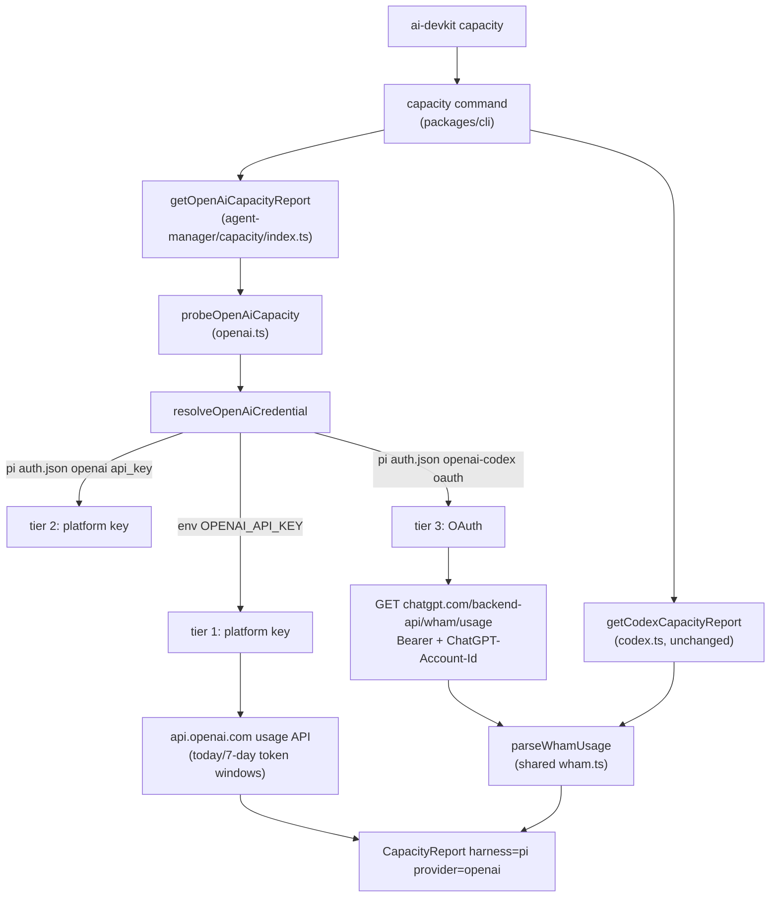

# System Design & Architecture

## Architecture Overview

The feature extends the existing pi·OpenAI capacity provider (`capacity/openai.ts`) with an OAuth tier backed by pi's OpenAI login, reusing the wham/usage endpoint that the codex harness provider already consumes. No CLI or render changes are required — `render.ts` already renders generic `CapacityWindow` rows and labels provider `openai` as "OpenAI".



Key components:

- `packages/agent-manager/src/capacity/openai.ts` — credential resolution becomes tiered; gains the wham/usage fetch path and OAuth staleness classification.
- `packages/agent-manager/src/capacity/wham.ts` (new) — shared wham/usage response parsing (rate-limit windows, extra limits, credits), extracted from `codex.ts` now that a second real caller exists.
- `packages/agent-manager/src/capacity/codex.ts` — unchanged behavior; `parseUsage`/`toRateWindow` remain exported (tests import them) and delegate to `wham.ts`.
- CLI (`packages/cli`) — no changes.

## Data Models

**Input credential (read-only), tier 3 — pi `~/.pi/agent/auth.json`:**

```jsonc
{
  "openai-codex": {
    "type": "oauth",            // verified live: "oauth"
    "access": "<jwt string>",   // never logged/persisted
    "refresh": "<opaque>",      // unused (no refresh, see D2)
    "expires": 1791355868557,   // epoch MILLISECONDS (verified live)
    "accountId": "<chatgpt account uuid>"
  }
}
```

**Resolved credential (internal discriminated union):**

```ts
type OpenAiCredential =
  | { kind: "platform"; key: string }                                  // tiers 1-2
  | { kind: "oauth"; access: string; accountId: string; expiresMs: number | null };
```

**Output** — existing `CapacityReport`/`CapacityWindow` types, unchanged. OAuth windows come from wham: `session` (5h), `weekly` (7d), plus any `additional_rate_limits` entries; `creditsRemaining` from `credits.balance`.

**Staleness rule (ms-aware):** `expires` values above 1e12 are epoch ms (pi convention), smaller values are treated as seconds; JWT `exp` (seconds) is the fallback when `expires` is absent/invalid — mirroring `codex.ts staleOAuth`'s metadata-then-JWT order. Reference "now" is `Date.parse(checkedAt)` (already injectable via `now` option) so tests are deterministic.

## API Design

**External:** one read-only `GET https://chatgpt.com/backend-api/wham/usage` with headers `Authorization: Bearer <access>` and `ChatGPT-Account-Id: <accountId>` — identical to the codex provider's call. Verified live with the real pi token: HTTP 200, `rate_limit.primary_window/secondary_window`, `credits.balance`, top-level `rate_limit_reached_type` present. Timeout and abort handling follow the existing AbortController pattern in `openai.ts`.

**Internal:** `probeOpenAiCapacity(options)` keeps its signature (`env`, `readFile`, `fetch`, `timeoutMs`, `checkedAt` via `getOpenAiCapacityReport`). `resolveOpenAiApiKey` remains exported for compatibility; a new internal `resolveOpenAiCredential` returns the union above. Resolution order:

1. `env.OPENAI_API_KEY` (explicit override; auth file not even read — preserved behavior)
2. pi `openai` `{type: "api_key", key}` (platform key path, byte-identical report)
3. pi `openai-codex` `{type: "oauth"}` with non-empty `access` + `accountId` → OAuth path
4. nothing found → error `OpenAI credentials not found; set OPENAI_API_KEY, configure the Pi openai provider, or log in to OpenAI via Pi`

**Response classification (OAuth tier):**

- fresh token → fetch wham; 200 → report (authenticated, windows, credits)
- 401/403 → `{authenticated: false, available: "unknown", windows: []}` (revoked login)
- timeout / network error / 5xx / malformed JSON → sanitized throw (`OpenAI usage request failed…`), rendered as the per-provider warning by `capacityCommand` — consistent with the platform tier's error behavior
- stale token (expiry ≤ now) → **no fetch**; `{authenticated: true, available: "unknown", windows: [], creditsRemaining: null}` (authenticated-but-stale)
- malformed `openai-codex` entry (wrong type, missing fields) → tier skipped, falls to step 4 error; error messages never include file content

## Component Breakdown

- `wham.ts` (new): `toRateWindow`, `extraWindows`, `parseWhamUsage(raw): { windows, creditsRemaining }`, plus the small guards (`record`, `finiteNumber`, `nonEmptyText`, `resetTime`, `safeIdentifier`). Pure functions, no I/O.
- `codex.ts`: imports parsing from `wham.ts`; re-exports `toRateWindow` and keeps `parseUsage(raw, source)` as a thin wrapper so `codex.test.ts` passes unchanged. Probe behavior identical.
- `openai.ts`: `resolveOpenAiCredential` tiers; OAuth fetch helper (Bearer + account id, abort, status classification); staleness check; report assembly mirroring codex's `capacityFromSnapshot` for API responses (`available = hasUsage ? "yes" : "unknown"`; top-level `rate_limit_reached_type` is deliberately **not** read, matching codex.ts API-path behavior).
- Tests/fixtures: `openai-codex-auth.json` (fake tokens), `wham-usage.json` (redacted live shape) under `capacity/fixtures/`.

## Design Decisions

- **D1 Resolution order (env → platform key → OAuth).** Platform paths stay first: they are correct for platform-key users and the brief mandates keeping them working. OAuth only fills the no-setup gap. Alternative (OAuth first) would change output for dual-credential users without a motivating use case. Alternative (show both) would need two `pi · OpenAI` rows and render changes — rejected as scope creep.
- **D2 No OAuth refresh.** Matches codex.ts precedent exactly (its OAuth path never refreshes; stale → skip). Attempting refresh would invent a new flow (token rotation, persistence of rotated tokens into pi's auth file — writing another tool's state) with no existing pattern to follow. Stale renders authenticated-but-stale.
- **D3 Extract wham parsing into `wham.ts`.** The brief allows extraction only with a second real caller — that now exists (pi OAuth tier), verified live against the same endpoint/shape. Alternatives: importing `parseUsage` from `codex.ts` (couples the pi provider to the codex provider) or duplicating ~60 lines of parsing (drift risk) — both worse than a small shared pure module. Codex re-exports keep its public surface stable.
- **D4 ms-vs-s staleness heuristic.** pi writes epoch ms (verified); codex writes seconds. A magnitude check (`> 1e12` ⇒ ms) handles both without guessing per-source conventions, and JWT fallback covers missing metadata.
- **D5 No dedupe with `codex · OpenAI`.** Different credential stores (`~/.codex/auth.json` vs `~/.pi/agent/auth.json`); both rows legitimately coexist; the harness column exists for exactly this.
- **D6 Error message updated** to mention the pi login path (it fires only when nothing is found, so platform users never see it). Sanitized errors only — no token or file content in messages, matching the existing openai/codex tests' no-leak assertions.

## Non-Functional Requirements

- **Security:** token values never appear in reports, errors, logs, docs, or fixtures (fixtures use fake values); auth file is read-only; one live probe only (done, read-only GET).
- **Performance:** one additional HTTPS GET (timeout 5s default, abortable) only in the OAuth tier; platform tier unchanged; tests use injected `fetch` (no network).
- **Reliability:** failure modes classified (stale / unauthenticated / unavailable) so one provider's failure never blanks the multi-provider report.
- **Compatibility:** `resolveOpenAiApiKey`, `parseUsage`, `toRateWindow` exports preserved; platform-key report byte-identical.
