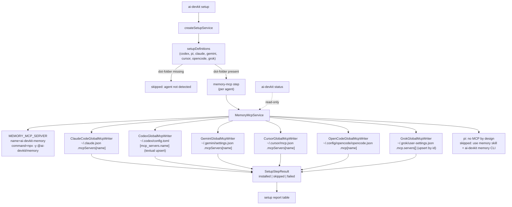

# Design Review

## Architecture Overview

`ai-devkit setup` gains a per-agent `memory-mcp` step backed by a new `MemoryMcpService`. The service owns the launch definition (single source of truth for command/args/name) and one idempotent **global config writer per harness**. Harness support is a verified matrix — wired, or honestly skipped with a reason. `ai-devkit status` reuses the same writers in read-only mode.



## Data Models

`packages/cli/src/services/setup/memory-mcp/`:

```ts
interface MemoryMcpServerSpec {
  name: string;          // "ai-devkit-memory"
  command: string;       // "npx"
  args: string[];        // ["-y", "@ai-devkit/memory"]
}

interface GlobalMcpWriter {
  readonly agent: SetupAgent | EnvironmentCode;
  readonly configPath: string;              // relative to homeDir, e.g. ".claude.json"
  /** Upsert our entry; create file/dir as needed; preserve everything else. */
  apply(spec: MemoryMcpServerSpec, homeDir: string): Promise<MemoryMcpWriteResult>;
  /** Read-only probe for status. */
  inspect(homeDir: string): Promise<MemoryMcpInspectResult>; // wired | missing | drift | unsupported | error
}
```

Entry shapes written per harness (verified sources in progress file):

| Harness | File | Shape |
|---|---|---|
| claude | `~/.claude.json` | `mcpServers["ai-devkit-memory"] = {command, args}` |
| codex | `~/.codex/config.toml` | `[mcp_servers.ai-devkit-memory]` table: `command`, `args` |
| gemini | `~/.gemini/settings.json` | `mcpServers["ai-devkit-memory"] = {command, args}` |
| cursor | `~/.cursor/mcp.json` | `mcpServers["ai-devkit-memory"] = {command, args}` |
| opencode | `~/.config/opencode/opencode.json` | `mcp["ai-devkit-memory"] = {type:"local", command:[...], enabled:true}` |
| grok | `~/.grok/user-settings.json` | `mcp.servers[]` upsert by `id`: `{id, label, enabled:true, transport:"stdio", command, args}` |

Tool description updates (packages/memory/src/server.ts) — text only, no schema/logic change:

- `memory_searchKnowledge`: "Call BEFORE starting any non-trivial task…" + one short example query.
- `memory_storeKnowledge`: instruct to persist verified, reusable decisions/fixes/conventions after completing meaningful work.
- `memory_updateKnowledge`: instruct to correct knowledge proven wrong, instead of storing duplicates.

## API Design

- `SUPPORTED_SETUP_AGENTS` extends to `["codex","pi","claude","gemini","cursor","opencode","grok"]`; `setupDefinitions` gains gemini/cursor/opencode/grok entries (dot-folders `.gemini`, `.cursor`, `.config/opencode`, `.grok`) whose only step is `memory-mcp`; codex/pi/claude get `memory-mcp` appended after existing steps.
- Setup command `--agent` help text updated to the new agent list.
- Status: new `memoryMcp` check in `StatusReport` — per-agent `{agent, state: wired|unwired|unsupported|error, detail}`; rendered as a section, no exit-code regression (warning-level only).
- No public API changes elsewhere; `MemoryMcpService` internal to CLI.

## Component Breakdown

1. `packages/cli/src/services/setup/memory-mcp/spec.ts` — `MEMORY_MCP_SERVER` spec + `MCP_CAPABLE_AGENTS`/`MCP_UNSUPPORTED_AGENTS` lists with reasons.
2. `memory-mcp/writers.ts` — six `GlobalMcpWriter` implementations + JSON read-modify-write helper.
3. `memory-mcp/codex-toml.ts` — textual TOML table upsert (append or replace `[mcp_servers.ai-devkit-memory]` block, preserving the rest byte-for-byte).
4. `memory-mcp/memory-mcp.service.ts` — `applyForAgent(agent, homeDir)` → `SetupStepResult`; `inspectAll(homeDir)` for status.
5. `setup.service.ts` — wire the new step + definitions; keep deps injectable (`homeDir`).
6. `status.service.ts` — add read-only memory-MCP section.
7. `packages/memory/src/server.ts` — description text only.
8. Tests: writer unit tests (temp dirs), setup-service tests (per-agent install/idempotence/skip/fail), status check tests, e2e isolated-HOME test, memory-server description snapshot tests.

## Design Decisions

1. **Command = `npx -y @ai-devkit/memory`** (floating latest). Alternatives: pinned version (stale memory content between releases; config churn on every release), local `node <repo>/dist` (machine/repo-specific, breaks global availability). npx is the documented stdio convention in every wired harness's docs, resolves from npm cache after first fetch, and means users always run the released server that matches its own migrations. Rejected `ai-devkit-memory` global bin (requires a separate global install step → violates "zero manual steps").
2. **Global-only scope.** Project-scope wiring already exists (`ai-devkit init` `mcpServers`). Harness precedence means project configs may override ours per repo — acceptable and documented.
3. **Our namespace only.** Writers touch exactly one key (`ai-devkit-memory` / `mcp_servers.ai-devkit-memory` / array entry with `id:"ai-devkit-memory"`). Drift (user hand-edit) → overwrite that key and report `installed`; we never delete or rewrite other entries.
4. **Codex TOML = textual upsert.** smol-toml round-trip reformats and drops comments in the user's `config.toml`. We append a well-formed table block or replace the existing block between its header and the next header line. Verified by round-trip parse test (smol-toml must parse output equal to intent).
5. **pi skipped honestly.** pi documents "No MCP" by design; report points at the `memory` skill + `ai-devkit memory` CLI path that already works.
6. **Unverified harnesses skipped with reasons**, not guessed (roo/cline/kilocode/junie/kiro/github-copilot/antigravity/amp/devin — research log in progress file). Adding one later is a one-writer change.
7. **Status is read-only** and warning-level: wiring state informs, it does not gate CI/exit codes.

## Non-Functional Requirements

- **Safety**: every writer must preserve unrelated config (unit-tested with adversarial fixtures: foreign MCP servers, nested keys, comments in TOML, trailing newlines).
- **Performance**: config-only, no npx invocation; setup cost is a few small file reads/writes.
- **Offline**: setup never hits the network. First MCP *launch* may (npm cache miss) — harness-level, out of scope.
- **Security**: no secrets written; entry contains only command/args/flags.
- **Determinism**: stable key order (JSON.stringify with sorted keys where we own the object; 2-space indent; trailing newline) so reruns are byte-stable.
