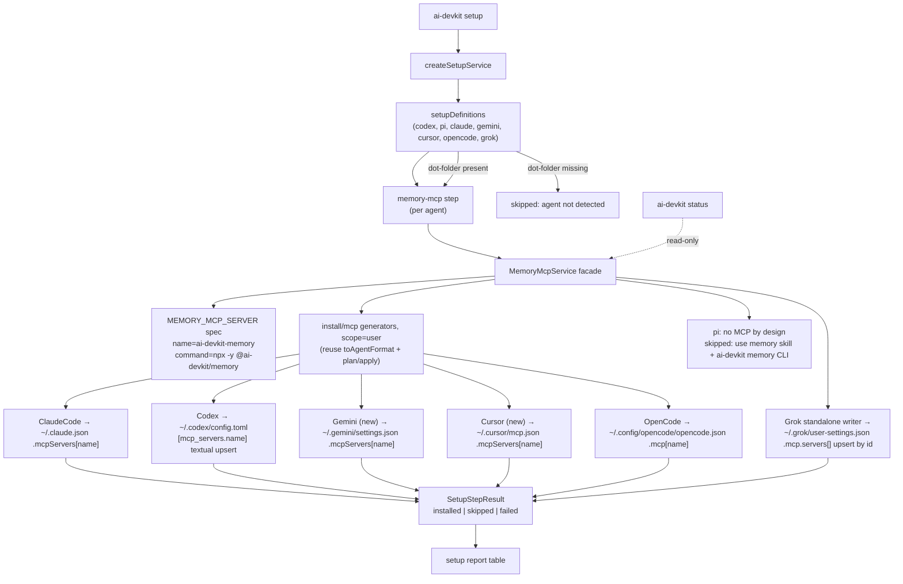

# Design Review

## Architecture Overview

`ai-devkit setup` gains a per-agent `memory-mcp` step backed by a new `MemoryMcpService`. **Reuse first:** the existing MCP generator architecture in `packages/cli/src/services/install/mcp/` (BaseMcpGenerator plan/apply diff-and-merge, per-harness `toAgentFormat`) is extended to be **scope-aware** (`project` vs `user` home) instead of being duplicated. Setup invokes user-scope generators with the canonical memory server definition through a thin facade that maps results to `SetupStepResult`. Grok's array-based config and pi's no-MCP design are handled as documented deviations. `ai-devkit status` reuses the same facade in read-only mode.



### Reuse: scope-aware generators (orchestrator-verified opportunity)

The 8 existing generators wrote to `projectRoot` only. The refactor:

- `BaseMcpGenerator` subclasses take an optional constructor scope (`"project"` default → zero behavior change for existing callers and tests) and resolve per-scope relative config paths from the same `baseDir` argument.
- ClaudeCode: project `.mcp.json` / user `.claude.json` (same `mcpServers` shape).
- Codex: project `.codex/config.toml` / user `.codex/config.toml` (same rel path; **user write is a textual table upsert**, see deviations).
- OpenCode: project `opencode.json` / user `.config/opencode/opencode.json` (same `mcp` shape).
- NEW Gemini + Cursor generators (both trivial `mcpServers` JSON; project and user paths differ only by baseDir for gemini, identical rel path for cursor). Registered in `GENERATORS` + `mcpConfigPath` in `ENVIRONMENT_DEFINITIONS`, so `ai-devkit install` gains working project-scope MCP wiring for gemini/cursor as an additive side effect (tested).
- Setup facade runs each user-scope generator non-interactively: `plan()` → drift on our namespace resolves to overwrite → `apply()`; mapped to installed/skipped/failed.

## Data Models

`packages/cli/src/services/setup/memory-mcp/`:

```ts
interface MemoryMcpServerSpec {
  name: string;          // "ai-devkit-memory"
  command: string;       // "npx"
  args: string[];        // ["-y", "@ai-devkit/memory"]
}

interface GlobalMcpWriter {
  readonly agent: SetupAgent | EnvironmentCode;
  readonly configPath: string;              // relative to homeDir, e.g. ".claude.json"
  /** Upsert our entry; create file/dir as needed; preserve everything else. */
  apply(spec: MemoryMcpServerSpec, homeDir: string): Promise<MemoryMcpWriteResult>;
  /** Read-only probe for status. */
  inspect(homeDir: string): Promise<MemoryMcpInspectResult>; // wired | missing | drift | unsupported | error
}
```

Entry shapes written per harness (verified sources in progress file):

| Harness | File | Shape |
|---|---|---|
| claude | `~/.claude.json` | `mcpServers["ai-devkit-memory"] = {command, args}` |
| codex | `~/.codex/config.toml` | `[mcp_servers.ai-devkit-memory]` table: `command`, `args` |
| gemini | `~/.gemini/settings.json` | `mcpServers["ai-devkit-memory"] = {command, args}` |
| cursor | `~/.cursor/mcp.json` | `mcpServers["ai-devkit-memory"] = {command, args}` |
| opencode | `~/.config/opencode/opencode.json` | `mcp["ai-devkit-memory"] = {type:"local", command:[...], enabled:true}` |
| grok | `~/.grok/user-settings.json` | `mcp.servers[]` upsert by `id`: `{id, label, enabled:true, transport:"stdio", command, args}` |

Tool description updates (packages/memory/src/server.ts) — text only, no schema/logic change:

- `memory_searchKnowledge`: "Call BEFORE starting any non-trivial task…" + one short example query.
- `memory_storeKnowledge`: instruct to persist verified, reusable decisions/fixes/conventions after completing meaningful work.
- `memory_updateKnowledge`: instruct to correct knowledge proven wrong, instead of storing duplicates.

## API Design

- `SUPPORTED_SETUP_AGENTS` extends to `["codex","pi","claude","gemini","cursor","opencode","grok"]`; `setupDefinitions` gains gemini/cursor/opencode/grok entries (dot-folders `.gemini`, `.cursor`, `.config/opencode`, `.grok`) whose only step is `memory-mcp`; codex/pi/claude get `memory-mcp` appended after existing steps.
- Setup command `--agent` help text updated to the new agent list.
- Status: new `memoryMcp` check in `StatusReport` — per-agent `{agent, state: wired|unwired|unsupported|error, detail}`; rendered as a section, no exit-code regression (warning-level only).
- No public API changes elsewhere; `MemoryMcpService` internal to CLI.

## Component Breakdown

1. `packages/cli/src/services/install/mcp/` — scope-aware refactor of Base/ClaudeCode/Codex/OpenCode generators + NEW Gemini/Cursor generators; Codex user-scope textual TOML upsert helper.
2. `packages/cli/src/util/env.ts` — `mcpConfigPath` for gemini (`.gemini/settings.json`) and cursor (`.cursor/mcp.json`).
3. `packages/cli/src/services/setup/memory-mcp/` — `MEMORY_MCP_SERVER` spec, wired/unsupported agent matrix with reasons, `MemoryMcpService` facade over user-scope generators, standalone Grok writer.
4. `setup.service.ts` — wire the new step + definitions; keep deps injectable (`homeDir`).
5. `status.service.ts` — add read-only memory-MCP section.
6. `packages/memory/src/server.ts` — description text only.
7. Tests: generator scope tests (install/mcp test dir), facade/writer tests (setup/memory-mcp test dir), setup-service tests, status tests, e2e isolated-HOME test, memory-server description tests.

## Design Decisions

0. **Reuse the install/mcp generator architecture (scope-aware extension) instead of duplicating writers.** `toAgentFormat` format knowledge and plan/apply diff-and-merge idempotence live in one place; setup runs the same code with `scope=user` and a home baseDir. With this feature, `install/mcp` is now a two-consumer config-format library (project `install mcp` + global `setup` memory wiring); relocating it to a neutral module is a known follow-up, deferred to keep this branch scoped. Documented deviations from pure reuse:
   - **Codex user scope writes textually** (append/replace the `[mcp_servers.ai-devkit-memory]` block). The generator's project path uses a smol-toml parse/stringify round-trip, which reformats and drops comments — unacceptable for a user's global `~/.codex/config.toml`. Reading still parses TOML (drift detection); only writing is textual.
   - **Grok is a standalone writer**, not a generator: its user-level config (`~/.grok/user-settings.json` → `mcp.servers[]` array, upsert by `id`) does not fit BaseMcpGenerator's map-shaped `readExistingServers`/`writeServers` contract, and grok project-scope wiring is out of scope (unregistered).
   - **pi skipped honestly** (unchanged): pi documents "No MCP" by design; report points at the `memory` skill + `ai-devkit memory` CLI path.
1. **Command = `npx -y @ai-devkit/memory`** (floating latest). Alternatives: pinned version (stale memory content between releases; config churn on every release), local `node <repo>/dist` (machine/repo-specific, breaks global availability). npx is the documented stdio convention in every wired harness's docs, resolves from npm cache after first fetch, and means users always run the released server that matches its own migrations. Rejected `ai-devkit-memory` global bin (requires a separate global install step → violates "zero manual steps").
2. **Global-only scope.** Project-scope wiring already exists (`ai-devkit init` `mcpServers`). Harness precedence means project configs may override ours per repo — acceptable and documented.
3. **Our namespace only.** Writers touch exactly one key (`ai-devkit-memory` / `mcp_servers.ai-devkit-memory` / array entry with `id:"ai-devkit-memory"`). Drift (user hand-edit) → overwrite that key and report `installed`; we never delete or rewrite other entries.
4. **Codex TOML = textual upsert.** smol-toml round-trip reformats and drops comments in the user's `config.toml`. We append a well-formed table block or replace the existing block between its header and the next header line. Verified by round-trip parse test (smol-toml must parse output equal to intent).
5. **pi skipped honestly.** pi documents "No MCP" by design; report points at the `memory` skill + `ai-devkit memory` CLI path that already works.
6. **Unverified harnesses skipped with reasons**, not guessed (roo/cline/kilocode/junie/kiro/github-copilot/antigravity/amp/devin — research log in progress file). Adding one later is a one-writer change.
7. **Status is read-only** and warning-level: wiring state informs, it does not gate CI/exit codes.

## Non-Functional Requirements

- **Safety**: every writer must preserve unrelated config (unit-tested with adversarial fixtures: foreign MCP servers, nested keys, comments in TOML, trailing newlines).
- **Performance**: config-only, no npx invocation; setup cost is a few small file reads/writes.
- **Offline**: setup never hits the network. First MCP *launch* may (npm cache miss) — harness-level, out of scope.
- **Security**: no secrets written; entry contains only command/args/flags.
- **Determinism**: stable key order (JSON.stringify with sorted keys where we own the object; 2-space indent; trailing newline) so reruns are byte-stable.
