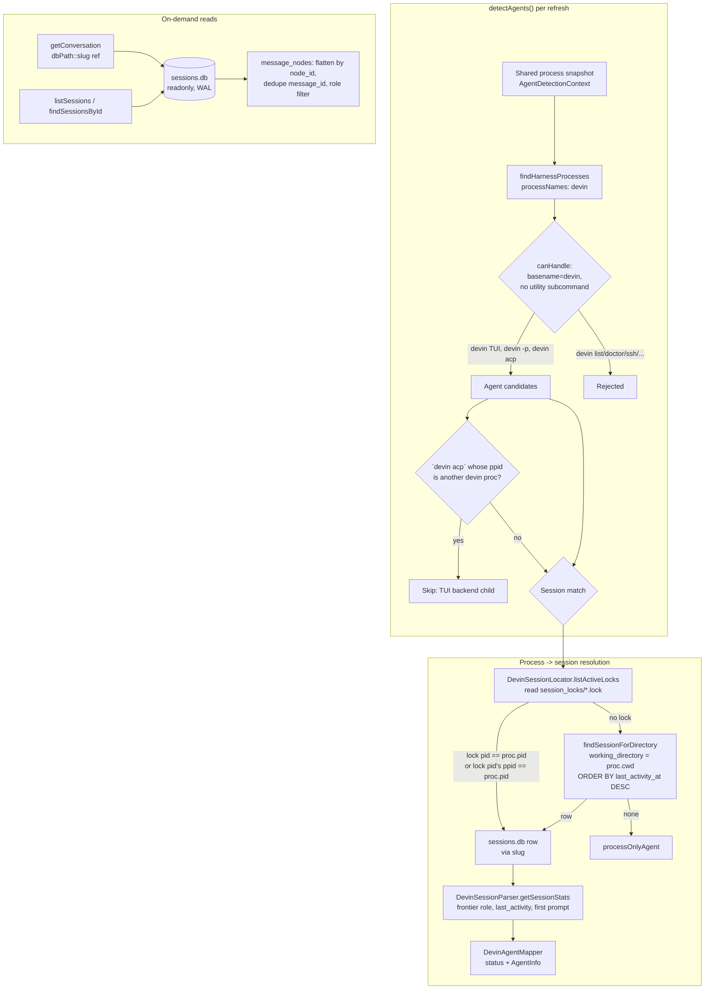

# Design: Devin Adapter for @ai-devkit/agent-manager

## Architecture

## Devin storage model (verified against Devin 3000.11.3)

`~/.local/share/devin/cli/` (XDG `data/devin/cli`):

| Source | Shape | Used for |
|---|---|---|
| `sessions.db` → `sessions` | `id` (slug, e.g. `brawny-shirt`), `working_directory`, `title`, `created_at`, `last_activity_at` (ms epoch), `main_chain_id`, `hidden` | session identity, cwd, timestamps, hidden filter |
| `sessions.db` → `message_nodes` | `session_id`, `node_id`, `parent_node_id`, `chat_message` (JSON `{message_id, role, content, metadata, tool_calls?, thinking?}`), `created_at` | conversation + status frontier |
| `sessions.db` → `prompt_history` | `session_id`, `content`, `timestamp`, `is_shell` | first user message for summaries |
| `session_locks/<slug>.lock` | file body = holder PID (`devin acp` backend) | live session → process map |
| `transcripts/<slug>.json` | ATIF-rendered transcript | not used v1 (contingency only) |

`message_nodes` is a forest: each turn roots a fresh `system` preamble chain ending at the real user node; assistant/tool nodes descend from it. Sibling nodes sharing `message_id` are revisions — keep the highest `node_id` per `message_id`. `metadata.is_user_input` marks genuine user prompts. Abandoned branches (rewinds/retries) may leave orphan subtrees; v1 accepts them as rare noise (mostly `system` role, filtered anyway).

## Components

### `harnesses/devin/DevinAdapter.ts`

- `readonly type = "devin"`, `readonly processNames = ["devin"]`.
- `canHandle(proc)`: `executableBasename(command) === "devin"` AND the first non-flag argv token is not in `UTILITY_SUBCOMMANDS` (`list ls rm ssh forward doctor auth mcp rules skills plugins update version migrate uninstall setup sandbox help`). `acp` is deliberately not in the list — standalone `devin acp` is an agent.
- `detectAgents(context)`:
  1. `findHarnessProcesses(this, context)` → candidates.
  2. `locator.listActiveLocks()` → `Map<holderPid, slug>`; a lock counts only if `holderPid` resolves to a live `devin` process in the snapshot (covers stale locks and pid reuse).
  3. Drop `devin acp` candidates whose `ppid` is another candidate `devin` process (TUI backend children).
  4. For each remaining proc, session resolution order:
     - `locks.get(proc.pid)` — standalone `acp` backend or `-p` run holding its own lock.
     - TUI: any lock holder pid whose `ppid === proc.pid` — the TUI's session via its backend child.
     - `locator.findSessionForDirectory(db, proc.cwd)` — OpenCode-style cwd fallback.
     - none → `mapper.mapProcessOnlyAgent(proc)`.
  5. Matched → `mapper.mapSessionToAgent(session, stats, proc)`.
- `getConversation(ref, opts)`: decode `dbPath::slug` → `parser.getConversation(db, slug, opts)`.
- `listSessions(opts)` / `findSessionsById(id)` → locator.
- Constructor/cleanup mirror `OpenCodeAdapter` (cached readonly DB, `process.once` exit hooks, `close()`).

### `harnesses/devin/DevinSessionLocator.ts`

- `resolveDbPath()`: `$XDG_DATA_HOME/devin/cli/sessions.db` or `~/.local/share/devin/cli/sessions.db`.
- `resolveLocksDir()`: sibling `session_locks/` directory of the resolved cli dir.
- `openDb()`: lazy `better-sqlite3` `{ readonly: true }`, cached, `null` on any failure (missing file, WAL issues).
- `listActiveLocks()`: `readdir` locks dir → for each `<slug>.lock` read+parse pid → `{ sessionId, pid }[]`. All failures tolerated per-file.
- `findSessionForDirectory(db, cwd)`: `SELECT id, working_directory, title, created_at, last_activity_at FROM sessions WHERE working_directory = ? AND hidden = 0 ORDER BY last_activity_at DESC LIMIT 1`.
- `listSessions(opts)` / `findSessionsById(id)`: project `sessions` rows to `SessionSummary` (`type:"devin"`, verbatim slug `sessionId`, `cwd`, `firstUserMessage` via parser, `lastActive`, `startedAt`, `sessionFilePath` = `dbPath::slug`); skip `hidden = 1`; apply strict `opts.cwd` equality.
- `findSessionById(db, slug)`: single-row lookup used by the lock join.

### `harnesses/devin/DevinSessionParser.ts`

- `getSessionStats(db, sessionId)` → `{ lastRole, lastTimeUpdated, summary }`:
  - frontier: `SELECT chat_message FROM message_nodes WHERE session_id=? ORDER BY node_id DESC LIMIT 1` → `role`.
  - `lastTimeUpdated`: `MAX(created_at)` over `message_nodes` for the session, fallback `sessions.last_activity_at`.
  - `summary`: `SELECT content FROM prompt_history WHERE session_id=? AND is_shell=0 ORDER BY timestamp ASC LIMIT 1`; fallback first `is_user_input` user node.
- `getConversation(db, sessionId, options)`:
  - `SELECT node_id, chat_message FROM message_nodes WHERE session_id=? ORDER BY node_id ASC` (all failures → `[]`).
  - Parse `chat_message` JSON; skip unparseable. Dedupe by `message_id` keeping highest `node_id`.
  - Map roles: `user` → include (skip empty/system-injected by honoring `is_user_input === false` if present), `assistant` → include `content`, `tool` → verbose-only as `[tool: <name>]` when `tool_calls`/name available, `system` → skip.
  - `verbose` additionally emits assistant `thinking` as `[thinking] ...`.
  - `tail`: when set, pre-limit the SQL (`ORDER BY node_id DESC LIMIT tail*8`) then filter, dedupe, and `sliceTail` — keeps cost proportional to the tail.
- All parsing is per-row fault-isolated; a corrupt row never aborts the conversation.

### `harnesses/devin/DevinAgentMapper.ts`

- `mapSessionToAgent(session, stats, proc)`: `generateAgentName`, `type:"devin"`, `sessionId`=slug, `projectPath`=`working_directory || proc.cwd`, `sessionFilePath`=`dbPath::slug`, `summary`=stats.summary || "Devin session active".
- Status: `isIdle(lastActive)` → `IDLE`; frontier role `assistant` → `WAITING`; `user`/`tool`/other → `RUNNING`; unknown → `RUNNING` (live process).
- `mapProcessOnlyAgent(proc)`: `processOnlyAgent("devin", proc, { summary: "Devin process running" })`.

### `harnesses/devin/readiness.ts`

- `devinReadiness: HarnessReadinessProfile = { configDir: ".config/devin", auth }`.
- `auth`: `runtime.runCommand("devin", ["auth", "status"])` → stdout starting `Logged in` → `authenticated`; otherwise `unauthenticated` with "Devin is not logged in". Probe failure → `unknown`/`warn`, never throws.

## Registration changes

| File | Change |
|---|---|
| `adapters/AgentAdapter.ts` | append `"devin"` to `AGENT_TYPES` (after `"pi"`) |
| `harnesses/index.ts` | append `new DevinAdapter()` to `createBuiltinAdapters()` |
| `harnesses/runtimeProfiles.ts` | `devin: profile("devin", matchArgv0("devin"))` — makes `agent start devin` spawn the TUI |
| `harnesses/readiness/AgentReadiness.ts` | `devin: devinReadiness` in `READINESS_PROFILES` (required — Record is exhaustive over `AGENT_TYPES`) |
| `cli/src/commands/agent.ts` | extend `agent sessions` help text to mention Devin |

## Key decisions

1. **Lock-first matching over cwd-first** (unlike OpenCode): Devin's locks give exact pid↔session, needed because multiple Devin TUIs can share a cwd. The lock holds the *backend* (`acp`) pid, so the join also matches via `ppid` to attribute the session to the TUI. Precedent: Copilot's `inuse.<pid>.lock` — same idea, inverse layout (pid in filename vs file body).
2. **`devin acp` handling**: child of a `devin` TUI → deduplicated via `ppid`. Standalone `acp` (external ACP clients) → listed; its own pid is the lock holder.
3. **Conversation = flat scan, not chain walk**: per-turn root chains mean a parent-walk from `main_chain_id` yields only the current turn. Flatten by `node_id` + `message_id` dedupe reproduces the visible conversation and tolerates `main_chain_id` ambiguity in branched sessions.
4. **No `lookupByPid` registry cache in v1**: matching is O(locks) + one indexed query — same reasoning OpenCode used to skip lookup; `AgentManager` still `registerBatch`es centrally.
5. **`devin` not `devin_cli`**: matches the executable name; `gemini_cli`-style suffixes exist only where the type diverges from the binary.
6. **Read-only everything**: DB `{ readonly: true }`, lock files read-only; every failure degrades to process-only agents. No Devin state is ever written.

## Security & performance

- Read-only SQLite in WAL mode; no SQL built from user input (all parameterized).
- Lock pid validated against the live snapshot before use (stale locks, pid reuse).
- Hot path per refresh: `readdir` + small file reads + 2–3 indexed queries ≈ <1ms marginal cost on top of the shared snapshot.
- `getConversation` is on-demand; `tail` is pushed into SQL so cost tracks the tail, not transcript length (sessions can reach tens of thousands of nodes).
- `hidden` sessions excluded from listings; deleted-session rows handled by null-tolerant queries.

## Follow-ups (not in this feature)

- `agent send` via `devin acp` (ACP stdio protocol) — needs a durable-agent contract without `--session-id`/stream-json.
- ATIF transcript parser if `message_nodes` schema drifts.
- Devin Cloud session support; capacity probing.
