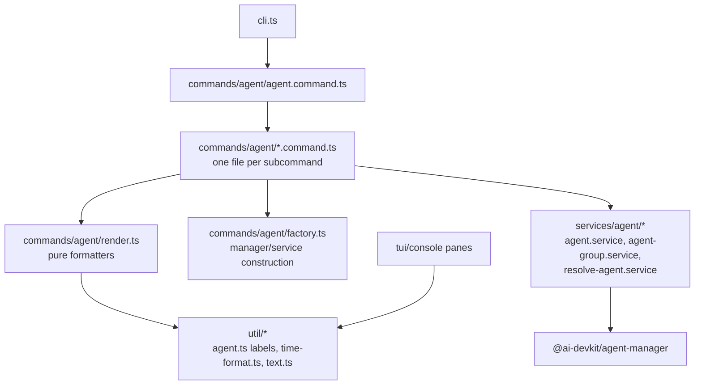

# System Design & Architecture

## Architecture Overview

**What is the high-level system structure?**



- `commands/agent/agent.command.ts` — `registerAgentCommand(program)` creates the `agent` group and delegates to per-subcommand registrars. Public contract unchanged (`cli.ts:57` import path updates only if file moves; keep a same-named export).
- `commands/agent/<name>.command.ts` — commander wiring: options, `.action()` with `withErrorHandler`, `ui.*` output calls. No fs/process/manager logic inline.
- `commands/agent/render.ts` — pure presentation: `formatCwd`, `formatSeparator`, `formatWorkOn`, `resolveTailCount`, `selectConversationMessages`, `renderConversationDetail`, table row builders.
- `commands/agent/factory.ts` — `createAgentManager`, `createDurableAgentService`, `createCommandSendReporter`, `resolveSendMessage`/`readStdin`, `NAME_REGEX`.
- `services/agent/resolve-agent.ts` — shared resolution: list + `resolveAgent` + "none found"/"multiple match" reporting via a reporter interface, plus the durable-vs-interactive ambiguity check. Consumed by open/kill/detail/send; reusable by `services/channel/channel-runner.ts`.
- `util/agent.ts` — single label map: `AGENT_TYPE_LABELS` + `agentTypeLabel(type)` + new `agentTypeLabelCompact(type)` (absorbs `render/agentTypeLabel.ts`).
- `util/time-format.ts` — single formatter set: `formatRelativeOrAbsoluteTime` gains a compact variant absorbing `formatRelative` and `formatRelativeTime`.

## Data Models

**What data do we need to manage?**

No new data models. The shared resolver returns the existing `AgentInfo` / durable entry types from `@ai-devkit/agent-manager` and `DurableAgentRepository`.

Suggested resolver shape:

```ts
type ResolveReport =
  | { kind: "none"; candidates: AgentInfo[] }
  | { kind: "multiple"; matches: AgentInfo[] }
  | { kind: "single"; agent: AgentInfo };

resolveAgentOrReport(manager, id, reporter) -> AgentInfo | null
resolveDurableAmbiguity(id, durable, liveAgents) -> Error | null
```

## API Design

**How do components communicate?**

- Internal only. `registerAgentCommand(program: Command): void` remains the single export consumed by `cli.ts`.
- Each subcommand file exports `register<Name>Command(agentCommand: Command): void`.
- Command handlers call `services/agent/*` for logic and `commands/agent/render.ts` for formatting; `ui.*` stays at the command layer.

## Component Breakdown

**What are the major building blocks?**

| New file | Contents (moved from `agent.ts`) |
|---|---|
| `start.command.ts` | `agent start` action + validation error mapping |
| `list.command.ts` | `agent list` incl. durable table |
| `sessions.command.ts` | `agent sessions` |
| `session.command.ts` | `agent session detail` + `session compact` |
| `open.command.ts` | `agent open` incl. `select` prompt on ambiguity |
| `send.command.ts` | `agent send` incl. durable routing |
| `kill.command.ts` | `agent kill` |
| `detail.command.ts` | `agent detail` incl. durable detail path |
| `rename.command.ts` | `agent rename` |
| `console.command.ts` | `agent console` |
| `render.ts` | pure formatters listed above |
| `factory.ts` | factories, stdin plumbing, `NAME_REGEX` |

## Design Decisions

**Why did we choose this approach?**

- One-file-per-subcommand matches the existing `commands/skill/` + `commands/status/` + `commands/capacity/` convention and `commands/agent/group.command.ts` precedent.
- Formatters go to `commands/agent/render.ts`, not `services/` — they're presentation, same boundary as `commands/status/render.ts` and `commands/skill/skill.render.ts`. (Confirmed in requirements.)
- Reporter-style extraction for agent resolution keeps per-command UX differences (interactive `select` in `open`, hard error in `kill`) while deleting the copy-pasted list/resolve/report skeleton.
- Label maps: `util/agent.ts` is the canonical map (complete, 11 types). Compact labels become an explicit variant instead of a second partial map that silently lacked 7 types.
- Time formatting: `util/time-format.ts` wins as the shared home; the console's compact relative format becomes an option there.
- Alternatives considered: single `commands/agent/` barrel with sections (rejected — still one god-file worth of imports); moving render helpers into `services/` (rejected — wrong layer, confirmed by boundary decision).

## Non-Functional Requirements

**How should the system perform?**

- Pure refactor: no performance, security, or availability changes expected.
- `channel-start`/`channel-stop` console actions keep spawning `--daemon` subprocesses — untouched.
- Test suite acts as the regression net; no public CLI output changes.
