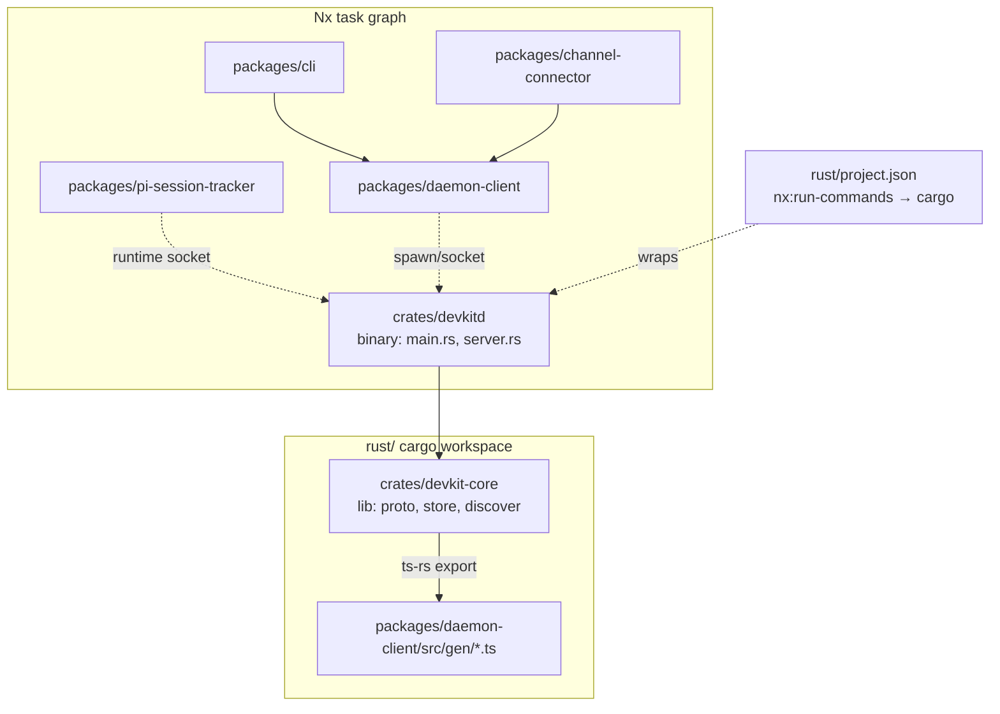

# Design — devkitd-monorepo

## Architecture overview



The daemon binary shrinks to transport + lifecycle (`main.rs`, `server.rs`).
Everything reusable — the wire protocol (`proto`), the SQLite store
(`store`), process discovery (`discover`) — moves to `devkit-core`, the
library crate every future Rust component (harness parsers, tools) depends
on.

## Crate layout

```
rust/
├── Cargo.toml            # workspace: members = ["crates/*"]
├── Cargo.lock
├── project.json          # NEW: Nx project wrapping cargo
└── crates/
    ├── devkitd/
    │   ├── Cargo.toml    # bin crate, deps: devkit-core, tokio, tracing, libc
    │   └── src/{main.rs, server.rs}
    └── devkit-core/
        ├── Cargo.toml    # lib crate, deps: serde, serde_json, rusqlite,
        │                 #   anyhow; dev-deps: ts-rs
        └── src/{lib.rs, proto.rs, store.rs, discover.rs}
```

`devkitd` keeps `serve`/`install`/`status` subcommands unchanged. Crate names
use kebab-case (`devkit-core`), modules unchanged.

## Wire contract: single source of truth in Rust

`proto.rs` types get `#[derive(TS)]` + `#[ts(export)]` from `ts-rs`:

- `Event` → `packages/daemon-client/src/gen/Event.ts`
- `Request`, `Response` likewise exported for tests/client internals.

ts-rs exports bindings during `cargo test -p devkit-core` (the standard
`#[test] fn export_bindings()` calling `TS::export_all`). Generated files are
**checked in** — pure-TS builds never need cargo; drift is caught because
`cargo test` regenerates and dirties the tree (CI runs cargo tests).

`client.ts` replaces its hand-written `DaemonEvent` interface with a re-export
of the generated `Event` type; field names match (`seq, ts, kind, payload`)
so no behavior change. `payload` types as `unknown` on the TS side
(`serde_json::Value` → `any`/`unknown`).

## Nx integration

`rust/project.json` follows the existing per-package `nx:run-commands`
convention (same shape as `packages/agent-manager/project.json`):

| Target | Command |
|---|---|
| `build` | `cargo build --workspace` |
| `build:release` | `cargo build --workspace --release` |
| `test` | `cargo test --workspace` |
| `lint` | `cargo clippy --workspace --all-targets -- -D warnings` |
| `fmt` | `cargo fmt --all` |
| `fmt:check` | `cargo fmt --all -- --check` |

Inputs: `rust/**/*.rs`, `rust/**/Cargo.toml`, `rust/Cargo.lock`. Outputs
declare `{workspaceRoot}/rust/target` for completeness, but caching is
limited to "skip when inputs unchanged" — cargo owns incremental
correctness; we do not let Nx restore `target/` artifacts (gigabytes, and
cargo's own fingerprinting is authoritative).

`daemon-client` does **not** `dependsOn` the rust build: shipping resolves
platform packages, dev resolves `rust/target/` at runtime. The gen/ files
are checked in, so `daemon-client:build` stays cargo-free.

## Rename: ai-devkitd → devkitd

Unreleased feature → clean rename, no filename back-compat:

| Surface | Change |
|---|---|
| `rust/ai-devkitd/` → `rust/crates/devkitd/` | crate + bin name `devkitd` |
| `binary.ts` | binary names → `devkitd`/`devkitd.exe`; `~/.ai-devkit/bin/devkitd`; `rust/target/*/devkitd`; env `DEVKITD_BIN` primary, `AI_DEVKITD_BIN` deprecated alias; platform pkg `@ai-devkit/devkitd-<plat>-<arch>` |
| `autostart.ts` | env checks updated (same dual-env rule) |
| `daemon.ts` (cli) | descriptions + error text; `AI_DEVKITD_BIN` mention → `DEVKITD_BIN` |
| `main.rs` | usage string; systemd unit `devkitd.service` |
| `integration.test.ts`, `client.test.ts` | binary name references |
| `docs/ai/*/2026-10-07-feature-rust-daemon.md` | update code-facing names (binary, crate paths); keep historical narrative |

**Unchanged**: socket `~/.ai-devkit/daemon.sock`, db `daemon.db`, log
`daemon.log`, lockfile `daemon.sock.spawn.lock`, env `AI_DEVKIT_NO_DAEMON`
(product-scoped, not daemon-scoped), npm package `@ai-devkit/daemon-client`,
CLI command `ai-devkit daemon`.

Rationale: product-scoped paths stay stable (the socket is ai-devkit's daemon
socket regardless of binary name); only the binary artifact renames.

## Decisions

1. **Check in generated types** over build-time codegen: zero toolchain
   coupling for TS consumers; drift caught by cargo tests in CI.
2. **Nx wraps cargo, never replaces it**: `nx:run-commands` only; cargo
   remains the sole Rust build authority. Rejected: `@nxrs/cargo`-style
   plugins (extra dep for no capability gain) and Nx caching `target/`
   (size, fingerprint conflicts).
3. **devkit-core holds proto+store+discover**, not just proto: the knowledge
   port needs store/discover too (e.g., a `devkit-harness` crate writing
   enriched agent rows), and splitting later costs more than splitting now.
4. **`server.rs` stays in `devkitd`**: it's the transport/lifecycle edge, not
   a reusable library concern. Rejected moving it to core (no second caller).
5. **Dual env var** `DEVKITD_BIN` / `AI_DEVKITD_BIN` alias: one `??` in the
   resolver; protects anyone already pointing the old var at a binary.

## Risks / non-functional

- `git mv` preserves history for moved files; the rename diff is reviewable.
- ts-rs version pinned ≥7 days old per repo convention.
- No protocol shape changes — wire compat with the unreleased daemon is
  preserved (same method names, same event kinds).
