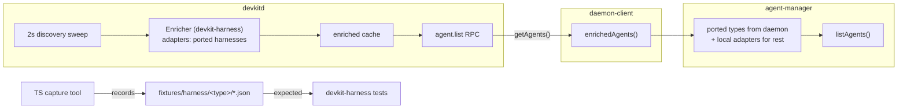

# Design — Harness Port Foundation (I0)

Requirements: `../requirements/2026-10-08-feature-harness-port-foundation.md`
Epic: `../planning/2026-10-08-epic-harness-port.md`

## Architecture



## Data model (wire contract)

`EnrichedAgent` mirrors `AgentInfo` field-for-field:

```rust
pub struct EnrichedAgent {
    pub name: String,
    pub agent_type: String,        // "claude" | "codex" | ... | "other"
    pub status: String,            // "running"|"waiting"|"idle"|"unknown"
    pub summary: String,
    pub pid: u64,
    pub project_path: String,
    pub session_id: String,
    pub last_active: String,       // ISO-8601 (TS `Date` already crosses as string)
    pub pinned: Option<bool>,
    pub session_file_path: Option<String>,
}
```

Field names serialize with serde camelCase (`agentType`→`type` handled via
`#[serde(rename = "type")]`) so the wire shape matches TS `AgentInfo` exactly.

`agent.list` response:

```json
{ "agents": [EnrichedAgent...], "ported": ["claude", ...] }
```

`ported` is the contract that makes incremental rollout safe: the client uses
daemon data for those types only, local adapters for everything else. In I0,
`ported: []`, `agents: []`.

## Components

### `devkit-core/src/agent.rs`

- `EnrichedAgent` (above) + `EnrichedAgent[] { agents, ported }`, both
  `Serialize + Deserialize + TS`, exported via the existing
  `export_ts_bindings` test → `packages/daemon-client/src/gen/`.
- Chosen over devkit-harness for the type: `devkitd` serves the RPC without
  linking the harness crate for its type only. (Resolves open item 1.)

### `rust/crates/devkit-harness`

```rust
pub struct SweepContext {
    pub processes: Vec<ProcessRow>,   // from devkit-core discovery snapshot
    pub now: i64,                     // frozen sweep time
}

pub trait HarnessAdapter: Send + Sync {
    fn type_id(&self) -> &'static str;
    fn can_handle(&self, proc: &ProcessRow) -> bool;
    fn detect(&self, ctx: &SweepContext) -> Vec<EnrichedAgent>;
}

pub struct Registry { adapters: Vec<Box<dyn HarnessAdapter>> }
impl Registry {
    pub fn ported_types(&self) -> Vec<String>;
    pub fn enrich(&self, ctx: &SweepContext) -> EnrichedAgent[];
}
```

I0 ships the trait + registry + a `MockAdapter` smoke test. Real adapters
land in I1+.

### `devkitd` wiring

- `Daemon` gains `enricher: devkit_harness::Registry` + `enriched:
  RwLock<EnrichedAgent[]>` refreshed inside `apply_sweep` — enrichment
  cost is per-sweep, not per-RPC (requirement: N clients never multiply
  parse work).
- New method `agent.list` → returns cached `EnrichedAgent[]`.

### daemon-client

- `client.enrichedAgents(): Promise<EnrichedAgent[]>` using generated
  types; surfaced as `getAgents()` convenience.
- AgentManager integration (the ported/local merge) lands in I1 when the
  first real type exists — wiring it now with `ported: []` is dead code.
  I0 ships the client API + a per-call whole-result fallback contract.

### Fixture tool — `packages/agent-manager/src/fixtures/`

- `capture.ts`: for each adapter, run `detectAgents` against a recorded
  input set; emit `fixtures/harness/<type>/<case>.json`:
  `{capturedAt, processes: ProcessInfo[], files: {relpath: content},
  expected: AgentInfo[]}`.
- Determinism: script monkeypatches `Date` to a frozen instant before
  importing adapters (`lastActive: new Date()` paths); all absolute paths
  normalized to a `$FIXTURE_HOME` placeholder.
- Two input sources: (a) **live capture** — snapshot real `ps` + real
  session dirs (path-sanitized), realistic data for free; (b) **synthetic
  cases** authored per-harness during its iteration for edge cases the live
  machine doesn't exhibit.
- `replay.ts`: materialize a bundle into a temp dir → run adapter → deep
  compare vs `expected`. I0 validates the tool by round-tripping claude's
  adapter against its own bundle (TS↔TS); Rust consumes the same bundles in
  I1+.

## Design decisions

- **Registry merge stays client-side for I0** (daemon returns detection
  results only; `AgentManager` still merges names/pinned). Rationale: the
  rename/pin write path is TS-owned; moving it is a cutover concern, not a
  foundation one.
- **String enums on the wire**, not Rust enums — `"other"` and future
  harness types pass through without schema churn.
- **`agent.list` untouched** — raw rows remain for cheap consumers.
- Verified assumption: zero network I/O in any `detectAgents` — all
  adapters are `fs`-only, safe inside the daemon's sweep thread.
- Blocking work caveat (carried from v1): session parsing runs inside the
  sweep task; if a port ever gets expensive, move enrichment to
  `tokio::task::spawn_blocking`. Noted, not built in I0.

## Security / performance

- No new trust surface: unix socket, same-uid, `0600` — unchanged.
- Fixture bundles from live capture must sanitize `$HOME` prefixes; a
  pre-commit-style check in the capture tool refuses absolute user paths.
- Parse cost is per-sweep and cache-served; `agent.list` itself is O(1)
  over a prebuilt list.
