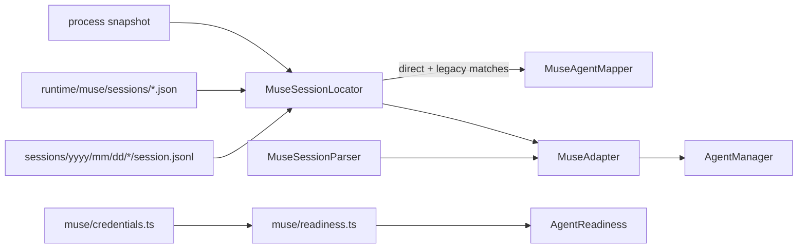

# System Design & Architecture

## Architecture

New `muse/` harness mirroring the `claude/` and `codex/` layout. Detection joins two sources:
the small live set (`runtime/muse/sessions/*.json`) and the dated archive
(`sessions/yyyy/mm/dd/<uuid>/session.jsonl`).

## Components

- `MuseSessionLocator`: three-stage match like Claude's — runtime-file PID match (authoritative,
  with a start-time staleness guard), then archive fallback by session id, then legacy
  cwd+birthtime heuristic. Enumerates the archive with a flatten walk + UUID regex, mtime
  cache, excluding `subagent/`, `approval-review/`, logs, and sqlite files.
- `MuseSessionParser`: two-stage framed parse (outer line, then inner `record_json`) dispatched
  on `payload_type`; extracts user/assistant messages, first-user-message filtering, µs→ms
  timestamps, `workspace_root`/`model_id` from metadata payloads. Spike alternative: `muse export`
  JSON document (decided in planning; see open item).
- `MuseAgentMapper`: name from `workspace_label`/`session_name`, summary from last user prompt,
  status from tail heuristic (no published live status exists).
- `MuseAdapter`: registers `muse` in `AGENT_TYPES`, `processNames` covering the
  `muse-bin-<version>-<build>` shape, `canHandle`, `detectAgents`, tail-efficient
  `getConversation`, `listSessions`, `findSessionsById` (runtime-first).
- Type-forced registration checklist (all three are `Record` over every `AGENT_TYPES`
  member, so the compiler enforces them): `HARNESS_RUNTIME_PROFILES.muse` in
  `runtimeProfiles.ts` using a `matchArgv0Name("muse")`-style matcher (argv0 basenames look
  like `muse-bin-1.4.4-R5419.1`, so exact-name matching fails); `READINESS_PROFILES.muse`
  in `AgentReadiness.ts` pointing at `muse/readiness.ts`; adapter instance in
  `createBuiltinAdapters()`. The readiness `executableCheck` resolves the profile's
  `command`, so the profile command must be `muse` (on PATH).
- `muse/readiness.ts` + `muse/credentials.ts`: executable on PATH, `~/.config/muse/` dir,
  `auth.json` state, built-in skills presence — reusing the shared readiness checks.

## Data Models

- Runtime entry: `{ schema_version, session_id, session_name|null, endpoint_hint?,
  workspace_label?, target_eligibility?, process_generation_hint: "pid=<n>" }`.
- Transcript frame: `{ retained_frame, record_json: string, ... }` with inner
  `{ stream:{kind,id}, sequence, recorded_at(µs), record_type, payload_type, payload }`.
- Outputs reuse `AgentInfo`, `SessionSummary`, `ConversationMessage` unchanged.

## Design Decisions

- Runtime-first lookup everywhere: the live set is tiny, the archive walk is cached.
- Exclude, never parse, non-transcript files; require `session.jsonl` presence per session dir.
- Verbatim session-id round-trip for `muse resume` compatibility.
- Read-only: no writes under Muse directories; temp files only if the export path wins the spike.

## Security / Performance

- Tolerate `0600` files; skip unreadable entries instead of failing enumeration.
- Never log transcript content or the export document (bundles encrypted reasoning).
- Tail reads scale with the tail; full-file reads only where the caller asks for full history.
- One cached archive walk per refresh; keyed invalidation by directory mtime.

## Open Items

- Parser vs `export` spike outcome (cost/latency/freshness comparison on a large transcript).
- Status heuristic definition (which tail payloads map to running/waiting/idle).
