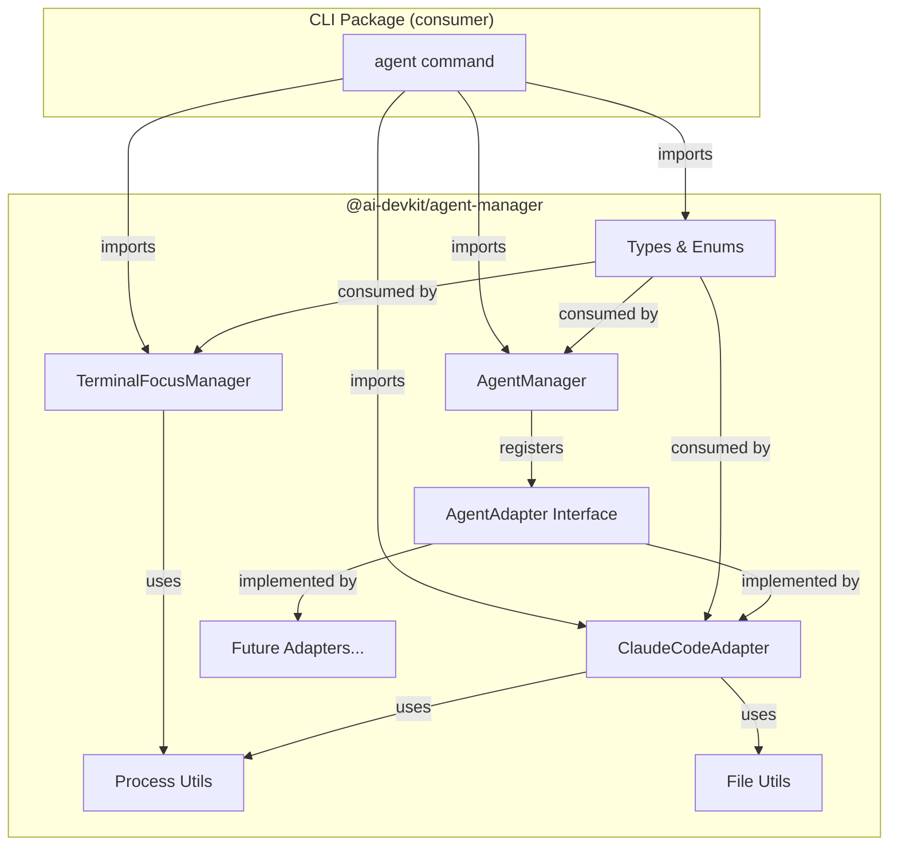

# Design: @ai-devkit/agent-manager Package

## Architecture Overview



### Package Directory Structure

```
packages/agent-manager/
├── src/
│   ├── index.ts                    # Public API barrel export
│   ├── AgentManager.ts             # Core orchestrator
│   ├── adapters/
│   │   ├── AgentAdapter.ts         # Interface, types, enums
│   │   ├── ClaudeCodeAdapter.ts    # Claude Code detection
│   │   └── index.ts                # Adapter barrel export
│   ├── terminal/
│   │   ├── TerminalFocusManager.ts # Terminal focus (macOS)
│   │   └── index.ts                # Terminal barrel export
│   └── utils/
│       ├── process.ts              # Process detection utilities
│       ├── file.ts                 # File reading utilities
│       └── index.ts                # Utils barrel export
├── src/__tests__/
│   ├── AgentManager.test.ts
│   └── adapters/
│       └── ClaudeCodeAdapter.test.ts
├── package.json
├── tsconfig.json
├── jest.config.js
├── project.json
└── .eslintrc.json
```

## Data Models

All types are extracted from the existing `AgentAdapter.ts` without changes:

- **AgentType**: `'Claude Code' | 'Gemini CLI' | 'Codex' | 'Other'`
- **AgentStatus**: Enum (`RUNNING`, `WAITING`, `IDLE`, `UNKNOWN`)
- **StatusConfig**: `{ emoji, label, color }`
- **AgentInfo**: Full agent information (name, type, status, pid, projectPath, sessionId, slug, lastActive, etc.)
- **ProcessInfo**: `{ pid, command, cwd, tty }`
- **AgentAdapter**: Interface with `type`, `detectAgents()`, `canHandle()`
- **TerminalLocation**: `{ type, identifier, tty }` (from TerminalFocusManager)

## API Design

### Public Exports (`index.ts`)

```typescript
// Core
export { AgentManager } from './AgentManager';

// Adapters
export { ClaudeCodeAdapter } from './adapters/ClaudeCodeAdapter';
export type { AgentAdapter } from './adapters/AgentAdapter';
export { AgentStatus, STATUS_CONFIG } from './adapters/AgentAdapter';
export type { AgentType, AgentInfo, ProcessInfo, StatusConfig } from './adapters/AgentAdapter';

// Terminal
export { TerminalFocusManager } from './terminal/TerminalFocusManager';
export type { TerminalLocation } from './terminal/TerminalFocusManager';

// Utilities
export { listProcesses, getProcessCwd, getProcessTty, isProcessRunning, getProcessInfo } from './utils/process';
export type { ListProcessesOptions } from './utils/process';
export { readLastLines, readJsonLines, fileExists, readJson } from './utils/file';
```

### Usage Example

```typescript
import { AgentManager, ClaudeCodeAdapter } from '@ai-devkit/agent-manager';

const manager = new AgentManager();
manager.registerAdapter(new ClaudeCodeAdapter());

const agents = await manager.listAgents();
agents.forEach(agent => {
  console.log(`${agent.name}: ${agent.statusDisplay}`);
});
```

## Component Breakdown

### 1. AgentManager (core orchestrator)
- Adapter registration/unregistration
- Agent listing with parallel adapter queries
- Agent resolution (exact/partial name matching)
- Status-based sorting
- **Extracted from**: `packages/cli/src/lib/AgentManager.ts`
- **Changes**: None — direct copy

### 2. AgentAdapter + Types (interface layer)
- Interface contract for adapters
- Type definitions and enums
- Status display configuration
- **Extracted from**: `packages/cli/src/lib/adapters/AgentAdapter.ts`
- **Changes**: None — direct copy

### 3. ClaudeCodeAdapter (concrete adapter)
- Claude Code process detection via `ps aux`
- Session file reading from `~/.claude/projects/`
- Status determination from JSONL entries
- History-based summary extraction
- **Extracted from**: `packages/cli/src/lib/adapters/ClaudeCodeAdapter.ts`
- **Changes**: Import paths updated to use local `utils/` instead of `../../util/`

### 4. TerminalFocusManager (terminal control)
- Terminal emulator detection (tmux, iTerm2, Terminal.app)
- Terminal window/pane focusing
- macOS-specific AppleScript integration
- **Extracted from**: `packages/cli/src/lib/TerminalFocusManager.ts`
- **Changes**: Import paths updated to use local `utils/process`

### 5. Process Utilities
- `listProcesses()` — system process listing with filtering
- `getProcessCwd()` — process working directory lookup
- `getProcessTty()` — process TTY device lookup
- `isProcessRunning()` — process existence check
- `getProcessInfo()` — detailed single-process info
- **Extracted from**: `packages/cli/src/util/process.ts`
- **Changes**: `ProcessInfo` type import updated (now from `../adapters/AgentAdapter`)

### 6. File Utilities
- `readLastLines()` — efficient last-N-lines reading
- `readJsonLines()` — JSONL file parsing
- `fileExists()` — file existence check
- `readJson()` — safe JSON file parsing
- **Extracted from**: `packages/cli/src/util/file.ts`
- **Changes**: None — direct copy

## Design Decisions

| Decision | Choice | Rationale |
|----------|--------|-----------|
| Package name | `@ai-devkit/agent-manager` | Consistent with `@ai-devkit/memory` naming |
| Build system | `tsc` (not SWC) | Simpler setup; no special transforms needed; consistent with CLI package |
| Runtime deps | Zero | Only Node.js built-ins used; keeps package lightweight |
| Include TerminalFocusManager | Yes, as separate module | Useful for consumers; closely related to agent management |
| Include utilities | Yes, within package | They're tightly coupled to adapter implementation; not general-purpose enough for a separate package |
| Test framework | Jest with ts-jest | Matches existing monorepo conventions |

## Non-Functional Requirements

### Performance
- Process listing uses `ps aux` (single exec, ~50ms typical)
- Session file reading limited to last 100 lines for large JSONL files
- Adapter queries run in parallel via `Promise.all`

### Platform Support
- Process detection: macOS and Linux (uses `ps aux`, `lsof`, `pwdx`)
- Terminal focus: macOS only (AppleScript for iTerm2/Terminal.app, tmux universal)

### Security
- No external network calls
- Reads only from `~/.claude/` directory (user-owned)
- Process inspection uses standard OS tools
- No secrets or credentials handled
