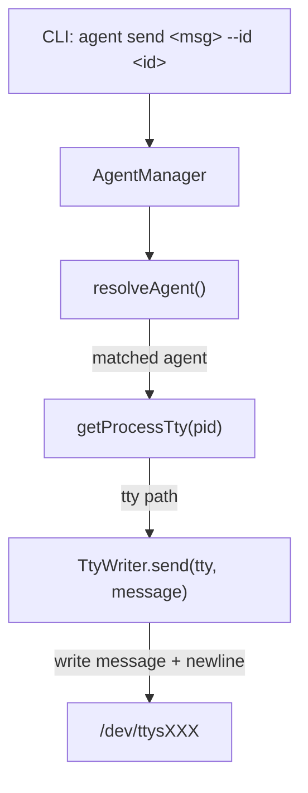

# Agent Send Command - Design

## Architecture Overview



The flow is:
1. CLI parses `--id` flag and message argument
2. `AgentManager.listAgents()` detects all running agents
3. `AgentManager.resolveAgent(id, agents)` finds the target
4. `getProcessTty(pid)` resolves the agent's TTY device
5. `TtyWriter.send(tty, message)` writes message + `\n` to the TTY

## Data Models

No new data models needed. Reuses existing:
- `AgentInfo` (from `AgentAdapter.ts`) - contains `pid`, `name`, `slug`, `status`
- `ProcessInfo` (from `AgentAdapter.ts`) - contains `tty`

## API Design

### CLI Interface

```
ai-devkit agent send <message> --id <identifier>
```

- `<message>`: Required positional argument. The text to send.
- `--id <identifier>`: Required flag. Agent name, slug, or partial match string.

### New Module: TtyWriter

Location: `packages/agent-manager/src/terminal/TtyWriter.ts`

```typescript
export class TtyWriter {
  /**
   * Send a message to a TTY device
   * @param tty - Short TTY name (e.g., "ttys030")
   * @param message - Text to send
   * @param appendNewline - Whether to append \n (default: true)
   * @throws Error if TTY is not writable
   */
  static async send(tty: string, message: string, appendNewline?: boolean): Promise<void>;
}
```

Implementation: Opens `/dev/${tty}` for writing via `fs.writeFile` and writes `message + '\r'`. Uses `\r` (carriage return) instead of `\n` because interactive CLIs like Claude Code run in raw terminal mode where Enter sends CR (0x0D), not LF (0x0A).

## Component Breakdown

### 1. TtyWriter (new) - `agent-manager` package
- Single static method `send(tty, message, appendNewline)`
- Opens TTY device file for writing
- Writes message (+ optional newline)
- Validates TTY exists and is writable before writing

### 2. CLI `agent send` subcommand (new) - `cli` package
- Registers under existing `agentCommand`
- Parses `<message>` positional arg and `--id` required option
- Uses `AgentManager` to list and resolve agent
- Uses `getProcessTty()` to get TTY
- Uses `TtyWriter.send()` to deliver message
- Displays success/error feedback via `ui`

### 3. Export from agent-manager (update)
- Export `TtyWriter` from `packages/agent-manager/src/terminal/index.ts`
- Export from `packages/agent-manager/src/index.ts`

## Design Decisions

| Decision | Choice | Rationale |
|----------|--------|-----------|
| Delivery mechanism | TTY write | Cross-terminal-emulator, fast, no dependency on tmux/AppleScript |
| Agent identification | `--id` flag only | Explicit, avoids confusion with positional args |
| Auto-submit | Append `\r` (CR) | Interactive CLIs run in raw mode where Enter = `\r` (0x0D), not `\n` (0x0A). Appending `\r` triggers submit. |
| Embedded newlines | Send as-is (single write) | Write the entire message in one TTY write, then append `\r`. No line-by-line splitting. |
| Module location | `TtyWriter` in agent-manager | Reusable by other features; keeps terminal logic together |

## Non-Functional Requirements

- **Performance**: TTY write is near-instant; no meaningful latency concern
- **Security**: Only writes to TTY devices the current user has permission to access (OS-level enforcement)
- **Reliability**: Validates TTY exists before writing; clear error on failure
- **Portability**: Works on macOS and Linux (both use `/dev/ttyXXX` convention)
