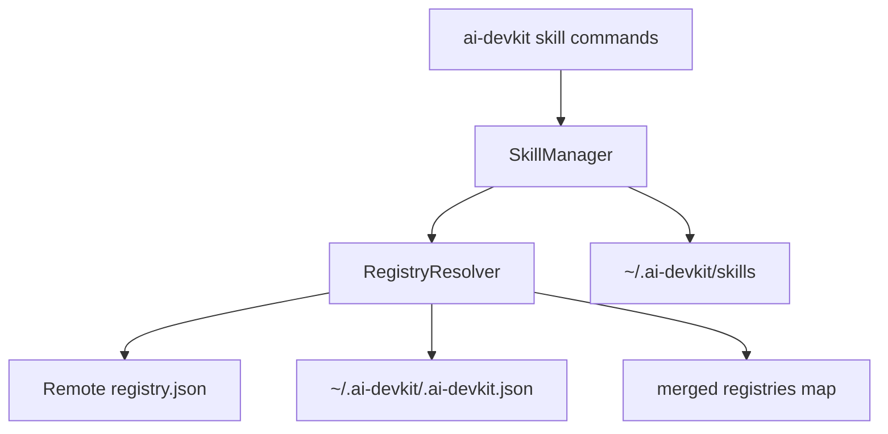

# System Design & Architecture

## Architecture Overview

**What is the high-level system structure?**

- Add a registry resolution layer that merges default and custom registries before skill operations.
- Default registry remains fetched from the current remote registry JSON.
- Custom registries are read from a global `.ai-devkit.json`.
- Skill commands use the merged registry map with local overrides.



## Data Models

**What data do we need to manage?**

- Global config (new or extended):
  - `skills.registries` (map of `registryId -> gitUrl`)
- Registry JSON (existing):
  - `registries` map of registry IDs to Git URLs

Example global config snippet:

```json
{
  "skills": {
    "registries": {
      "my-org/skills": "git@github.com:my-org/skills.git",
      "me/personal-skills": "https://github.com/me/personal-skills.git"
    }
  }
}
```

## API Design

**How do components communicate?**

- CLI commands (`skill add`, `skill list`, `skill remove`, `skill update`, `skill search`) call `SkillManager`.
- `SkillManager` uses a new helper (e.g., `RegistryResolver`) to:
  - Load default registry (remote JSON).
  - Load custom registries from global config.
  - Merge with custom overrides on conflict.
- No external API changes; internal interface remains synchronous with current workflow.

## Component Breakdown

**What are the major building blocks?**

- `SkillManager`: update to use merged registries for all commands.
- `GlobalConfigManager` (new): read/write `~/.ai-devkit/.ai-devkit.json`.
- `RegistryResolver` (new or within SkillManager): merge registry sources.
- Cache handler (existing): reuse `~/.ai-devkit/skills`.

## Design Decisions

**Why did we choose this approach?**

- Use existing registry format to avoid new parsing logic.
- Keep CLI UX unchanged by merging sources before lookup.
- Local override provides predictable behavior for conflicts.
- Cache reuse enables offline workflows without new storage systems.

Alternatives considered:

- Separate registry list files per project (rejected: requirement is global).
- Display registry source in list output (rejected: keep seamless UX).

## Non-Functional Requirements

**How should the system perform?**

- Performance: avoid repeated registry downloads by caching and only fetching when needed.
- Scalability: support many registries by merging maps and cloning on demand.
- Security: rely on git and local credentials; no credential handling in CLI.
- Reliability: fall back to cache when remote registry is unavailable.

