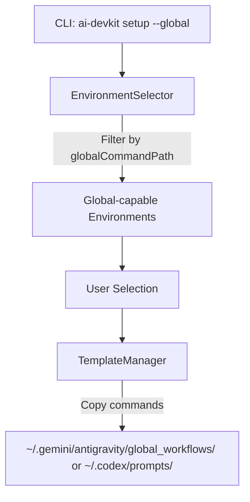

# System Design & Architecture - Global Setup Feature

## Architecture Overview
**What is the high-level system structure?**



**Key components and their responsibilities:**
- **CLI (`src/cli.ts`)**: Adds new `setup` command with `--global` flag
- **EnvironmentSelector (`src/lib/EnvironmentSelector.ts`)**: New method to select only global-capable environments
- **TemplateManager (`src/lib/TemplateManager.ts`)**: New method to copy commands to global folders
- **Environment Definitions (`src/util/env.ts`)**: New `globalCommandPath` property to indicate global support

**Technology stack choices:**
- Use existing `fs-extra` for file operations with `os.homedir()` for home directory resolution
- Use existing `inquirer` for user prompts

## Data Models
**What data do we need to manage?**

### EnvironmentDefinition (Updated)
```typescript
export interface EnvironmentDefinition {
  code: string;
  name: string;
  contextFileName: string;
  commandPath: string;
  description?: string;
  isCustomCommandPath?: boolean;
  customCommandExtension?: string;
  globalCommandPath?: string; // NEW: Path relative to home dir for global commands
}
```

### Environment Definitions with Global Support
```typescript
antigravity: {
  code: 'antigravity',
  name: 'Antigravity',
  contextFileName: 'AGENTS.md',
  commandPath: '.agent/workflows',
  globalCommandPath: '.gemini/antigravity/global_workflows', // NEW
},
codex: {
  code: 'codex',
  name: 'OpenAI Codex',
  contextFileName: 'AGENTS.md',
  commandPath: '.codex/commands',
  globalCommandPath: '.codex/prompts', // NEW
}
```

## API Design
**How do components communicate?**

### New CLI Command
```bash
ai-devkit setup --global
```

### New/Modified Functions

**`src/util/env.ts`:**
```typescript
// Get only environments that support global setup
export function getGlobalCapableEnvironments(): EnvironmentDefinition[];

// Check if an environment supports global setup
export function hasGlobalSupport(envCode: EnvironmentCode): boolean;
```

**`src/lib/EnvironmentSelector.ts`:**
```typescript
// Select from global-capable environments only
async selectGlobalEnvironments(): Promise<EnvironmentCode[]>;
```

**`src/lib/TemplateManager.ts`:**
```typescript
// Copy commands to global folder
async copyCommandsToGlobal(envCode: EnvironmentCode): Promise<string[]>;

// Check if global commands exist
async checkGlobalCommandsExist(envCode: EnvironmentCode): Promise<boolean>;
```

## Component Breakdown
**What are the major building blocks?**

### 1. Types Update (`src/types.ts`)
- Add `globalCommandPath?: string` to `EnvironmentDefinition`

### 2. Environment Definitions Update (`src/util/env.ts`)
- Add `globalCommandPath` to Antigravity and Codex definitions
- Add `getGlobalCapableEnvironments()` function
- Add `hasGlobalSupport()` function

### 3. EnvironmentSelector Update (`src/lib/EnvironmentSelector.ts`)
- Add `selectGlobalEnvironments()` method that filters to global-capable envs

### 4. TemplateManager Update (`src/lib/TemplateManager.ts`)
- Add `copyCommandsToGlobal()` method
- Add `checkGlobalCommandsExist()` method
- Handle home directory resolution with `os.homedir()`

### 5. New Setup Command (`src/commands/setup.ts`)
- Create new command file for `setup --global`
- Handle environment selection, overwrite prompts, and file copying

### 6. CLI Update (`src/cli.ts`)
- Add `setup` command with `--global` flag

## Design Decisions
**Why did we choose this approach?**

1. **Separate `setup` command vs. extending `init`:**
   - Chosen: New `setup` command with `--global` flag
   - Rationale: Keeps concerns separated; `init` is for project setup, `setup --global` is for global setup

2. **`globalCommandPath` property on EnvironmentDefinition:**
   - Chosen: Optional property that indicates global support
   - Rationale: Extensible - any environment can add global support by defining this property
   - Alternative considered: Separate `GLOBAL_ENVIRONMENTS` constant - less flexible

3. **File extension handling:**
   - Chosen: Use `.md` format for both Antigravity and Codex global commands
   - Rationale: Antigravity global workflows use `.md` format (same as local `.agent/workflows/`), Codex prompts also use `.md`
   - Note: Unlike regular Gemini which uses `.toml`, Antigravity global is different

4. **Overwrite behavior:**
   - Chosen: Check for existing files and prompt user
   - Rationale: Prevents accidental data loss of customized commands

5. **Cross-platform support:**
   - Chosen: Use `os.homedir()` and `path.join()` for path resolution
   - Rationale: Works consistently on macOS, Linux, and Windows

## Non-Functional Requirements
**How should the system perform?**

**Reliability:**
- Gracefully handle missing home directory
- Create global folders if they don't exist
- Provide clear error messages if file operations fail

**Usability:**
- Clear prompts for environment selection
- Informative success/error messages
- Consistent with existing `init` command UX
