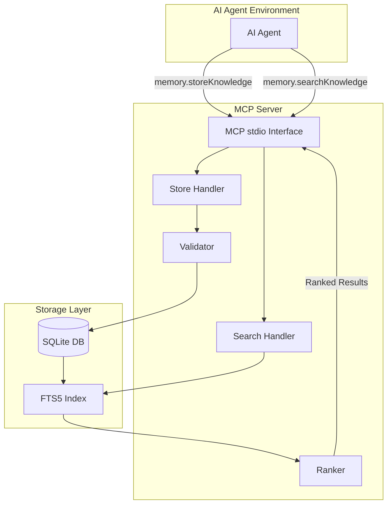
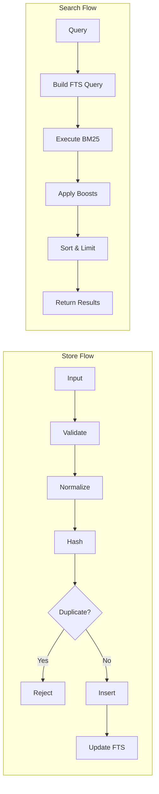

# System Design & Architecture

## Architecture Overview
**What is the high-level system structure?**



### Key Components and Responsibilities

| Component | Responsibility |
|-----------|----------------|
| **MCP stdio Interface** | Handle JSON-RPC protocol, parse tool calls, return results |
| **Store Handler** | Process storage requests, validate input, check duplicates |
| **Search Handler** | Parse search queries, build FTS5 queries, coordinate ranking |
| **Validator** | Ensure knowledge quality (specific, actionable, not generic) |
| **Ranker** | Combine BM25 scores with tag matches and scope boosts |
| **SQLite + FTS5** | Persistent storage with full-text search indexing |

### Ranking Algorithm

The ranker combines BM25 with context signals for a simple, effective ranking:

```
final_score = bm25_score × tag_boost + scope_boost

Where:
  bm25_score = FTS5 bm25() with column weights (title=10, content=5, tags=1)
  tag_boost  = 1 + (matching_tags × 0.1)    // +10% per matching contextTag
  scope_boost = +0.5 if scope matches query scope, +0.2 if global, 0 otherwise
```

**Ranking Priority** (highest to lowest):
1. Project-scoped results matching query scope
2. High BM25 score (title matches weighted highest)
3. Items with matching contextTags
4. Global scope items

### Technology Stack
- **Runtime**: Node.js (v18+)
- **Database**: SQLite3 with FTS5 extension
- **Protocol**: MCP (Model Context Protocol) over stdio
- **Language**: TypeScript
- **Dependencies**: `better-sqlite3`, `@modelcontextprotocol/sdk`

## Data Models
**What data do we need to manage?**

### Core Entity: Knowledge Item

```typescript
interface KnowledgeItem {
  // Primary Key
  id: string;                    // UUID v4
  
  // Core Content (user provides these)
  title: string;                 // Short, explicit (5-12 words, max 100 chars)
  content: string;               // Markdown format with code samples supported (max 5000 chars)
  tags: string[];                // Domain keywords (e.g., ["api", "backend", "dto"])
  scope: string;                 // "global" | "project:<name>" | "repo:<name>"
  
  // Auto-generated
  normalizedTitle: string;       // Lowercase, trimmed, normalized whitespace
  contentHash: string;           // SHA-256 of normalized content
  createdAt: string;             // ISO 8601 timestamp
  updatedAt: string;             // ISO 8601 timestamp
}
```

**Design Decision**: Simplified to 9 fields (from 13) to make knowledge input seamless. Users only need to provide title, content, and optionally tags/scope.

### SQLite Schema

```sql
-- Schema version tracking for migrations
CREATE TABLE IF NOT EXISTS meta (
  key TEXT PRIMARY KEY,
  value TEXT NOT NULL
);
INSERT OR IGNORE INTO meta (key, value) VALUES ('schema_version', '1');

-- Main knowledge table (simplified: 9 fields)
CREATE TABLE knowledge (
  id TEXT PRIMARY KEY,
  title TEXT NOT NULL CHECK (length(title) <= 100),
  content TEXT NOT NULL CHECK (length(content) <= 5000),
  tags TEXT NOT NULL,                    -- JSON array stored as string
  scope TEXT NOT NULL DEFAULT 'global',
  normalized_title TEXT NOT NULL,
  content_hash TEXT NOT NULL,
  created_at TEXT NOT NULL,
  updated_at TEXT NOT NULL,
  
  -- Deduplication constraints
  UNIQUE (normalized_title, scope),
  UNIQUE (content_hash, scope)
);

-- FTS5 virtual table for full-text search
-- Column weights for bm25(): title=10, content=5, tags=1
CREATE VIRTUAL TABLE knowledge_fts USING fts5(
  title,
  content,
  tags,
  content='knowledge',
  content_rowid='rowid',
  tokenize='porter unicode61'
);

-- Triggers to keep FTS in sync
CREATE TRIGGER knowledge_ai AFTER INSERT ON knowledge BEGIN
  INSERT INTO knowledge_fts(rowid, title, content, tags)
  VALUES (NEW.rowid, NEW.title, NEW.content, NEW.tags);
END;

CREATE TRIGGER knowledge_ad AFTER DELETE ON knowledge BEGIN
  INSERT INTO knowledge_fts(knowledge_fts, rowid, title, content, tags)
  VALUES ('delete', OLD.rowid, OLD.title, OLD.content, OLD.tags);
END;

CREATE TRIGGER knowledge_au AFTER UPDATE ON knowledge BEGIN
  INSERT INTO knowledge_fts(knowledge_fts, rowid, title, content, tags)
  VALUES ('delete', OLD.rowid, OLD.title, OLD.content, OLD.tags);
  INSERT INTO knowledge_fts(rowid, title, content, tags)
  VALUES (NEW.rowid, NEW.title, NEW.content, NEW.tags);
END;

-- Index for fast scope filtering
CREATE INDEX idx_knowledge_scope ON knowledge(scope);
```

### Data Flow



## API Design
**How do components communicate?**

### MCP Tool: `memory.storeKnowledge`

**Purpose**: Store a new knowledge item

**Input Schema** (Simplified - only 2 required fields):
```json
{
  "type": "object",
  "properties": {
    "title": {
      "type": "string",
      "description": "Short, explicit description of the rule (5-12 words)",
      "minLength": 10,
      "maxLength": 100
    },
    "content": {
      "type": "string",
      "description": "Detailed explanation in markdown format. Supports code blocks and examples.",
      "minLength": 50,
      "maxLength": 5000
    },
    "tags": {
      "type": "array",
      "items": { "type": "string" },
      "description": "Optional domain keywords (e.g., ['api', 'backend'])",
      "maxItems": 10,
      "default": []
    },
    "scope": {
      "type": "string",
      "description": "Optional scope: 'global', 'project:<name>', or 'repo:<name>'",
      "default": "global"
    }
  },
  "required": ["title", "content"]
}
```

**Output Schema**:
```json
{
  "type": "object",
  "properties": {
    "success": { "type": "boolean" },
    "id": { "type": "string" },
    "message": { "type": "string" }
  }
}
```

**Error Cases**:
- `VALIDATION_ERROR`: Title too short/long, content too generic
- `DUPLICATE_ERROR`: Knowledge with same title/scope or content hash exists
- `STORAGE_ERROR`: Database write failure

### MCP Tool: `memory.searchKnowledge`

**Purpose**: Retrieve relevant knowledge for a task

**Input Schema**:
```json
{
  "type": "object",
  "properties": {
    "query": {
      "type": "string",
      "description": "Natural language task description",
      "minLength": 3,
      "maxLength": 500
    },
    "contextTags": {
      "type": "array",
      "items": { "type": "string" },
      "description": "Optional tags to boost matching results (e.g., ['api', 'backend'])",
      "default": []
    },
    "scope": {
      "type": "string",
      "description": "Optional project/repo scope filter",
      "default": null
    },
    "limit": {
      "type": "integer",
      "minimum": 1,
      "maximum": 20,
      "default": 5
    }
  },
  "required": ["query"]
}
```

**Output Schema**:
```json
{
  "type": "object",
  "properties": {
    "results": {
      "type": "array",
      "items": {
        "type": "object",
        "properties": {
          "id": { "type": "string" },
          "title": { "type": "string" },
          "content": { "type": "string" },
          "tags": { "type": "array", "items": { "type": "string" } },
          "scope": { "type": "string" },
          "score": { "type": "number", "description": "Combined relevance score" }
        }
      }
    },
    "totalMatches": { "type": "integer" },
    "query": { "type": "string" }
  }
}
```

**Empty Database Behavior**:
When the database is empty or no results match the query:
```json
{
  "results": [],
  "totalMatches": 0,
  "query": "the original query string"
}
```

## Component Breakdown
**What are the major building blocks?**

### Directory Structure
```
packages/knowledge-memory-service/
├── src/
│   ├── index.ts                 # Entry point, MCP server setup
│   ├── server.ts                # MCP server implementation
│   ├── handlers/
│   │   ├── store.ts             # memory.storeKnowledge handler
│   │   └── search.ts            # memory.searchKnowledge handler
│   ├── database/
│   │   ├── connection.ts        # SQLite connection management
│   │   ├── schema.ts            # Schema creation & migrations
│   │   └── queries.ts           # Prepared statements
│   ├── services/
│   │   ├── validator.ts         # Knowledge quality validation
│   │   ├── normalizer.ts        # Text normalization, hashing
│   │   └── ranker.ts            # Result ranking logic
│   ├── types/
│   │   └── index.ts             # TypeScript interfaces
│   └── utils/
│       ├── errors.ts            # Custom error classes
│       └── logger.ts            # Logging utilities
├── tests/
│   ├── unit/
│   │   ├── validator.test.ts
│   │   ├── normalizer.test.ts
│   │   └── ranker.test.ts
│   └── integration/
│       ├── store.test.ts
│       └── search.test.ts
├── package.json
├── tsconfig.json
└── README.md
```

### Module Descriptions

| Module | Description |
|--------|-------------|
| **server.ts** | Sets up MCP stdio server, registers tools, handles lifecycle |
| **handlers/store.ts** | Validates input, checks duplicates, inserts knowledge |
| **handlers/search.ts** | Builds FTS query, executes search, applies ranking |
| **database/connection.ts** | Manages SQLite connection, enables WAL mode |
| **database/schema.ts** | Creates tables, FTS index, triggers, migrations |
| **services/validator.ts** | Checks title length, content specificity, tag validity |
| **services/normalizer.ts** | Lowercase, trim, normalize whitespace, compute hash |
| **services/ranker.ts** | Combines BM25 + priority + confidence + tags + scope |

## Design Decisions
**Why did we choose this approach?**

### Decision 1: SQLite + FTS5 over External Databases
**Choice**: SQLite with FTS5 full-text search  
**Rationale**:
- Zero external dependencies
- Single file, easy to backup/move
- FTS5 provides production-quality BM25 ranking
- Perfect for local-first, single-process architecture

**Alternatives Considered**:
- PostgreSQL: Too heavy, requires separate server
- Elasticsearch: Overkill for small knowledge base
- In-memory only: No persistence

### Decision 2: MCP stdio over HTTP
**Choice**: Model Context Protocol over stdio  
**Rationale**:
- Direct integration with AI agents
- No network overhead for local use
- Lower attack surface (no exposed ports)
- Easy evolution path: wrap stdio server with HTTP later

**Alternatives Considered**:
- HTTP REST API: More familiar, but unnecessary complexity for local use
- gRPC: Even more complex, overkill

### Decision 3: BM25 Lexical Search over Embeddings
**Choice**: FTS5 BM25 ranking for MVP  
**Rationale**:
- Deterministic, explainable results
- No external embedding API needed
- Fast, well-understood algorithm
- Embeddings can be added later as optional boost

**Alternatives Considered**:
- Vector embeddings (OpenAI): Requires API, adds latency, cost
- Hybrid BM25 + embeddings: Defer to later iteration

### Decision 4: Dual Deduplication Strategy
**Choice**: Unique constraints on (normalized_title, scope) AND (content_hash, scope)  
**Rationale**:
- Catches both title-based and content-based duplicates
- Normalized title handles minor wording differences
- Content hash catches copy-paste with different titles

### Decision 5: Scoped Knowledge with Project Priority
**Choice**: Scope as string (`global`, `project:X`, `repo:X`) with project-specific rules ranked higher  
**Rationale**:
- Simple, extensible format
- Allows future scopes without schema changes
- Project-specific rules get +0.5 boost, global gets +0.2 boost
- Both results shown, but project-scoped rules appear first

### Decision 6: Simple Version-Based Migrations
**Choice**: Store schema version in `meta` table, run migrations sequentially on startup  
**Rationale**:
- No external migration framework needed
- Simple numeric versioning (1, 2, 3...)
- Migration functions run once and are idempotent
- Easy to understand and debug

**Alternatives Considered**:
- Knex/TypeORM migrations: Too heavy for local-first
- No migrations: Can't evolve schema

## Non-Functional Requirements
**How should the system perform?**

### Performance Targets
| Metric | Target |
|--------|--------|
| Storage latency | < 100ms |
| Search latency | < 50ms (< 1000 items) |
| Cold start time | < 500ms |
| Memory footprint | < 100MB |
| Database size | < 50MB per 10,000 items |

### Scalability Considerations
- SQLite handles 10,000+ items efficiently with proper indexing
- FTS5 index scales linearly with content size
- WAL mode enables concurrent reads during writes
- For larger scale, evolve to PostgreSQL or HTTP service

### Security Requirements
- No authentication required (local process)
- Input validation prevents SQL injection (parameterized queries)
- Content length limits prevent DoS
- No sensitive data expected (guidelines, not secrets)

### Reliability/Availability Needs
- Graceful handling of database corruption
- Automatic schema migration on startup
- Transaction safety for writes
- No data loss on crash (SQLite durability)
