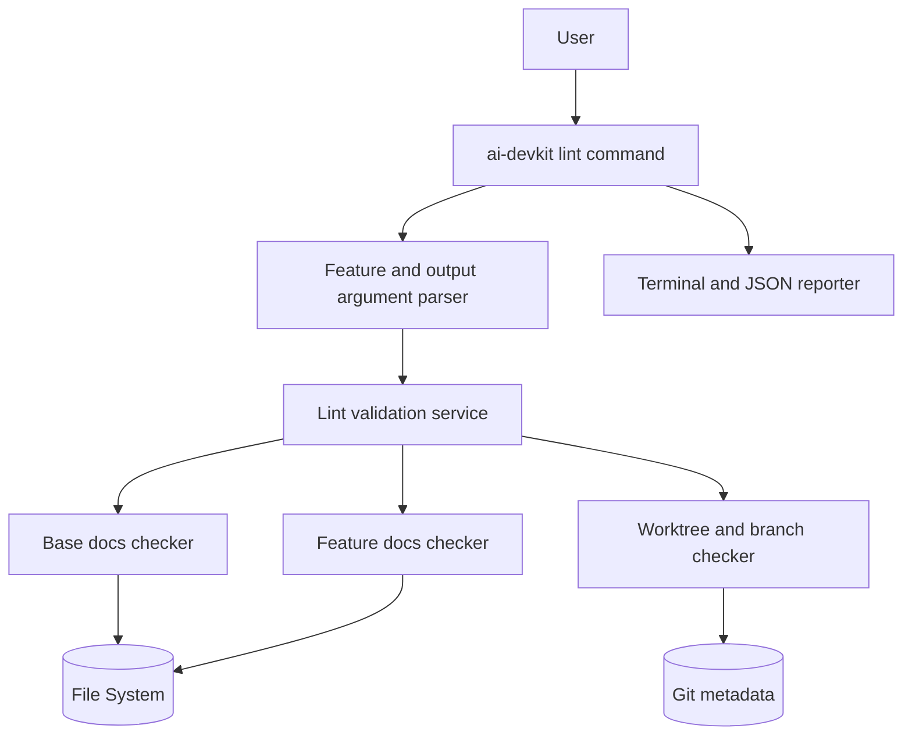

# System Design & Architecture

## Architecture Overview
**What is the high-level system structure?**

- Key components and responsibilities
  - `lint` command handler: parse options and orchestrate checks.
  - Name normalizer: convert `--feature` input into canonical `<name>` and `feature-<name>` (accept `foo` and `feature-foo`).
  - Base docs checker: validate required phase template files (`docs/ai/*/README.md`).
  - Feature docs checker: validate `docs/ai/{phase}/feature-<name>.md` across lifecycle phases.
  - Git/worktree checker: evaluate feature branch/worktree convention used by `dev-lifecycle` Phase 1 prerequisite.
  - Reporter (command-owned): consistent output rows (`[OK]`, `[MISS]`, `[WARN]`) and final summary with exit code.
- Technology stack choices and rationale
  - TypeScript within existing CLI package for shared UX and testability.
  - Extract shell script checks into reusable TS utilities to avoid behavior drift.
  - Git checks via lightweight git commands (`git worktree list`, branch existence checks) to preserve compatibility.

## Data Models
**What data do we need to manage?**

- Core entities and their relationships
  - `LintOptions`: parsed CLI options.
  - `LintTarget`: normalized feature identity (`name`, `branchName`, `docSlug`).
  - `LintCheckResult`: result of individual check.
  - `LintSummary`: aggregate counts and final status.
- Data schemas/structures
  - `LintOptions`
    - `{ feature?: string, json?: boolean }`
  - `LintTarget`
    - `{ rawFeature: string, normalizedName: string, branchName: string, docFilePrefix: string }`
  - `LintCheckResult`
    - `{ id: string, level: 'ok' | 'miss' | 'warn', category: 'base-docs' | 'feature-docs' | 'git-worktree', required: boolean, message: string, fix?: string }`
  - `LintSummary`
    - `{ checks: LintCheckResult[], hasRequiredFailures: boolean, warningCount: number }`
- Data flow between components
  - Parse args -> normalize feature -> run applicable checks -> collect results -> render terminal or JSON output -> return exit code.

## API Design
**How do components communicate?**

- External APIs (if applicable)
  - CLI invocations:
    - `ai-devkit lint`
    - `ai-devkit lint --feature <name>`
    - `ai-devkit lint --feature <name> --json`
- Internal interfaces
  - `runLintChecks(options, dependencies?): LintReport`
  - `renderLintReport(report, options): void` (in `commands/lint`)
  - `normalizeFeatureName(input): string`
  - `isInsideGitWorkTreeSync(cwd): boolean`
  - `localBranchExistsSync(cwd, branchName): boolean`
  - `getWorktreePathsForBranchSync(cwd, branchName): string[]`
- Request/response formats
  - Input: CLI flags and current working directory.
  - Output:
    - Default: human-readable checklist and summary.
    - `--json`: structured JSON object for CI parsing (checks, counts, normalized feature, pass/fail state).
  - Exit code policy:
    - `0`: no required failures.
    - `1`: one or more required failures.
    - Warnings (including missing dedicated worktree) do not change exit code when required checks pass.
- Authentication/authorization approach
  - Read-only operations only (filesystem + git metadata queries).

## Component Breakdown
**What are the major building blocks?**

- Frontend components (if applicable)
  - Terminal output formatter using existing CLI conventions.
  - JSON formatter for machine-readable mode.
- Backend services/modules
  - `commands/lint` command entry.
  - `services/lint/lint.service.ts` for orchestration and business rules only.
  - `services/lint/rules/*` for modular validation rules (base docs, feature docs, feature-name, git worktree).
  - `util/git` sync helpers for git/worktree checks.
  - `util/terminal-ui` for consistent terminal output formatting.
- Database/storage layer
  - None.
- Third-party integrations
  - Local git executable.

## Design Decisions
**Why did we choose this approach?**

- Key architectural decisions and trade-offs
  - Re-implement shell checks in TypeScript while keeping output semantics:
    - Pros: testable, reusable, cross-command integration.
    - Cons: initial duplication until script is retired/repointed.
  - Classify checks as required vs warning:
    - Pros: keeps lifecycle gating strict for missing docs while allowing advisory worktree guidance.
    - Cons: users may ignore warnings if not enforced in team policy.
  - Normalize feature names automatically:
    - Pros: better UX (`foo` and `feature-foo` both accepted).
    - Cons: requires clear messaging of normalized value.
  - Include `--json` output in v1:
    - Pros: CI-friendly parsing and automated reporting.
    - Cons: requires stable output schema maintenance.
- Alternatives considered
  - Keep shell script only and wrap it from CLI:
    - Rejected due to weaker cross-platform consistency and lower unit-test coverage.
  - Hard-fail when dedicated worktree is missing:
    - Rejected; requirement is warning-only behavior for this condition.
- Patterns and principles applied
  - Single-responsibility check modules.
  - Deterministic output for CI and humans.
  - Collect-all-results reporting to surface all issues in one run.
  - Avoid shell interpolation for git operations by using argument-based command execution.

## Non-Functional Requirements
**How should the system perform?**

- Performance targets
  - Complete typical checks in under 1 second on standard repositories.
- Scalability considerations
  - Check implementation should be extensible for additional lifecycle validations later.
- Security requirements
  - No file writes or mutations.
  - No network access required.
- Reliability/availability needs
  - Command should gracefully handle missing git repo context and provide actionable fixes.
