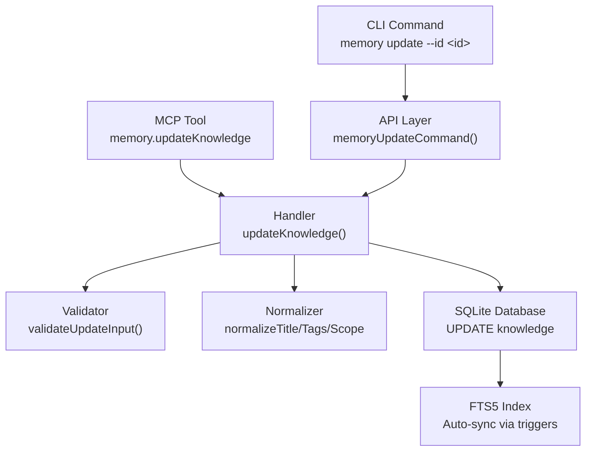

# Design: Memory Update CLI Command

## Architecture Overview

The update feature follows the same layered architecture as store and search:



## Data Models

### New Types

```typescript
// Input for update operation
interface UpdateKnowledgeInput {
    id: string;           // Required - UUID of item to update
    title?: string;       // Optional - new title (10-100 chars)
    content?: string;     // Optional - new content (50-5000 chars)
    tags?: string[];      // Optional - new tags (replaces existing)
    scope?: string;       // Optional - new scope
}

// Result from update operation
interface UpdateKnowledgeResult {
    success: boolean;
    id: string;
    message: string;
}

// CLI options interface
interface MemoryUpdateOptions {
    id: string;
    title?: string;
    content?: string;
    tags?: string;        // Comma-separated string from CLI
    scope?: string;
}
```

### Existing Types Used
- `KnowledgeRow` — for querying existing item
- `NotFoundError` — already exists in `errors.ts`
- `DuplicateError`, `ValidationError`, `StorageError` — reused as-is

## API Design

### CLI Command

```
npx ai-devkit@latest memory update --id <uuid> [--title <title>] [--content <content>] [--tags <tags>] [--scope <scope>]
```

| Option | Required | Description |
|--------|----------|-------------|
| `--id <id>` | Yes | UUID of the knowledge item |
| `-t, --title <title>` | No | New title (10-100 chars) |
| `-c, --content <content>` | No | New content (50-5000 chars) |
| `--tags <tags>` | No | Comma-separated new tags (replaces all) |
| `-s, --scope <scope>` | No | New scope |

**Response (JSON):**
```json
{
  "success": true,
  "id": "uuid-here",
  "message": "Knowledge updated successfully"
}
```

### MCP Tool

Tool name: `memory.updateKnowledge`

Input schema matches `UpdateKnowledgeInput`. Returns JSON result via MCP text content.

## Component Breakdown

### 1. Handler: `packages/memory/src/handlers/update.ts`
- `updateKnowledge(input: UpdateKnowledgeInput): UpdateKnowledgeResult`
- Validates input via `validateUpdateInput()`
- Fetches existing item by ID (throws `NotFoundError` if missing)
- Merges provided fields with existing values
- Checks duplicate title/content (excluding self)
- Executes `UPDATE` SQL within transaction
- Returns success result

### 2. Validator: addition to `packages/memory/src/services/validator.ts`
- `validateUpdateInput(input: UpdateKnowledgeInput): void`
- Validates ID is a non-empty string
- Validates only provided fields (title, content, tags, scope) using existing validators
- Requires at least one field besides ID

### 3. API Layer: addition to `packages/memory/src/api.ts`
- `memoryUpdateCommand(options: MemoryUpdateOptions): UpdateKnowledgeResult`
- Converts CLI options (comma-separated tags string) to handler input
- Wraps in try/finally with `closeDatabase()`

### 4. CLI Command: addition to `packages/cli/src/commands/memory.ts`
- Registers `memory update` subcommand with Commander.js
- Passes options to `memoryUpdateCommand()`
- Outputs JSON result or error

### 5. MCP Tool: addition to `packages/memory/src/server.ts`
- Registers `memory.updateKnowledge` tool definition
- Handles tool call by invoking `updateKnowledge()` handler

## Design Decisions

| Decision | Choice | Rationale |
|----------|--------|-----------|
| Partial update | Only update provided fields | Matches user expectation — don't require re-supplying unchanged fields |
| Tag replacement | Replace all tags (not merge) | Simpler semantics; user provides full new tag list. Consistent with store behavior |
| Duplicate check | Exclude self from duplicate detection | Allow updating title/content without triggering self-duplicate |
| No migration needed | Existing schema handles UPDATE | DB triggers for FTS5 already handle UPDATE events |

## Non-Functional Requirements

- **Performance:** Single-row UPDATE by primary key — O(1) lookup, negligible overhead
- **Security:** Input validated before database access; parameterized queries prevent SQL injection
- **Reliability:** Transaction wrapping ensures atomicity; no partial updates
