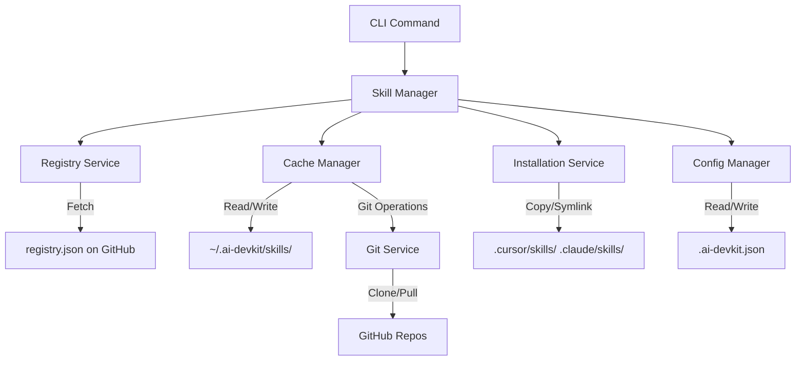

# System Design & Architecture: Skill Management

## Architecture Overview
**What is the high-level system structure?**



### Key Components (MVP - Simplified)
1. **CLI Command Interface** (`src/commands/skill.ts`): Handles `add`, `remove`, `list`
2. **Skill Manager** (`src/lib/SkillManager.ts`): All logic here (git, symlink, file ops)
3. **Config Manager** (existing): Reads `.ai-devkit.json`

**Note**: One SkillManager class does everything for MVP. Split into services later if needed.

### Technology Stack (MVP)
- **Language**: TypeScript (consistent with existing CLI)
- **CLI Framework**: Commander.js (already in project)
- **Git Operations**: `child_process.exec('git ...')` - no library needed
- **File Operations**: Node.js built-in `fs` module
- **HTTP**: Built-in `https` module or `node-fetch` (if already in project)

**Note**: No new dependencies if possible. Use what's already there.

## Data Models
**What data do we need to manage?**

### Registry Schema (`registry.json`) - MVP
```typescript
interface SkillRegistry {
  registries: Record<string, string>;  // id -> GitHub URL
}
```

**Example registry.json**:
```json
{
  "registries": {
    "anthropics/skills": "https://github.com/anthropics/skills.git",
    "vercel-labs/agent-skills": "https://github.com/vercel-labs/agent-skills.git"
  }
}
```

**Note**: Keep it simple - just a map of registry ID to git URL. We can add metadata later.

### Local Cache Structure (MVP)
```
~/.ai-devkit/
└── skills/
    ├── anthropics/
    │   └── skills/           # Git repo cloned here
    │       ├── .git/
    │       ├── frontend-design/
    │       └── ...
    └── vercel-labs/
        └── agent-skills/
```

**Note**: No user config, no manifest tracking for MVP. Just cache the repos.

## API Design
**How do components communicate?**

### CLI Commands (MVP)
```bash
# Add a skill (core command)
ai-devkit skill add <registry>/<repo> <skill-name>
# Example: ai-devkit skill add anthropics/skills frontend-design

# List installed skills
ai-devkit skill list

# Remove a skill
ai-devkit skill remove <skill-name>
```

**Note**: Start with these 3 commands. Add search, info, update, options later.

### Internal API Structure

#### SkillManager (MVP - Simplified)
```typescript
class SkillManager {
  constructor(
    private configManager: ConfigManager
  ) {}

  async addSkill(registryId: string, skillName: string): Promise<void>
  async removeSkill(skillName: string): Promise<void>
  async listSkills(): Promise<string[]>  // Just skill names
}
```

**Note**: All logic in SkillManager for MVP. No separate services yet. Use Node.js built-ins:
- `child_process.exec()` for git commands
- `fs` for file operations
- `fs.symlink()` with try/catch for symlinks

## Component Breakdown (MVP)

### CLI Commands (`src/commands/skill.ts`)
```typescript
// Register 3 commands with Commander.js
program
  .command('skill add <registry-repo> <skill-name>')
  .action(async (registryRepo, skillName) => {
    const manager = new SkillManager(configManager);
    await manager.addSkill(registryRepo, skillName);
  });

program
  .command('skill list')
  .action(async () => {
    const manager = new SkillManager(configManager);
    const skills = await manager.listSkills();
    console.table(skills);
  });

program
  .command('skill remove <skill-name>')
  .action(async (skillName) => {
    const manager = new SkillManager(configManager);
    await manager.removeSkill(skillName);
  });
```

### Skill Manager (`src/lib/SkillManager.ts`)
Single class with all logic:
- Fetch hardcoded registry.json from GitHub
- Check if repo cached in `~/.ai-devkit/skills/`
- If not, run `git clone` via child_process
- Read `.ai-devkit.json` for environments
- Try `fs.symlink()`, fallback to `fs.cp()` if fails
- List skills by reading `.cursor/skills/` and `.claude/skills/` directories
- Remove skills by `fs.rm()`

**That's it. ~200-300 lines total.**

## Design Decisions (MVP - Keep It Simple)

### 1. All Logic in One SkillManager Class
**Decision**: No separate service classes for MVP

**Rationale**: MVP needs ~200-300 lines. Split into services later if it grows

### 2. Symlink with Copy Fallback
**Decision**: Try symlink first, copy if it fails

**Rationale**: 
- Symlinks save disk space (main benefit)
- Auto-fallback handles Windows gracefully
- No user choice needed (keep it simple)

### 3. No Tracking Manifest
**Decision**: No `.ai-devkit/skills.json` for MVP

**Rationale**:
- List skills by reading directories (simple)
- No state to keep in sync
- Add manifest later if needed

### 4. Hardcoded Registry URL for MVP
**Decision**: Fetch from fixed GitHub URL in code

**Rationale**:
- No registry service needed
- No local caching logic
- Just fetch JSON on demand
- Add sophistication later

### 5. No Search, No Info, No Update for MVP
**Decision**: Only `add`, `list`, `remove`

**Rationale**: Core workflow is complete with these 3. Add features incrementally.

## Non-Functional Requirements (MVP - Simplified)

### Performance
- Cached install: < 2 seconds (symlink is instant)
- Fresh clone: < 15 seconds (depends on repo size)

### Security
- Validate registry ID format (no `..` or special chars)
- Only clone from hardcoded registry list
- No arbitrary URLs for MVP

### Reliability
- Show clear errors (git fails, network issues, etc.)
- Try/catch around symlink, fallback to copy

### Usability
- Progress messages: "Cloning...", "Installing...", "Done!"
- Works on macOS, Linux, Windows
