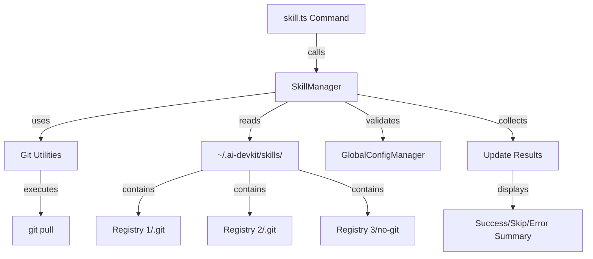

# System Design & Architecture: Skill Update

## Architecture Overview
**What is the high-level system structure?**



### Key Components
1. **CLI Command Handler** (`skill.ts`): Parses user input and delegates to SkillManager
2. **SkillManager** (`SkillManager.ts`): Orchestrates update logic, error handling, and reporting
3. **Git Utilities** (`util/git.ts`): Provides git operations (new `pullRepository` function)
4. **Skill Cache** (`~/.ai-devkit/skills/`): File system storage for cloned registries

### Technology Stack
- **Language**: TypeScript
- **CLI Framework**: Commander.js (existing)
- **File System**: fs-extra (existing)
- **Process Execution**: child_process.exec (existing in git utils)
- **Styling**: chalk (existing)

## Data Models
**What data do we need to manage?**

### UpdateResult Interface
```typescript
interface UpdateResult {
  registryId: string;      // e.g., "anthropic/skills"
  status: 'success' | 'skipped' | 'error';
  message: string;         // Human-readable status message
  error?: Error;           // Error object if status is 'error'
}
```

### UpdateSummary Interface
```typescript
interface UpdateSummary {
  total: number;           // Total registries processed
  successful: number;      // Successfully updated
  skipped: number;         // Skipped (non-git)
  failed: number;          // Failed with errors
  results: UpdateResult[]; // Detailed results
}
```

### Data Flow
1. User runs command → CLI parses arguments
2. SkillManager scans cache directory → identifies registries
3. For each registry → check if git repo → attempt pull
4. Collect results → aggregate summary → display to user

## API Design
**How do components communicate?**

### New SkillManager Methods

#### `updateSkills(registryId?: string): Promise<UpdateSummary>`
Updates all skills or a specific registry.

**Parameters**:
- `registryId` (optional): Specific registry to update (e.g., "anthropic/skills")

**Returns**: `UpdateSummary` with detailed results

**Behavior**:
- If `registryId` provided: Update only that registry
- If `registryId` omitted: Update all registries in cache
- Validates git installation before proceeding
- Continues on errors, collecting all results

#### `private updateRegistry(registryPath: string, registryId: string): Promise<UpdateResult>`
Updates a single registry.

**Parameters**:
- `registryPath`: Absolute path to registry directory
- `registryId`: Registry identifier (e.g., "anthropic/skills")

**Returns**: `UpdateResult` for this registry

**Behavior**:
1. Check if `.git` directory exists
2. If not git repo: return 'skipped' status
3. If git repo: call `pullRepository`
4. If pull succeeds: return 'success' status
5. If pull fails: return 'error' status with error details

### New Git Utility Functions

#### `pullRepository(repoPath: string): Promise<void>`
Pulls latest changes for a git repository.

**Parameters**:
- `repoPath`: Absolute path to git repository

**Throws**: Error if git pull fails

**Implementation**:
```typescript
export async function pullRepository(repoPath: string): Promise<void> {
  try {
    await execAsync('git pull', {
      cwd: repoPath,
      timeout: 30000,
    });
  } catch (error: any) {
    throw new Error(`Git pull failed: ${error.message}`);
  }
}
```

#### `isGitRepository(dirPath: string): Promise<boolean>`
Checks if a directory is a git repository.

**Parameters**:
- `dirPath`: Absolute path to directory

**Returns**: `true` if `.git` exists, `false` otherwise

**Implementation**:
```typescript
export async function isGitRepository(dirPath: string): Promise<boolean> {
  const gitDir = path.join(dirPath, '.git');
  return await fs.pathExists(gitDir);
}
```

### CLI Command Interface

```typescript
skillCommand
  .command('update [registry-id]')
  .description('Update skills from registries (e.g., ai-devkit skill update or ai-devkit skill update anthropic/skills)')
  .action(async (registryId?: string) => {
    // Implementation
  });
```

## Component Breakdown
**What are the major building blocks?**

### 1. Command Handler (`skill.ts`)
**Responsibilities**:
- Parse command arguments
- Create SkillManager instance
- Call `updateSkills()` method
- Handle top-level errors
- Exit with appropriate code

**Changes Required**:
- Add new `update [registry-id]` command
- Wire up to SkillManager.updateSkills()

### 2. SkillManager (`SkillManager.ts`)
**Responsibilities**:
- Scan skill cache directory
- Filter registries (all or specific)
- Orchestrate updates with progress feedback
- Collect and aggregate results
- Format and display summary

**New Methods**:
- `updateSkills(registryId?: string): Promise<UpdateSummary>`
- `private updateRegistry(registryPath: string, registryId: string): Promise<UpdateResult>`
- `private displayUpdateSummary(summary: UpdateSummary): void`

### 3. Git Utilities (`util/git.ts`)
**Responsibilities**:
- Execute git pull command
- Validate git repository status
- Handle git errors

**New Functions**:
- `pullRepository(repoPath: string): Promise<void>`
- `isGitRepository(dirPath: string): Promise<boolean>`

### 4. Progress Display
**Responsibilities**:
- Show real-time progress for each registry
- Use chalk for colored output
- Provide clear status indicators

**Output Format**:
```
Updating skills...

  → anthropic/skills... ✓ Updated
  → openai/skills... ⊘ Skipped (not a git repository)
  → custom/tools... ✗ Failed (uncommitted changes)

Summary:
  ✓ 1 updated
  ⊘ 1 skipped
  ✗ 1 failed

Errors:
  • custom/tools: Git pull failed: You have unstaged changes. 
    Tip: Run 'git status' in ~/.ai-devkit/skills/custom/tools to see details.
```

## Design Decisions
**Why did we choose this approach?**

### Decision 1: Update Registries, Not Individual Skills
**Rationale**: 
- Skills are stored within registry repositories
- Registries are the git units (have `.git` directories)
- Simpler mental model: update the source, not individual items
- Consistent with how skills are installed (from registries)

**Alternatives Considered**:
- Update individual skills: Would require tracking which registry each skill came from
- Update all at once: Chosen approach (with optional registry filter)

### Decision 2: Continue on Errors
**Rationale**:
- Users may have multiple registries; one failure shouldn't block others
- Collect all errors and report at end for better UX
- Allows users to see full picture before taking action

**Alternatives Considered**:
- Stop on first error: Too disruptive, poor UX
- Ignore errors silently: Dangerous, users wouldn't know about issues

### Decision 3: Skip Non-Git Directories
**Rationale**:
- Users might manually copy skills or have other files in cache
- Attempting git operations on non-git directories would fail
- Better to detect and skip gracefully

**Alternatives Considered**:
- Error on non-git directories: Too strict, would break existing workflows
- Try to update anyway: Would cause confusing errors

### Decision 4: No Automatic Conflict Resolution
**Rationale**:
- Git conflicts require human judgment
- Automatic resolution could lose user changes
- Better to fail with helpful message

**Alternatives Considered**:
- Auto-stash changes: Could hide important modifications
- Force pull: Would lose local changes

## Non-Functional Requirements
**How should the system perform?**

### Performance Targets
- **Update Speed**: < 5 seconds per registry (network dependent)
- **Startup Time**: < 500ms to begin first update
- **Memory Usage**: Minimal (streaming git output, not buffering)

### Scalability Considerations
- Handle 10+ registries efficiently
- Parallel updates not required (sequential is fine for v1)
- Future: Consider parallel updates with concurrency limit

### Security Requirements
- No credential storage (rely on system git credentials)
- No arbitrary command execution (use parameterized git commands)
- Validate registry paths to prevent directory traversal

### Reliability/Availability
- Graceful degradation on network failures
- Clear error messages for common issues
- No data loss (read-only operations on cache)
- Timeout protection (30s per git pull)

### Error Handling Strategy
1. **Git Not Installed**: Fail fast with installation instructions
2. **Network Errors**: Catch, log, continue to next registry
3. **Merge Conflicts**: Catch, provide helpful message, continue
4. **Permission Errors**: Catch, explain issue, continue
5. **Timeout**: Catch, suggest manual intervention, continue

### User Experience
- **Progress Feedback**: Show which registry is being updated
- **Color Coding**: Green for success, yellow for skip, red for error
- **Helpful Messages**: Suggest remediation for common errors
- **Summary**: Clear overview of what happened

