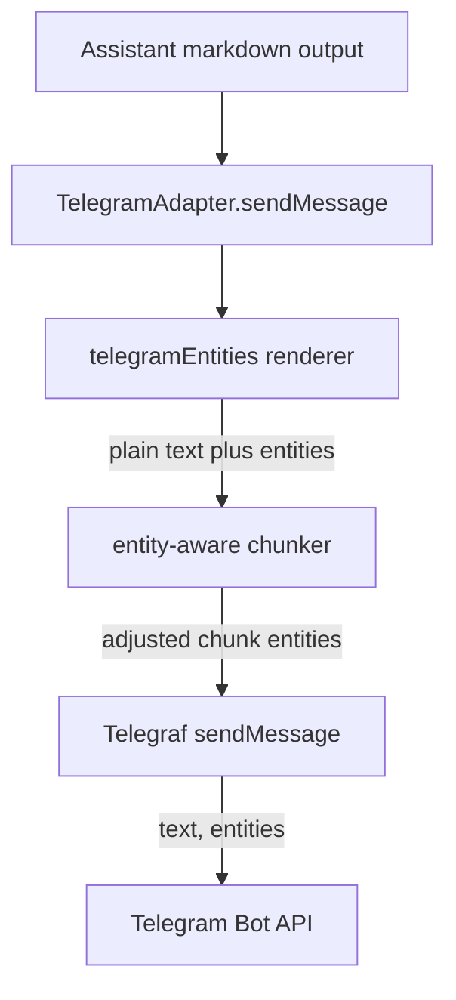

# System Design: Telegram MessageEntity Rich Messages

## Architecture Overview

Telegram outbound messages currently render markdown to Telegram-compatible HTML and send each chunk with `parse_mode: 'HTML'`. The long-term design is to render markdown directly into plain text plus Telegram Bot API `MessageEntity` ranges, then send each chunk with `entities` instead of `parse_mode`.

This is design-only. It does not reopen or modify the short-term HTML fallback work from PR #122.



### Key Principles

- Render from markdown tokens to plain text and entity ranges in one pass.
- Do not generate HTML and parse it back into entities.
- Keep the current HTML renderer available during rollout.
- Preserve message delivery over formatting fidelity when Telegram rejects an entity payload.
- Keep `ChannelAdapter.sendMessage(chatId, text)` unchanged; rich rendering remains an internal Telegram concern.

## Current State

Affected current files:

| File | Current responsibility |
|---|---|
| `packages/channel-connector/src/adapters/TelegramAdapter.ts` | Calls `markdownToTelegramHtml`, chunks rendered HTML, sends `parse_mode: 'HTML'`, and retries parse failures as plain text |
| `packages/channel-connector/src/utils/telegramHtml.ts` | Uses `marked` custom renderers to emit Telegram HTML |
| `packages/channel-connector/src/__tests__/adapters/TelegramAdapter.test.ts` | Covers HTML send options, chunking, and parse-entities fallback |
| `packages/channel-connector/src/__tests__/utils/telegramHtml.test.ts` | Covers markdown-to-HTML behavior |

Local Telegraf types already support the target API:

```typescript
sendMessage(chatId, text, { entities });
```

`@telegraf/types` defines `MessageEntity.offset` and `MessageEntity.length` as UTF-16 code unit positions.

## Data Models

Add a new utility module next to the existing HTML renderer:

```typescript
import type { MessageEntity } from '@telegraf/types';

export interface TelegramRichText {
  text: string;
  entities?: MessageEntity[];
}

export function markdownToTelegramEntities(markdown: string): TelegramRichText;

export function chunkTelegramRichText(
  message: TelegramRichText,
  maxLength?: number
): TelegramRichText[];
```

Recommended module path:

```text
packages/channel-connector/src/utils/telegramEntities.ts
```

Keep `telegramHtml.ts` during incremental rollout so `TelegramAdapter` can switch between renderers and retain a known fallback.

## Renderer Design

The renderer should continue to use `marked`, but it should walk tokens and append to a mutable plain-text buffer. Each formatted token records the buffer length before and after rendering its children.

```typescript
const start = buffer.length;
renderChildren(token.tokens);
const length = buffer.length - start;
entities.push({ type: 'bold', offset: start, length });
```

JavaScript string indexes and `.length` are UTF-16 code units, matching Telegram offsets. The implementation should still make this explicit with helper names and tests so future changes do not switch to code point or grapheme counts accidentally.

### Markdown Mapping

| Markdown input | Plain text output | Entity |
|---|---|---|
| Heading | Heading text plus blank line | `bold` |
| Strong | Text | `bold` |
| Emphasis | Text | `italic` |
| Strikethrough | Text | `strikethrough` |
| Inline code | Code text | `code` |
| Fenced code block | Code text plus blank line | `pre`, with `language` when present |
| Link | Link label | `text_link` with `url` |
| Image | Alt text, or URL when alt text is empty | `text_link` with `url` |
| Blockquote | Quote text plus blank line | `blockquote` |
| Unordered list | `- item` or bullet text | No entity |
| Ordered list | `1. item` | No entity |
| Table | Padded ASCII table | `pre` |
| Horizontal rule | Plain divider text | No entity |
| Raw HTML | Dropped | No entity |

Lists should remain plain text because Telegram has no list entity. The exact marker can preserve current visible output, but ASCII `-` is simpler than a bullet when strict ASCII output is preferred.

## Entity Constraints

Telegram allows nested message entities only under these constraints:

- If two entities share characters, one must fully contain the other.
- `bold`, `italic`, `underline`, `strikethrough`, and `spoiler` can contain or be contained by other entities except `pre` and `code`.
- `blockquote` entities cannot be nested.
- Other entity types cannot contain each other.

The renderer should include a validation or normalization step before returning entities:

1. Drop zero-length entities.
2. Sort by `offset`, then by descending `length` for containing entities.
3. Reject partial overlaps.
4. Remove style or link entities that fall inside `code` or `pre`.
5. Avoid nested `blockquote`; keep the outermost quote.
6. Prefer dropping the incompatible inner entity over failing the full message.

This preserves the user's text even when some nested markdown cannot be represented exactly.

## UTF-16 Offset Handling

Telegram offsets are UTF-16 code units. The renderer and chunker should use JavaScript string lengths directly:

```typescript
const utf16Offset = text.length;
const utf16Length = rendered.length;
```

Important cases:

- Emoji outside the BMP, such as U+1F600, count as two UTF-16 code units.
- ZWJ emoji sequences count as multiple UTF-16 code units.
- Combining marks and variation selectors count as separate UTF-16 code units.
- CJK text usually counts as one UTF-16 code unit per character.

The implementation should not use `[...text].length`, `Array.from(text).length`, `Intl.Segmenter`, or byte lengths for Telegram entity offsets.

## Chunking Design

Telegram `sendMessage` accepts 1-4096 characters after entity parsing. With entities, chunking should happen after markdown rendering and before sending:

1. Split on plain text, not HTML.
2. Prefer paragraph boundaries, then single newlines, then hard splits.
3. Do not split inside a UTF-16 surrogate pair.
4. For each chunk, keep only entities that intersect the chunk.
5. Adjust retained offsets by subtracting the chunk start offset.
6. For entities crossing a boundary:
   - Split simple style entities such as `bold`, `italic`, `strikethrough`, and `blockquote`.
   - Drop crossing `text_link`, `code`, and `pre` entities unless the chunk contains the full original entity.
7. Re-run entity normalization for each chunk.

Hard splitting should include a helper that backs up one code unit when `text.charCodeAt(splitAt - 1)` is a high surrogate and `text.charCodeAt(splitAt)` is a low surrogate.

## TelegramAdapter Integration

Add a renderer mode behind an internal option or feature flag:

```typescript
type TelegramRichMessageMode = 'html' | 'entities';

interface TelegramAdapterOptions {
  botToken: string;
  richMessageMode?: TelegramRichMessageMode;
}
```

Initial default should remain `html`. The `entities` path should call:

```typescript
const rendered = markdownToTelegramEntities(text);
for (const chunk of chunkTelegramRichText(rendered, TELEGRAM_MAX_MESSAGE_LENGTH)) {
  await bot.telegram.sendMessage(chatId, chunk.text, { entities: chunk.entities });
}
```

When `chunk.entities` is empty, omit the extra options object or omit `entities` to keep plain text sends simple.

## Fallback Behavior

Fallback should continue to favor message delivery:

- If entity rendering throws, send the original markdown as plain text chunks with no entities.
- If Telegram rejects a chunk with a parse-entities error, retry that chunk as plain text with no entities.
- If Telegram rejects for a non-parse error, propagate the error as today.
- If the `entities` mode is enabled and a structural invariant fails locally, log or debug the renderer issue and fall back to plain text rather than falling back through HTML.

The fallback text for entity mode is already plain text, so it does not need HTML tag stripping or entity decoding.

## Rollout Phases

1. Add `telegramEntities.ts` and focused tests without changing `TelegramAdapter` behavior.
2. Add `richMessageMode: 'html' | 'entities'` with default `html`.
3. Wire `TelegramAdapter` to the entity renderer behind the option and keep existing HTML tests.
4. Add adapter tests proving entity sends use `{ entities }` and do not set `parse_mode`.
5. Exercise the option in a non-default environment or manual Telegram bot smoke test.
6. Make `entities` the default after confidence is built.
7. Remove the HTML renderer after one release cycle if no fallback dependency remains.

## Test Plan

Add `packages/channel-connector/src/__tests__/utils/telegramEntities.test.ts` with cases for:

- Plain text pass-through with no entities.
- Bold, italic, strikethrough, nested style spans, and sorted offsets.
- Inline code excluding nested formatting.
- Fenced code block with `language`.
- Links and image alt-text links as `text_link`.
- Blockquotes and nested blockquote normalization.
- Ordered, unordered, and nested lists as readable plain text.
- Tables as ASCII `pre`.
- Raw HTML stripping.
- Emoji and Unicode before, inside, and after formatted ranges, asserting UTF-16 offsets.
- Chunking at paragraph, newline, hard limit, and surrogate-pair boundaries.
- Entity offset adjustment after chunking.
- Crossing entity behavior for style, `text_link`, `code`, and `pre`.

Update `TelegramAdapter.test.ts` with cases for:

- Entity mode sends `{ entities }` and no `parse_mode`.
- Empty entity arrays are omitted.
- Renderer failure sends original markdown as plain text.
- Telegram parse-entities rejection retries the chunk as plain text.
- Non-parse errors still propagate.
- HTML mode remains available during rollout.

## Risks and Trade-offs

- Entity rendering is more precise but more complex than HTML rendering.
- Some markdown nesting cannot be represented by Telegram entities; the design drops incompatible inner formatting to preserve delivery.
- Splitting long code blocks may remove `pre` formatting from split chunks, but avoids invalid entity spans.
- Feature-flagged rollout temporarily keeps two renderers, increasing test matrix size.
- UTF-16 correctness is easy to regress if future code uses code point or grapheme counts.

## Non-Functional Requirements

- Rendering and chunking should be deterministic and synchronous.
- Runtime behavior should not require new dependencies beyond existing `marked` and Telegraf types.
- No secrets, chat IDs, or message content should be logged by default.
- The public channel connector API should remain stable.
