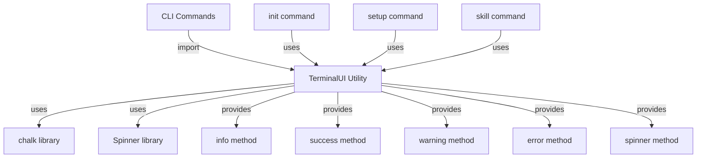

# System Design & Architecture

## Architecture Overview
**What is the high-level system structure?**



**Key components and their responsibilities:**
- **TerminalUI utility**: Centralized module providing consistent terminal output methods
- **Message formatters**: Functions for formatting different message types
- **Spinner wrapper**: Abstraction over spinner library for async operations

**Technology stack choices and rationale:**
- **chalk**: Already a dependency, provides excellent color support
- **ora** (proposed): Popular, well-maintained spinner library with good API
- **TypeScript**: Maintain type safety for the utility

## Data Models
**What data do we need to manage?**

**Message Types:**
```typescript
type MessageType = 'info' | 'success' | 'warning' | 'error';

interface SpinnerOptions {
  text: string;
  color?: string;
}

interface SpinnerInstance {
  start(): void;
  succeed(text?: string): void;
  fail(text?: string): void;
  warn(text?: string): void;
  stop(): void;
  text: string;
}
```

**No persistent data** - all output is ephemeral to the terminal

## API Design
**How do components communicate?**

**TerminalUI API:**
```typescript
// packages/cli/src/util/terminal-ui.ts

export const ui = {
  // Display informational message (blue)
  info(message: string): void;
  
  // Display success message (green)
  success(message: string): void;
  
  // Display warning message (yellow)
  warning(message: string): void;
  
  // Display error message (red)
  error(message: string): void;
  
  // Create and return a spinner instance
  spinner(text: string): SpinnerInstance;
};
```

**Usage examples:**
```typescript
import { ui } from '../util/terminal-ui';

// Simple messages
ui.info('Initializing project...');
ui.success('Project initialized successfully!');
ui.warning('Configuration file not found, using defaults');
ui.error('Failed to create directory');

// Spinner for async operations
const spinner = ui.spinner('Cloning repository...');
spinner.start();
try {
  await cloneRepo();
  spinner.succeed('Repository cloned successfully');
} catch (error) {
  spinner.fail('Failed to clone repository');
}
```

## Component Breakdown
**What are the major building blocks?**

### 1. TerminalUI Module (`src/util/terminal-ui.ts`)
- Core utility providing all UI methods
- Wraps chalk for consistent coloring
- Wraps spinner library for consistent progress indication

### 2. Message Formatters
- `formatInfo()`: Blue icon + message
- `formatSuccess()`: Green checkmark + message
- `formatWarning()`: Yellow warning icon + message
- `formatError()`: Red X + message

### 3. Spinner Wrapper
- Wraps ora spinner with consistent styling
- Provides start/succeed/fail/warn/stop methods
- Handles edge cases (nested spinners, rapid updates)

### 4. Updated Commands
- `src/commands/init.ts`: Replace console calls with ui methods
- `src/commands/setup.ts`: Replace console calls with ui methods
- `src/commands/skill.ts`: Replace console calls with ui methods
- Any other command files with console output

## Design Decisions
**Why did we choose this approach?**

### 1. Centralized Utility Module
**Decision**: Create a single `terminal-ui.ts` utility module
**Rationale**: 
- Single source of truth for all terminal output
- Easy to import and use across commands
- Simplifies future updates (change once, apply everywhere)

**Alternatives considered**:
- Class-based approach: More complex, unnecessary for stateless operations
- Separate utilities per message type: Too fragmented

### 2. Named Export with Object API
**Decision**: Export a `ui` object with methods
**Rationale**:
- Clear, discoverable API: `ui.info()`, `ui.success()`, etc.
- Easy to mock in tests
- Consistent with modern JavaScript patterns

**Alternatives considered**:
- Individual function exports: Less organized, harder to discover
- Default export: Less flexible for tree-shaking

### 3. Use ora for Spinners
**Decision**: Use `ora` library for spinner functionality
**Rationale**:
- Most popular spinner library (14M+ weekly downloads)
- Excellent API and documentation
- Supports all features we need
- Well-maintained and actively developed

**Alternatives considered**:
- `nanospinner`: Smaller but less feature-rich
- `cli-spinners`: Lower-level, would need more wrapper code
- Custom implementation: Unnecessary complexity

### 4. Symbol Prefixes for Messages
**Decision**: Use Unicode symbols (ℹ, ✔, ⚠, ✖) for message types
**Rationale**:
- Visually distinct and recognizable
- Works in most modern terminals
- Aligns with common CLI conventions

### 5. No Verbosity Levels
**Decision**: All messages are always shown
**Rationale**:
- Simpler implementation
- User explicitly requested no verbosity levels
- Can be added later if needed

## Non-Functional Requirements
**How should the system perform?**

### Performance targets
- Message display: < 1ms overhead
- Spinner operations: < 5ms overhead
- No noticeable impact on CLI responsiveness

### Scalability considerations
- Should handle rapid message updates (100+ messages/second)
- Should support nested async operations with spinners

### Security requirements
- No security concerns (output only)
- Ensure no sensitive data is inadvertently logged

### Reliability/availability needs
- Should gracefully handle terminals without color support
- Should work in CI/CD environments
- Should not crash if spinner operations fail
