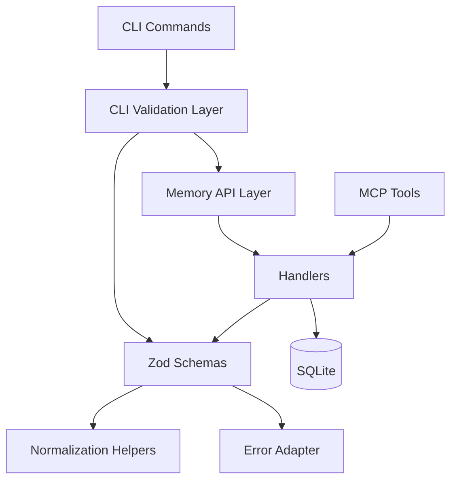

# Design: Validation Migration to Zod

## Architecture Overview

Validation moves from imperative functions to declarative Zod schemas across `packages/memory` and `packages/cli` while preserving existing entry points.

## Data Models

- Add schema module(s) for:
  - `StoreKnowledgeInput`
  - `UpdateKnowledgeInput` (partial fields + at least one update field)
  - `SearchKnowledgeInput`
- Add schema module(s) for CLI validator inputs currently enforced manually (for example registry ID and skill name formats in `packages/cli/src/util/skill.ts`).
- Reuse constants for min/max and regex patterns to avoid rule drift.
- Infer types from schemas where practical, while keeping exported public types stable.

## API Design

- Handlers continue receiving the same input shapes.
- Replace manual validator calls with `schema.parse` / `safeParse` wrappers.
- Convert Zod issues into existing error surfaces:
  - `ValidationError` for memory package flows.
  - `Error` (or existing CLI error handling shape) for CLI utility validators.
- Error text is allowed to differ as long as validation semantics stay equivalent.

## Component Breakdown

1. `packages/memory/src/services/validator.ts`
- Refactor to define and export Zod schemas plus parse helpers.
- Keep legacy exported function names (`validateStoreInput`, `validateUpdateInput`, etc.) as compatibility wrappers where needed.

2. `packages/memory/src/handlers/search.ts`
- Move inline `validateSearchInput` logic to shared Zod schema-based validation.

3. `packages/cli/src/util/skill.ts` (and optional helper module)
- Replace regex-based manual checks in `validateRegistryId` and `validateSkillName` with Zod schema parsing.
- Keep existing exported function signatures to avoid caller churn.

4. `packages/memory/tests/unit/validator.test.ts`, memory integration tests, and CLI util tests
- Update/add assertions for schema-driven validation behavior and error formatting.

## Design Decisions

- **Schema wrappers retained:** Keep current validator function surface to minimize downstream churn.
- **Centralized constants:** Preserve existing numeric/string constraints to avoid behavior regressions.
- **Error compatibility semantics:** Preserve pass/fail behavior and reasons; exact message strings may evolve.
- **Package-local adapters:** Keep memory and CLI error adaptation local to each package to avoid cross-package coupling.

## Non-Functional Requirements

- **Performance:** Validation overhead should remain negligible for CLI payload sizes.
- **Reliability:** Invalid payloads fail fast before DB calls.
- **Maintainability:** New validation rules should be added through schema composition, not duplicated logic.
- **Security:** Input constraints remain enforced before persistence/query execution.
