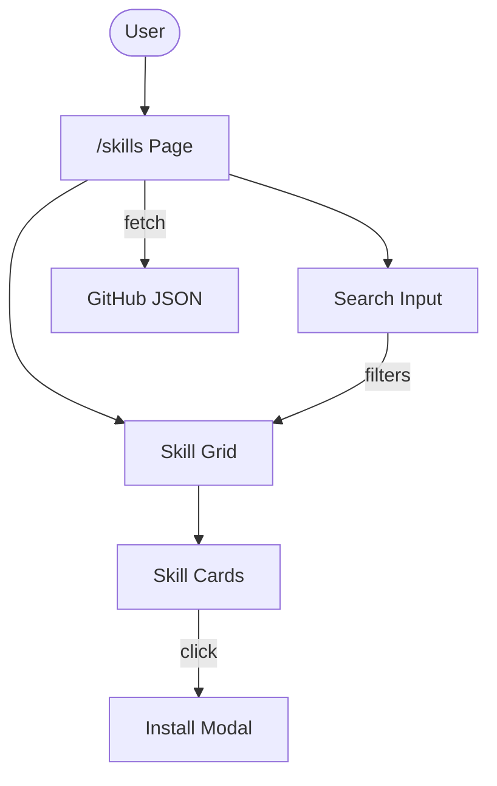

# System Design & Architecture

## Architecture Overview
**What is the high-level system structure?**



### Key Components
- **Skills Page** (`/skills`): Container page with search and grid
- **Search Input**: Text input for real-time filtering
- **Skill Grid**: Responsive grid displaying skill cards
- **Skill Card**: Individual skill display with name and description preview
- **Install Modal**: Overlay showing full details and install command

### Technology Stack
- Next.js 14+ (existing framework)
- React hooks for state management
- Tailwind CSS for styling (matching existing patterns)
- Fetch API for data loading

## Data Models
**What data do we need to manage?**

### Skill Data Structure (from JSON)
```typescript
interface Skill {
  name: string;
  registry: string;
  path: string;
  description: string;
  lastIndexed: number;
}

interface SkillIndex {
  meta: {
    version: number;
    createdAt: number;
    updatedAt: number;
    registryHeads: Record<string, string>;
  };
  skills: Skill[];
}
```

### Component State
```typescript
interface SkillsPageState {
  skills: Skill[];
  searchQuery: string;
  selectedSkill: Skill | null;
  isLoading: boolean;
  error: string | null;
  copied: boolean;  // Copy-to-clipboard feedback
}
```

## API Design
**How do components communicate?**

No custom API required. The page fetches directly from the remote JSON endpoint:
- **Endpoint**: `https://raw.githubusercontent.com/codeaholicguy/ai-devkit/main/skills/index.json`
- **Method**: GET (static file)
- **Auth**: None required (public endpoint)

## Component Breakdown
**What are the major building blocks?**

### Page Component: `app/skills/page.tsx`
- Fetches skill data on mount
- Manages search state and filtering
- Renders search input, grid, and conditional modal

### Subcomponents (inline)
- **SearchInput**: Controlled input with 200ms debounce for smoother filtering
- **SkillCard**: Displays skill name, truncated description, click handler
- **SkillModal**: Full details view with copy-to-clipboard for install command

## Design Decisions
**Why did we choose this approach?**

| Decision | Rationale | Alternatives Considered |
|----------|-----------|------------------------|
| Client-side fetch | Simple, no API needed | SSG with revalidation |
| Client-side filtering | Real-time UX, small dataset | Server-side search |
| Modal for details | Focus on one skill, copy command | Separate detail page |
| Inline components | Simple feature, fewer files | Component folder structure |

## Non-Functional Requirements
**How should the system perform?**

### Performance
- Initial load < 2 seconds
- Search filtering < 100ms response

### Accessibility
- Keyboard navigation for search and modal
- Screen reader support for skill cards
- Focus trap in modal

### Responsive Design
- Grid: 1 col mobile, 2 cols tablet, 3-4 cols desktop
- Modal: Full width on mobile, centered on desktop
