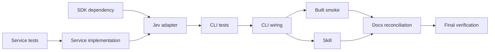

# Jev Session Compaction Plan

## Milestones

- [x] Milestone 1: Typed compaction domain and Jev adapter are covered by unit tests.
- [x] Milestone 2: `agent session compact` implements explicit unavailable and successful output flows.
- [x] Milestone 3: Built-in skill, lifecycle docs, and repository verification are complete.

## Task Breakdown

### Phase 1: Test-first service foundation

- [x] Task 1.1: Add the official `@typesafe-ai/sdk` CLI dependency.
  - Outcome: reproducible Jev SDK integration on Node 20.
  - Dependencies: none.
  - Evidence: lockfile diff and CLI package build.
- [x] Task 1.2: Write failing tests for compaction filtering, grouping, resume-prompt assembly, Markdown headings, and secret redaction.
  - Outcome: deterministic artifact contract is executable before production code.
  - Dependencies: requirements/design schemas.
  - Evidence: focused Vitest failure for missing modules/behavior.
  - Covers: service and security scenarios in the testing strategy.
- [x] Task 1.3: Implement compaction types and service until Task 1.2 passes.
  - Outcome: provider-independent, network-independent compaction core.
  - Dependencies: Task 1.2.
  - Evidence: focused service tests pass.
- [x] Task 1.4: Write failing Jev adapter tests, then implement the injectable SDK boundary and strict answer validation.
  - Outcome: typed questions map to validated domain events without exposing credentials.
  - Dependencies: Tasks 1.1 and 1.3.
  - Evidence: mocked-classifier tests pass; no network calls.

### Phase 2: CLI integration

- [x] Task 2.1: Write failing command tests for Markdown/JSON unavailable results, early key gate, format validation, session resolution, and successful rendering.
  - Outcome: user-visible semantics are locked before wiring.
  - Dependencies: Phase 1.
  - Evidence: focused command tests initially fail for absent command, then pass.
- [x] Task 2.2: Register `agent session compact` using existing session ID/type resolution and verbose adapter conversation parsing.
  - Outcome: discoverable command with no fallback and no transcript read when the key is absent.
  - Dependencies: Task 2.1.
  - Evidence: command tests and built `--help` smoke test.
- [x] Task 2.3: Verify built unavailable behavior in both formats.
  - Outcome: status 0 and exact output from compiled CLI.
  - Dependencies: Task 2.2 and CLI build.
  - Evidence: shell smoke commands with `TYPESAFE_API_KEY` unset.

### Phase 3: Skill, docs, and validation

- [x] Task 3.1: Create `skills/session-compact/SKILL.md` and add it to the built-in manifest/fallback list with validation tests.
  - Outcome: installed agents know when and how to use the command and report Jev unavailable.
  - Dependencies: stable CLI syntax from Phase 2.
  - Evidence: skill tests/lint and manifest assertions.
- [x] Task 3.2: Reconcile implementation and testing docs with actual files, decisions, and evidence.
  - Outcome: lifecycle artifacts reflect delivered behavior rather than the initial forecast.
  - Dependencies: implementation complete.
  - Evidence: feature lint.
- [x] Task 3.3: Run focused tests, CLI package tests/build, workspace build/test as proportionate, formatting/lint, and final lifecycle review.
  - Outcome: evidence-backed completion or documented blockers.
  - Dependencies: all preceding tasks.
  - Evidence: fresh command outputs recorded in testing docs and durable task.

## Dependencies

- The TypeSafe API is external, but automated tests use mocks and do not require credentials.
- Live-key validation is optional and cannot block CI or local verification.
- No migration or persistent state dependency exists.

## Timeline & Estimates

- Service and adapter: small-to-medium, approximately half a day.
- CLI/test integration: small, approximately two hours.
- Skill/docs/final verification: small, approximately two hours.
- Buffer is reserved for SDK response-shape or existing command-test fixture differences.

## Risks & Mitigation

- SDK/API schema changes: isolate in `JevSessionEventClassifier`, validate labels, pin via lockfile.
- Long sessions cause many sequential calls: accept for MVP, measure before adding concurrency.
- Secret leakage: early key gate, local redaction before calls, sensitive-event exclusion, synthetic security tests.
- Command namespace confusion: reuse existing `agent session` and document discovery via `agent sessions`.
- Command tests are already broad: add focused cases and avoid changing shared behavior.
- Live API unavailable: mock integration boundary; distinguish configuration unavailability from API failure.

## Resources Needed

- Existing `@ai-devkit/agent-manager` session discovery/conversation APIs.
- Official `@typesafe-ai/sdk` package.
- Vitest, Commander test harness, lifecycle lint, and existing built-in skill validation.
- No database, new service, or deployment infrastructure.

## Progress Summary

All planned tasks are complete. Final evidence: CLI package 98 files / 1171 tests passed; feature coverage reached 97.1% statements, 96.77% branches, 90.9% functions, and 98.36% lines; all workspace test/build/lint targets passed; changed TypeScript files are formatted; feature lint and compiled unavailable smoke tests passed. A live paid-key call remains intentionally optional.
