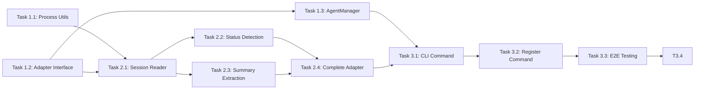

# Project Planning & Task Breakdown

## Milestones
**What are the major checkpoints?**

- [x] **Milestone 1**: Foundation - Process detection and state file reading (Completed)
- [x] **Milestone 2**: Claude Code Integration - Full adapter implementation (Completed)
- [x] **Milestone 3**: CLI Integration - Complete `agent list` command (Completed)

## Task Breakdown
**What specific work needs to be done?**

### Phase 1: Foundation

#### Task 1.1: Create Process Detection Utility
**Status**: ✅ Completed (Commit: e35315d)
- [x] Create `packages/cli/src/util/process.ts`
- [x] Implement `listProcesses()` function to query running processes
- [x] Filter by process name pattern (e.g., `claude`)
- [x] Extract PID, command line, working directory
- [x] Handle cross-platform differences (macOS focus first)
- [x] Write unit tests

**Estimated Effort**: 2 hours
**Actual Effort**: Part of commit e35315d (Jan 29, 2026)

#### Task 1.2: Create Agent Adapter Interface
**Status**: ✅ Completed (Commit: e35315d)
- [x] Create `packages/cli/src/lib/adapters/AgentAdapter.ts`
- [x] Define `AgentAdapter` interface
- [x] Define `AgentInfo`, `AgentType`, `AgentStatus` types
- [x] Export types for use by implementations
- [x] Added `STATUS_CONFIG` for display configuration
- [x] Added `ProcessInfo` interface

**Estimated Effort**: 1 hour
**Actual Effort**: Part of commit e35315d (Jan 29, 2026)

#### Task 1.3: Create AgentManager Class
**Status**: ✅ Completed (Commit: e35315d)
- [x] Create `packages/cli/src/lib/AgentManager.ts`
- [x] Implement adapter registration
- [x] Implement `listAgents()` method
- [x] Aggregate results from all registered adapters
- [x] Handle adapter errors gracefully
- [x] Write unit tests (252 lines of comprehensive tests)
- [x] Added utility methods: `unregisterAdapter`, `hasAdapter`, `getAdapterCount`, `clear`
- [x] Implemented status-based sorting (waiting > running > idle > unknown)

**Estimated Effort**: 2 hours
**Actual Effort**: Part of commit e35315d (Jan 29, 2026)

### Phase 2: Claude Code Integration

#### Task 2.1: Implement Claude Code Session Reader
**Status**: ✅ Completed (Commit: df346a6)
- [x] Create `packages/cli/src/lib/adapters/ClaudeCodeAdapter.ts`
- [x] Implement reading `~/.claude/projects/*/` directories
- [x] Parse `sessions-index.json` to get project paths
- [x] Read session JSONL files for conversation data
- [x] Read `~/.claude/history.jsonl` for user prompts
- [x] Extract session slug from JSONL entries
- [x] Write unit tests with fixture data (272 lines of tests)
- [x] Created helper utility `util/file.ts` with `readLastLines`, `readJsonLines`, `readJson` functions

**Estimated Effort**: 3 hours
**Actual Effort**: Part of commit df346a6 (Jan 29, 2026)

#### Task 2.2: Implement Status Detection
**Status**: ✅ Completed (Commit: df346a6)
- [x] Read last entries from session JSONL files
- [x] Implement `determineStatus()` method based on `type` field
- [x] Map entry types: `assistant`/`progress` → running, `user` → waiting
- [x] Add idle detection for sessions with old timestamps (>5 min)
- [x] Implement visual status display (🟡 wait, 🟢 run, ⚪ idle)
- [x] Write unit tests with sample session data
- [x] Handles edge cases: no last entry, unknown types

**Estimated Effort**: 2 hours
**Actual Effort**: Part of commit df346a6 (Jan 29, 2026)

#### Task 2.3: Implement Summary and Time Extraction
**Status**: ✅ Completed (Commit: df346a6)
- [x] Read `display` field from `~/.claude/history.jsonl`
- [x] Match history entries to sessions by `sessionId`
- [x] Implement `truncateSummary()` with ~40 char truncation
- [x] Implement `getRelativeTime()` for "2m ago", "just now" display
- [x] Provide fallback summary: "Session started"
- [x] Write unit tests
- [x] Handles minutes, hours, and days display formats

**Estimated Effort**: 2 hours
**Actual Effort**: Part of commit df346a6 (Jan 29, 2026)

#### Task 2.4: Complete Claude Code Adapter
**Status**: ✅ Completed (Commit: df346a6)
- [x] Implement full `detectAgents()` method
- [x] Correlate running processes with active sessions
- [x] Implement agent naming: project basename + optional slug
- [x] Filter out stale sessions (no matching process)
- [x] Sort agents: waiting first, then running, then idle (handled by AgentManager)
- [x] Integration testing with real Claude Code
- [x] Write unit tests
- [x] Implemented `canHandle()` method for process detection
- [x] Added `generateAgentName()` for unique naming with slug support

**Estimated Effort**: 2 hours
**Actual Effort**: Part of commit df346a6 (Jan 29, 2026)

### Phase 3: CLI Integration (List Command)

#### Task 3.1: Create Agent CLI Command
**Status**: ✅ Completed
- [x] Create `packages/cli/src/commands/agent.ts`
- [x] Register `agent` parent command
- [x] Register `agent list` subcommand
- [x] Use AgentManager to fetch agents
- [x] Format table with columns: Agent, Status, Working On, Active
- [x] Apply status colors and emoji
- [x] Add attention summary footer when agents waiting
- [x] Handle empty results with actionable guidance
- [x] Implement `--json` flag for JSON output

**Estimated Effort**: 2.5 hours

#### Task 3.2: Register Command in CLI
**Status**: ✅ Completed
- [x] Import and register agent command in main CLI file
- [x] Update help text
- [x] Manual testing

**Estimated Effort**: 0.5 hours

### Phase 4: Agent Open Command

#### Task 4.1: Create TerminalFocusManager
**Status**: ✅ Completed
- [x] Create `packages/cli/src/lib/TerminalFocusManager.ts`
- [x] Implement `findTerminal(pid)` to get TTY from process
- [x] Implement `focusTerminal(location)` dispatcher
- [x] Define `TerminalLocation` interface
- [x] Write unit tests

**Estimated Effort**: 1.5 hours

#### Task 4.2: Implement Tmux Support
**Status**: ✅ Completed
- [x] Implement `findTmuxPane(tty)` method
- [x] Parse `tmux list-panes` output
- [x] Implement focus with `tmux switch-client`
- [x] Write unit tests with mock tmux output

**Estimated Effort**: 1.5 hours

#### Task 4.3: Implement iTerm2 Support
**Status**: ✅ Completed
- [x] Create AppleScript to enumerate iTerm2 sessions
- [x] Match TTY to session
- [x] Implement focus with AppleScript window selection
- [x] Write unit tests

**Estimated Effort**: 1.5 hours

#### Task 4.4: Implement Terminal.app Support
**Status**: ✅ Completed
- [x] Create AppleScript to enumerate Terminal.app windows
- [x] Match TTY to window/tab
- [x] Implement focus with AppleScript activation
- [x] Write unit tests

**Estimated Effort**: 1 hour

#### Task 4.5: Implement Agent Name Resolution
**Status**: ✅ Completed
- [x] Implement `resolveAgentName(input, agents)` function
- [x] Handle exact match (case-insensitive)
- [x] Handle unique partial match
- [x] Handle ambiguous match with user prompt
- [x] Handle no match with available agents list
- [x] Write unit tests

**Estimated Effort**: 1 hour

#### Task 4.6: Create Agent Open Subcommand
**Status**: ✅ Completed
- [x] Register `agent open <name>` subcommand
- [x] Integrate AgentManager + TerminalFocusManager
- [x] Display success/error messages
- [x] Handle unfocusable terminals gracefully
- [x] Manual testing with different terminal environments

**Estimated Effort**: 1.5 hours

### Phase 5: Testing & Documentation

#### Task 5.1: End-to-End Testing
**Status**: 🔲 Not Started
- [ ] Test `agent list` with actual Claude Code sessions
- [ ] Test `agent open` with tmux, iTerm2, Terminal.app
- [ ] Verify output format
- [ ] Test edge cases (no agents, stale sessions, ambiguous names)
- [ ] Performance testing

**Estimated Effort**: 2 hours

#### Task 5.2: Documentation
**Status**: 🔲 Not Started
- [ ] Update CLI README with agent command docs
- [ ] Add usage examples for list and open
- [ ] Document supported terminal environments
- [ ] Document troubleshooting steps

**Estimated Effort**: 1 hour

## Dependencies
**What needs to happen in what order?**

### External Dependencies
- **Claude Code**: Must be installed and have debug logging enabled
- **Existing CLI utilities**: `terminal-ui` module for output formatting
- **Terminal environments**: tmux, iTerm2, or Terminal.app for open command

## Timeline & Estimates
**When will things be done?**

| Phase | Tasks | Estimated Hours | Status |
|-------|-------|-----------------|--------|
| Phase 1: Foundation | 1.1, 1.2, 1.3 | 5 hours | ✅ Completed |
| Phase 2: Claude Code Integration | 2.1, 2.2, 2.3, 2.4 | 9 hours | ✅ Completed |
| Phase 3: CLI Integration (List) | 3.1, 3.2 | 3 hours | ✅ Completed |
| Phase 4: Agent Open Command | 4.1, 4.2, 4.3, 4.4, 4.5, 4.6 | 8 hours | ✅ Completed |
| Phase 5: Testing & Documentation | 5.1, 5.2 | 3 hours | 🔲 Not Started |
| **Total** | | **28 hours** | |
| **Completed** | | **25 hours** | 89% Complete |
| **Remaining** | | **3 hours** | |

### Suggested Implementation Order
1. Task 1.2 (Interface) - Define contracts first
2. Task 1.1 (Process Utils) - Can be done in parallel
3. Task 1.3 (AgentManager) - Depends on interface
4. Task 2.1 (Session Reader) - Core functionality
5. Task 2.2 (Status Detection) - Requires log analysis
6. Task 2.3 (Summary Extraction) - Can parallel with 2.2
7. Task 2.4 (Complete Adapter) - Integration
8. Task 3.1 (CLI List Command) - User-facing
9. Task 3.2 (Register Command) - Quick integration
10. Task 3.3 (E2E Testing) - Validation
11. Task 3.4 (Documentation) - Final polish

## Risks & Mitigation
**What could go wrong?**

### Technical Risks

| Risk | Probability | Impact | Mitigation |
|------|-------------|--------|------------|
| Claude Code log format changes | Medium | High | Document known format, make parser flexible |
| Process detection varies by OS | Medium | Medium | Focus on macOS first, abstract OS-specific code |
| Status detection unreliable | Medium | Medium | Provide "unknown" fallback, iterate on heuristics |
| Debug logging disabled by user | Low | High | Document requirement, show warning |

### Resource Risks
| Risk | Probability | Impact | Mitigation |
|------|-------------|--------|------------|
| Larger logs impact performance | Low | Medium | Stream parsing, limit to last N lines |

## Resources Needed
**What do we need to succeed?**

### Knowledge Requirements
- Claude Code debug log format (research completed)
- Node.js child_process module
- Existing CLI patterns in ai-devkit

### Tools and Services
- Claude Code installation for testing
- Multiple terminal sessions for multi-agent testing

### Documentation References
- Existing `skill.ts` command as pattern reference
- `terminal-ui.ts` for output formatting
- Claude Code documentation for state file locations
