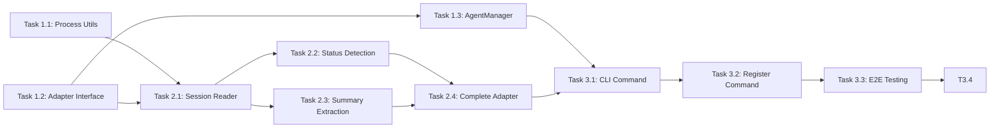

# Project Planning & Task Breakdown

## Milestones
**What are the major checkpoints?**

- [ ] **Milestone 1**: Foundation - Process detection and state file reading
- [ ] **Milestone 2**: Claude Code Integration - Full adapter implementation
- [ ] **Milestone 3**: CLI Integration - Complete `agent list` command

## Task Breakdown
**What specific work needs to be done?**

### Phase 1: Foundation

#### Task 1.1: Create Process Detection Utility
**Status**: 🔲 Not Started
- [ ] Create `packages/cli/src/util/process.ts`
- [ ] Implement `listProcesses()` function to query running processes
- [ ] Filter by process name pattern (e.g., `claude`)
- [ ] Extract PID, command line, working directory
- [ ] Handle cross-platform differences (macOS focus first)
- [ ] Write unit tests

**Estimated Effort**: 2 hours

#### Task 1.2: Create Agent Adapter Interface
**Status**: 🔲 Not Started
- [ ] Create `packages/cli/src/lib/adapters/AgentAdapter.ts`
- [ ] Define `AgentAdapter` interface
- [ ] Define `AgentInfo`, `AgentType`, `AgentStatus` types
- [ ] Export types for use by implementations

**Estimated Effort**: 1 hour

#### Task 1.3: Create AgentManager Class
**Status**: 🔲 Not Started
- [ ] Create `packages/cli/src/lib/AgentManager.ts`
- [ ] Implement adapter registration
- [ ] Implement `listAgents()` method
- [ ] Aggregate results from all registered adapters
- [ ] Handle adapter errors gracefully
- [ ] Write unit tests

**Estimated Effort**: 2 hours

### Phase 2: Claude Code Integration

#### Task 2.1: Implement Claude Code Session Reader
**Status**: 🔲 Not Started
- [ ] Create `packages/cli/src/lib/adapters/ClaudeCodeAdapter.ts`
- [ ] Implement reading `~/.claude/projects/*/` directories
- [ ] Parse `sessions-index.json` to get project paths
- [ ] Read session JSONL files for conversation data
- [ ] Read `~/.claude/history.jsonl` for user prompts
- [ ] Extract session slug from JSONL entries
- [ ] Write unit tests with fixture data

**Estimated Effort**: 3 hours

#### Task 2.2: Implement Status Detection
**Status**: 🔲 Not Started
- [ ] Read last entries from session JSONL files
- [ ] Implement `determineStatus()` method based on `type` field
- [ ] Map entry types: `assistant`/`progress` → running, `user` → waiting
- [ ] Add idle detection for sessions with old timestamps (>5 min)
- [ ] Implement visual status display (🟡 wait, 🟢 run, ⚪ idle)
- [ ] Write unit tests with sample session data

**Estimated Effort**: 2 hours

#### Task 2.3: Implement Summary and Time Extraction
**Status**: 🔲 Not Started
- [ ] Read `display` field from `~/.claude/history.jsonl`
- [ ] Match history entries to sessions by `sessionId`
- [ ] Implement `extractSummary()` with ~40 char truncation
- [ ] Implement `getRelativeTime()` for "2m ago", "just now" display
- [ ] Provide fallback summary: "Session started"
- [ ] Write unit tests

**Estimated Effort**: 2 hours

#### Task 2.4: Complete Claude Code Adapter
**Status**: 🔲 Not Started
- [ ] Implement full `detectAgents()` method
- [ ] Correlate running processes with active sessions
- [ ] Implement agent naming: project basename + optional slug
- [ ] Filter out stale sessions (no matching process)
- [ ] Sort agents: waiting first, then running, then idle
- [ ] Integration testing with real Claude Code
- [ ] Write unit tests

**Estimated Effort**: 2 hours

### Phase 3: CLI Integration (List Command)

#### Task 3.1: Create Agent CLI Command
**Status**: 🔲 Not Started
- [ ] Create `packages/cli/src/commands/agent.ts`
- [ ] Register `agent` parent command
- [ ] Register `agent list` subcommand
- [ ] Use AgentManager to fetch agents
- [ ] Format table with columns: Agent, Status, Working On, Active
- [ ] Apply status colors and emoji
- [ ] Add attention summary footer when agents waiting
- [ ] Handle empty results with actionable guidance
- [ ] Implement `--json` flag for JSON output

**Estimated Effort**: 2.5 hours

#### Task 3.2: Register Command in CLI
**Status**: 🔲 Not Started
- [ ] Import and register agent command in main CLI file
- [ ] Update help text
- [ ] Manual testing

**Estimated Effort**: 0.5 hours

### Phase 4: Agent Open Command

#### Task 4.1: Create TerminalFocusManager
**Status**: 🔲 Not Started
- [ ] Create `packages/cli/src/lib/TerminalFocusManager.ts`
- [ ] Implement `findTerminal(pid)` to get TTY from process
- [ ] Implement `focusTerminal(location)` dispatcher
- [ ] Define `TerminalLocation` interface
- [ ] Write unit tests

**Estimated Effort**: 1.5 hours

#### Task 4.2: Implement Tmux Support
**Status**: 🔲 Not Started
- [ ] Implement `findTmuxPane(tty)` method
- [ ] Parse `tmux list-panes` output
- [ ] Implement focus with `tmux switch-client`
- [ ] Write unit tests with mock tmux output

**Estimated Effort**: 1.5 hours

#### Task 4.3: Implement iTerm2 Support
**Status**: 🔲 Not Started
- [ ] Create AppleScript to enumerate iTerm2 sessions
- [ ] Match TTY to session
- [ ] Implement focus with AppleScript window selection
- [ ] Write unit tests

**Estimated Effort**: 1.5 hours

#### Task 4.4: Implement Terminal.app Support
**Status**: 🔲 Not Started
- [ ] Create AppleScript to enumerate Terminal.app windows
- [ ] Match TTY to window/tab
- [ ] Implement focus with AppleScript activation
- [ ] Write unit tests

**Estimated Effort**: 1 hour

#### Task 4.5: Implement Agent Name Resolution
**Status**: 🔲 Not Started
- [ ] Implement `resolveAgentName(input, agents)` function
- [ ] Handle exact match (case-insensitive)
- [ ] Handle unique partial match
- [ ] Handle ambiguous match with user prompt
- [ ] Handle no match with available agents list
- [ ] Write unit tests

**Estimated Effort**: 1 hour

#### Task 4.6: Create Agent Open Subcommand
**Status**: 🔲 Not Started
- [ ] Register `agent open <name>` subcommand
- [ ] Integrate AgentManager + TerminalFocusManager
- [ ] Display success/error messages
- [ ] Handle unfocusable terminals gracefully
- [ ] Manual testing with different terminal environments

**Estimated Effort**: 1.5 hours

### Phase 5: Testing & Documentation

#### Task 5.1: End-to-End Testing
**Status**: 🔲 Not Started
- [ ] Test `agent list` with actual Claude Code sessions
- [ ] Test `agent open` with tmux, iTerm2, Terminal.app
- [ ] Verify output format
- [ ] Test edge cases (no agents, stale sessions, ambiguous names)
- [ ] Performance testing

**Estimated Effort**: 2 hours

#### Task 5.2: Documentation
**Status**: 🔲 Not Started
- [ ] Update CLI README with agent command docs
- [ ] Add usage examples for list and open
- [ ] Document supported terminal environments
- [ ] Document troubleshooting steps

**Estimated Effort**: 1 hour

## Dependencies
**What needs to happen in what order?**

### External Dependencies
- **Claude Code**: Must be installed and have debug logging enabled
- **Existing CLI utilities**: `terminal-ui` module for output formatting
- **Terminal environments**: tmux, iTerm2, or Terminal.app for open command

## Timeline & Estimates
**When will things be done?**

| Phase | Tasks | Estimated Hours |
|-------|-------|-----------------|
| Phase 1: Foundation | 1.1, 1.2, 1.3 | 5 hours |
| Phase 2: Claude Code Integration | 2.1, 2.2, 2.3, 2.4 | 9 hours |
| Phase 3: CLI Integration (List) | 3.1, 3.2 | 3 hours |
| Phase 4: Agent Open Command | 4.1, 4.2, 4.3, 4.4, 4.5, 4.6 | 8 hours |
| Phase 5: Testing & Documentation | 5.1, 5.2 | 3 hours |
| **Total** | | **28 hours** |

### Suggested Implementation Order
1. Task 1.2 (Interface) - Define contracts first
2. Task 1.1 (Process Utils) - Can be done in parallel
3. Task 1.3 (AgentManager) - Depends on interface
4. Task 2.1 (Session Reader) - Core functionality
5. Task 2.2 (Status Detection) - Requires log analysis
6. Task 2.3 (Summary Extraction) - Can parallel with 2.2
7. Task 2.4 (Complete Adapter) - Integration
8. Task 3.1 (CLI List Command) - User-facing
9. Task 3.2 (Register Command) - Quick integration
10. Task 3.3 (E2E Testing) - Validation
11. Task 3.4 (Documentation) - Final polish

## Risks & Mitigation
**What could go wrong?**

### Technical Risks

| Risk | Probability | Impact | Mitigation |
|------|-------------|--------|------------|
| Claude Code log format changes | Medium | High | Document known format, make parser flexible |
| Process detection varies by OS | Medium | Medium | Focus on macOS first, abstract OS-specific code |
| Status detection unreliable | Medium | Medium | Provide "unknown" fallback, iterate on heuristics |
| Debug logging disabled by user | Low | High | Document requirement, show warning |

### Resource Risks
| Risk | Probability | Impact | Mitigation |
|------|-------------|--------|------------|
| Larger logs impact performance | Low | Medium | Stream parsing, limit to last N lines |

## Resources Needed
**What do we need to succeed?**

### Knowledge Requirements
- Claude Code debug log format (research completed)
- Node.js child_process module
- Existing CLI patterns in ai-devkit

### Tools and Services
- Claude Code installation for testing
- Multiple terminal sessions for multi-agent testing

### Documentation References
- Existing `skill.ts` command as pattern reference
- `terminal-ui.ts` for output formatting
- Claude Code documentation for state file locations
