# Project Planning & Task Breakdown

## Milestones
**What are the major checkpoints?**

- [ ] Milestone 1: Package scaffold and workspace wiring complete
- [ ] Milestone 2: Agent manager domain logic migrated to new package
- [ ] Milestone 3: CLI switched to package API with parity tests passing

## Task Breakdown
**What specific work needs to be done?**

### Phase 1: Foundation (Package Setup)
- [ ] Task 1.1: Create `packages/agent-manager` using `packages/memory` setup pattern.
- [ ] Task 1.2: Configure `package.json`, `project.json`, TypeScript, Jest, and exports for package.
- [ ] Task 1.3: Add package to workspace build/lint/test flows and verify compile.

### Phase 2: Core Migration
- [ ] Task 2.1: Move `AgentManager.ts` into package and adjust imports.
- [ ] Task 2.2: Move related adapter/types/utils modules required by manager.
- [ ] Task 2.3: Define package root public API (`index.ts`/`api.ts`) and stable contracts.
- [ ] Task 2.4: Add/update unit tests in package for migrated behavior.

### Phase 3: CLI Integration & Validation
- [ ] Task 3.1: Update CLI agent command(s) to call `@ai-devkit/agent-manager` API.
- [ ] Task 3.2: Remove deprecated CLI-local manager imports and dead code.
- [ ] Task 3.3: Run lint/test/build for affected packages; fix regressions.
- [ ] Task 3.4: Update implementation/testing docs with concrete outcomes and coverage.

## Dependencies
**What needs to happen in what order?**

```mermaid
graph LR
  T11[1.1 Scaffold package] --> T12[1.2 Configure package]
  T12 --> T13[1.3 Workspace wiring]
  T13 --> T21[2.1 Move AgentManager]
  T21 --> T22[2.2 Move related modules]
  T22 --> T23[2.3 Public API]
  T23 --> T24[2.4 Package tests]
  T24 --> T31[3.1 CLI integration]
  T31 --> T32[3.2 Cleanup]
  T32 --> T33[3.3 Verification]
  T33 --> T34[3.4 Docs update]
```

### External Dependencies
- Existing `packages/cli` agent command implementation.
- Current adapter/status logic behavior as parity baseline.

## Timeline & Estimates
**When will things be done?**

| Phase | Estimated Effort |
|------|-------------------|
| Phase 1: Foundation | 2-3 hours |
| Phase 2: Core Migration | 4-6 hours |
| Phase 3: Integration & Validation | 2-3 hours |
| **Total** | **8-12 hours** |

## Risks & Mitigation
**What could go wrong?**

| Risk | Impact | Mitigation |
|------|--------|------------|
| Hidden coupling to CLI internals | High | Identify imports early; keep API boundary strict |
| Behavior regression during move | High | Snapshot expected behavior and keep parity tests |
| Circular dependencies | Medium | Enforce one-way dependency (CLI -> agent-manager) |
| Export surface instability | Medium | Publish minimal, explicit root exports only |

## Resources Needed
**What do we need to succeed?**

- Maintainer review for API surface and package naming.
- Existing tests as migration safety net.
- Documentation updates in implementation/testing phases after code changes.
