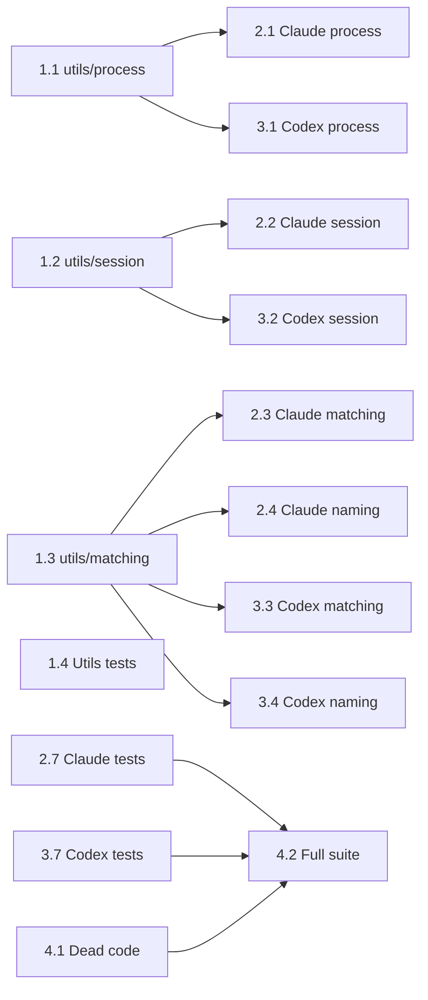

# Project Planning & Task Breakdown

## Milestones

- [ ] Milestone 1: Shared utilities created and tested
- [ ] Milestone 2: ClaudeCodeAdapter refactored to use shared utilities
- [ ] Milestone 3: CodexAdapter refactored to use shared utilities
- [ ] Milestone 4: Full test suite passes, dead code removed

## Task Breakdown

### Phase 1: Shared Utilities

- [ ] Task 1.1: Extend `utils/process.ts` — add `listAgentProcesses(namePattern)` (runs `ps aux | grep <pattern>`, post-filters by `path.basename(executable)` match, returns `ProcessInfo[]` with pid, command, tty). Add `batchGetProcessCwds(pids)` (single `lsof -a -d cwd -Fn -p PID1,PID2,...`). Add `batchGetProcessStartTimes(pids)` (single `ps -o pid=,lstart= -p PID1,...`, parses full timestamp). Add `enrichProcesses(processes)` convenience that calls both batch functions and populates cwd + startTime on each ProcessInfo. Returns partial results on failure. Remove per-PID `getProcessCwd()`.

- [ ] Task 1.2: Create `utils/session.ts` — implement `getSessionFileBirthtimes(dir)` using `stat -f '%B %N'` on macOS or `stat --format='%W %n'` on Linux. Parse epoch seconds + filename. Return `SessionFile[]` with `resolvedCwd` left empty (adapter sets it). Platform detection via `process.platform`. Return empty array on failure.

- [ ] Task 1.3: Create `utils/matching.ts` — implement `matchProcessesToSessions(processes, sessions)`: exclude processes without `startTime`, build candidate pairs where `process.cwd === session.resolvedCwd` and `deltaMs <= 180_000`, sort by deltaMs ascending, greedy 1:1 assign. Implement `generateAgentName(cwd, pid)` returning `basename(cwd) (pid)`.

- [ ] Task 1.4: Write unit tests for all new utilities — mock `execSync` at module level with `jest.mock`. Test cases: no processes, no sessions, multiple processes same CWD, no match within tolerance, exact 1:1, more sessions than processes, more processes than sessions, partial lsof failure, process without startTime excluded, platform detection for stat command.

### Phase 2: Refactor ClaudeCodeAdapter

- [ ] Task 2.1: Replace process detection — use `listAgentProcesses('claude')` + `enrichProcesses()`. Remove `listClaudeProcesses()`, `getProcessStartTimes()`, `parseElapsedSeconds()`.

- [ ] Task 2.2: Replace session file scanning — use `getSessionFileBirthtimes(dir)` for listing files. Adapter sets `resolvedCwd` on each SessionFile using its CWD→project-dir mapping. Keep session dir derivation (CWD → `~/.claude/projects/<encoded>/`). Remove `findSessionFiles()`, `calculateSessionScanLimit()`.

- [ ] Task 2.3: Replace matching — use `matchProcessesToSessions()`. Remove `assignSessionsForMode()`, `selectBestSession()`, `rankCandidatesByStartTime()`, `filterCandidateSessions()`. Remove parent-child/missing-cwd modes.

- [ ] Task 2.4: Replace naming — use `generateAgentName(cwd, pid)`. Remove adapter's `generateAgentName()`.

- [ ] Task 2.5: Keep adapter-specific: `canHandle()`, session dir derivation, `readSession()` (JSONL parsing), `determineStatus()`, `extractUserMessageText()`, `mapSessionToAgent()`, `mapProcessOnlyAgent()`.

- [ ] Task 2.6: Remove all `execSync` calls and path comparison helpers (`pathEquals`, `pathRelated`, `isChildPath`, `normalizePath`).

- [ ] Task 2.7: Update ClaudeCodeAdapter tests — mock shared util imports instead of internal methods.

### Phase 3: Refactor CodexAdapter

- [ ] Task 3.1: Replace process detection — use `listAgentProcesses('codex')` + `enrichProcesses()`. Remove duplicated process/etime functions.

- [ ] Task 3.2: Replace session file listing — use `getSessionFileBirthtimes()` per date directory. Keep date-dir scanning: use `batchGetProcessStartTimes` to determine which `YYYY/MM/DD/` dirs to scan (±1 day window). Adapter sets `resolvedCwd` from session meta entry. Remove `calculateSessionScanLimit()`.

- [ ] Task 3.3: Replace matching — use `matchProcessesToSessions()`. Remove duplicated matching functions.

- [ ] Task 3.4: Replace naming — use shared `generateAgentName()`.

- [ ] Task 3.5: Keep adapter-specific: `canHandle()`, date-dir scanning, `readSession()`, `determineStatus()`, `extractSummary()`.

- [ ] Task 3.6: Remove all `execSync` calls from CodexAdapter.

- [ ] Task 3.7: Update CodexAdapter tests.

### Phase 4: Cleanup

- [ ] Task 4.1: Remove dead code — old `getProcessCwd()`, `getProcessTty()` if unused, unused imports/types across all files.

- [ ] Task 4.2: Run full test suite, verify no regressions.

## Dependencies

- Phase 1 (1.1-1.3) must complete before Phase 2 and Phase 3
- Phase 2 and Phase 3 are independent (can run in parallel)
- Task 1.4 can run in parallel with Phase 2/3

## Risks & Mitigation

| Risk | Likelihood | Impact | Mitigation |
|------|-----------|--------|------------|
| `stat` birthtime returns 0 on older Linux | Medium | Low | Fallback to `mtimeMs` in `utils/session.ts` |
| `ps -o lstart` format differs on Linux vs macOS | Medium | Medium | Test on both platforms, use `Date.parse()` with fallback parser |
| `stat` output format differs across distributions | Low | Medium | Parse defensively, test with sample output |
| Agent name format change breaks downstream | Low | Medium | Accepted as intentional breaking change |
| Partial shell command failure | Medium | Low | Return partial results, future `--verbose` mode for logging |
