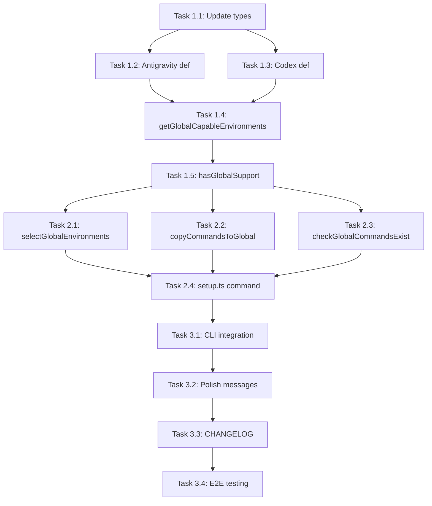

# Project Planning & Task Breakdown - Global Setup Feature

## Milestones
**What are the major checkpoints?**

- [ ] Milestone 1: Environment definitions updated with global support
- [ ] Milestone 2: Core global setup functionality implemented
- [ ] Milestone 3: CLI command integrated and tested

## Task Breakdown
**What specific work needs to be done?**

### Phase 1: Foundation - Update Types and Environment Definitions
- [ ] Task 1.1: Add `globalCommandPath` property to `EnvironmentDefinition` interface in `src/types.ts`
- [ ] Task 1.2: Add `globalCommandPath` to Antigravity definition in `src/util/env.ts`
- [ ] Task 1.3: Add `globalCommandPath` to Codex definition in `src/util/env.ts`
- [ ] Task 1.4: Add `getGlobalCapableEnvironments()` function in `src/util/env.ts`
- [ ] Task 1.5: Add `hasGlobalSupport()` function in `src/util/env.ts`

### Phase 2: Core Features - Implement Global Setup Logic
- [ ] Task 2.1: Add `selectGlobalEnvironments()` method to `EnvironmentSelector` class
- [ ] Task 2.2: Add `copyCommandsToGlobal()` method to `TemplateManager` class
- [ ] Task 2.3: Add `checkGlobalCommandsExist()` method to `TemplateManager` class
- [ ] Task 2.4: Create new `src/commands/setup.ts` file with global setup logic

### Phase 3: Integration & Polish
- [ ] Task 3.1: Add `setup` command to CLI in `src/cli.ts`
- [ ] Task 3.2: Add user-friendly messages and error handling
- [ ] Task 3.3: Update CHANGELOG.md with new feature
- [ ] Task 3.4: Test end-to-end with Antigravity and Codex

## Dependencies
**What needs to happen in what order?**

**External dependencies:**
- None - all dependencies are internal

## Timeline & Estimates
**When will things be done?**

| Task | Estimated Effort |
|------|-----------------|
| Phase 1 (Tasks 1.1-1.5) | ~30 minutes |
| Phase 2 (Tasks 2.1-2.4) | ~45 minutes |
| Phase 3 (Tasks 3.1-3.4) | ~30 minutes |
| **Total** | **~1.75 hours** |

## Risks & Mitigation
**What could go wrong?**

| Risk | Likelihood | Impact | Mitigation |
|------|------------|--------|------------|
| Home directory not accessible | Low | High | Add error handling with clear message |
| File permissions issues | Low | Medium | Catch errors and provide helpful guidance |
| Path resolution issues on Windows | Medium | Medium | Use `os.homedir()` and `path.join()` consistently |

## Resources Needed
**What do we need to succeed?**

- Existing codebase familiarity (already explored)
- `fs-extra` and `os` Node.js modules (already available)
- Test environment with Antigravity and/or Codex installed (user to verify)
