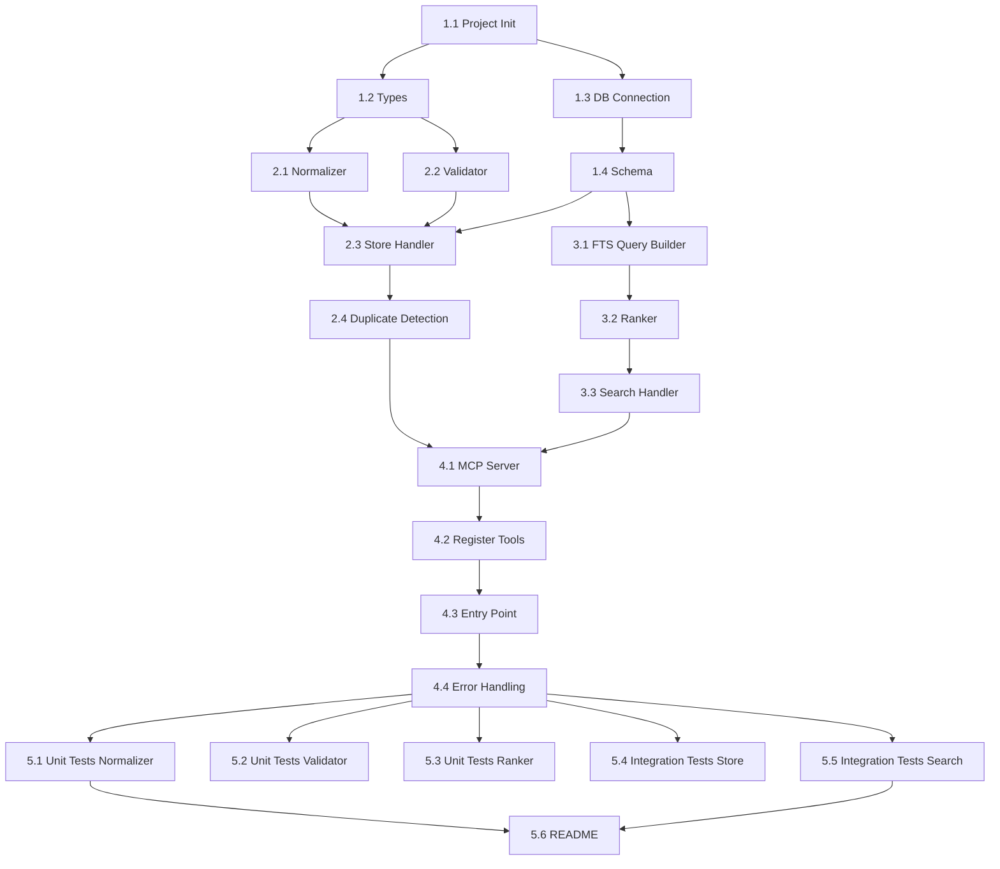

# Project Planning & Task Breakdown

## Milestones
**What are the major checkpoints?**

- [ ] **Milestone 1: Foundation** - Project setup, database layer, basic schema (Day 1-2)
- [ ] **Milestone 2: Core Storage** - Store handler with validation and deduplication (Day 2-3)
- [ ] **Milestone 3: Core Search** - Search handler with FTS5 and ranking (Day 3-4)
- [ ] **Milestone 4: MCP Integration** - Full MCP server with both tools working (Day 4-5)
- [ ] **Milestone 5: Quality & Polish** - Tests, documentation, edge cases (Day 5-6)

## Task Breakdown
**What specific work needs to be done?**

### Phase 1: Foundation (Estimated: 4-6 hours)

- [ ] **Task 1.1: Project Initialization**
  - Create `packages/knowledge-memory-service/` directory
  - Initialize `package.json` with dependencies
  - Configure `tsconfig.json` for TypeScript
  - Set up ESLint and Prettier configs
  - Dependencies: `better-sqlite3`, `@modelcontextprotocol/sdk`, `uuid`, `crypto`
  - Effort: 1 hour

- [ ] **Task 1.2: TypeScript Type Definitions**
  - Define `KnowledgeItem` interface
  - Define input/output types for MCP tools
  - Define error types and result types
  - Effort: 1 hour

- [ ] **Task 1.3: Database Connection Module**
  - Implement `database/connection.ts`
  - SQLite connection with better-sqlite3
  - Enable WAL mode for better concurrency
  - Configurable database path (default: `~/.knowledge-memory/memory.db`)
  - Effort: 1 hour

- [ ] **Task 1.4: Schema Creation**
  - Implement `database/schema.ts`
  - Create `knowledge` table with all fields
  - Create `knowledge_fts` FTS5 virtual table
  - Create sync triggers (INSERT, UPDATE, DELETE)
  - Create indexes on scope, category, priority
  - Add schema version tracking for migrations
  - Effort: 1-2 hours

### Phase 2: Core Storage (Estimated: 4-6 hours)

- [ ] **Task 2.1: Normalizer Service**
  - Implement `services/normalizer.ts`
  - `normalizeTitle()`: lowercase, trim, collapse whitespace
  - `normalizeContent()`: trim, normalize newlines
  - `hashContent()`: SHA-256 hash of normalized content
  - Effort: 1 hour

- [ ] **Task 2.2: Validator Service**
  - Implement `services/validator.ts`
  - Validate title length (10-100 chars)
  - Validate content length (50-5000 chars)
  - Check content specificity (reject generic phrases)
  - Validate tags (1-10 items, alphanumeric with hyphens)
  - Validate scope format (`global`, `project:*`, `repo:*`)
  - Return structured validation errors
  - Effort: 2 hours

- [ ] **Task 2.3: Store Handler**
  - Implement `handlers/store.ts`
  - Accept input, validate with Validator
  - Normalize title and content
  - Generate UUID and content hash
  - Check for duplicates (title+scope, hash+scope)
  - Insert into database with transaction
  - Return success/error response
  - Effort: 2 hours

- [ ] **Task 2.4: Duplicate Detection**
  - Query existing by normalized_title + scope
  - Query existing by content_hash + scope
  - Return specific error for each duplicate type
  - Effort: 1 hour

### Phase 3: Core Search (Estimated: 4-6 hours)

- [ ] **Task 3.1: FTS Query Builder**
  - Implement `services/search.ts` (or in handler)
  - Convert natural language query to FTS5 query
  - Handle special characters, quotes
  - Build column-weighted query (title^3, content^2, tags^1)
  - Effort: 1-2 hours

- [ ] **Task 3.2: Ranker Service**
  - Implement `services/ranker.ts`
  - `calculateScore()` implementing the ranking formula:
    ```
    final_score = bm25_score × priority_boost × confidence × tag_boost + scope_boost
    
    Where:
      bm25_score     = FTS5 bm25() with column weights (title=10, content=5, tags=1)
      priority_boost = 1 + (priority - 5) × 0.05    // Range: 0.8 to 1.25
      confidence     = confidence value (0.0 to 1.0)
      tag_boost      = 1 + (matching_tags × 0.1)   // +10% per matching contextTag
      scope_boost    = +0.5 if scope matches, +0.2 if global, 0 otherwise
    ```
  - Return sorted results with combined score
  - Effort: 2 hours

- [ ] **Task 3.3: Search Handler**
  - Implement `handlers/search.ts`
  - Parse search parameters
  - Build FTS query with filters
  - Execute query with BM25 ranking
  - Apply additional ranking factors
  - Filter by minConfidence if specified
  - Limit results (default 5, max 20)
  - Return formatted response
  - Effort: 2 hours

### Phase 4: MCP Integration (Estimated: 3-4 hours)

- [ ] **Task 4.1: MCP Server Setup**
  - Implement `server.ts`
  - Initialize MCP server with stdio transport
  - Configure server metadata and capabilities
  - Effort: 1 hour

- [ ] **Task 4.2: Register Tools**
  - Register `memory.storeKnowledge` tool
  - Register `memory.searchKnowledge` tool
  - Define JSON schemas for inputs
  - Wire handlers to tool calls
  - Effort: 1 hour

- [ ] **Task 4.3: Entry Point**
  - Implement `index.ts`
  - Initialize database on startup
  - Run schema migrations if needed
  - Start MCP server
  - Handle graceful shutdown
  - Effort: 1 hour

- [ ] **Task 4.4: Error Handling**
  - Implement `utils/errors.ts`
  - Custom error classes: `ValidationError`, `DuplicateError`, `StorageError`
  - Error to MCP response mapping
  - Effort: 1 hour

### Phase 5: Quality & Polish (Estimated: 4-6 hours)

- [ ] **Task 5.1: Unit Tests - Normalizer**
  - Test `normalizeTitle()` with various inputs
  - Test `hashContent()` for consistency
  - Effort: 0.5 hours

- [ ] **Task 5.2: Unit Tests - Validator**
  - Test valid inputs pass
  - Test short/long title rejection
  - Test generic content rejection
  - Test invalid scope formats
  - Effort: 1 hour

- [ ] **Task 5.3: Unit Tests - Ranker**
  - Test BM25 score integration
  - Test priority boost calculation
  - Test tag match counting
  - Test scope boost logic
  - Effort: 1 hour

- [ ] **Task 5.4: Integration Tests - Store**
  - Test successful storage
  - Test duplicate rejection (title)
  - Test duplicate rejection (content hash)
  - Test validation errors
  - Effort: 1 hour

- [ ] **Task 5.5: Integration Tests - Search**
  - Test basic query matching
  - Test tag filtering
  - Test scope filtering
  - Test ranking order
  - Test API-specific rules in top 3 (DoD)
  - Effort: 1.5 hours

- [ ] **Task 5.6: README Documentation**
  - Installation instructions
  - Configuration options
  - Tool usage examples
  - MCP client setup guide
  - Effort: 1 hour

## Dependencies
**What needs to happen in what order?**



### External Dependencies
- `better-sqlite3`: Native SQLite3 binding with sync API
- `@modelcontextprotocol/sdk`: Official MCP SDK for Node.js
- `uuid`: UUID v4 generation
- Built-in `crypto`: SHA-256 hashing

### No Blockers
- All dependencies are npm packages, no external services needed
- Can be developed and tested entirely offline

## Timeline & Estimates
**When will things be done?**

| Phase | Tasks | Estimated Hours | Target |
|-------|-------|-----------------|--------|
| Phase 1: Foundation | 1.1-1.4 | 4-6 hours | Day 1 |
| Phase 2: Core Storage | 2.1-2.4 | 4-6 hours | Day 2 |
| Phase 3: Core Search | 3.1-3.3 | 4-6 hours | Day 3 |
| Phase 4: MCP Integration | 4.1-4.4 | 3-4 hours | Day 4 |
| Phase 5: Quality & Polish | 5.1-5.6 | 4-6 hours | Day 5 |
| **Total** | 20 tasks | **19-28 hours** | **5-6 days** |

### Buffer
- 20% buffer for unknowns and edge cases
- Total with buffer: 23-34 hours

## Risks & Mitigation
**What could go wrong?**

### Technical Risks

| Risk | Likelihood | Impact | Mitigation |
|------|------------|--------|------------|
| `better-sqlite3` native build issues | Medium | High | Fallback to `sql.js` (pure JS) |
| FTS5 tokenizer not matching expectations | Low | Medium | Test early, tune tokenizer config |
| MCP SDK breaking changes | Low | Medium | Pin SDK version, monitor releases |
| BM25 ranking not relevant enough | Medium | Medium | Add optional embedding boost later |

### Resource Risks

| Risk | Likelihood | Impact | Mitigation |
|------|------------|--------|------------|
| Underestimated complexity | Medium | Medium | Time-boxed phases, cut scope if needed |
| Edge cases in validation logic | Medium | Low | Comprehensive test coverage |

### Dependency Risks
- All dependencies are stable, well-maintained packages
- No external API dependencies for core functionality

## Resources Needed
**What do we need to succeed?**

### Team Members
- 1 developer (full-stack TypeScript)

### Tools and Services
- Node.js v18+ with npm
- TypeScript compiler
- Jest for testing
- No cloud services required

### Infrastructure
- Local development environment
- SQLite database file (~50MB for 10,000 items)

### Documentation/Knowledge
- [MCP Specification](https://modelcontextprotocol.io/)
- [SQLite FTS5 Documentation](https://www.sqlite.org/fts5.html)
- [better-sqlite3 Documentation](https://github.com/WiseLibs/better-sqlite3)
