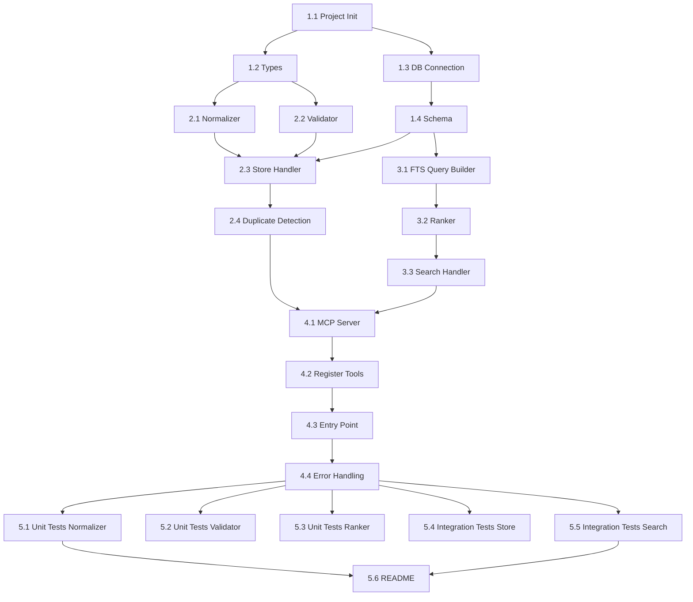

# Project Planning & Task Breakdown

## Milestones
**What are the major checkpoints?**

- [x] **Milestone 1: Foundation** - Project setup, database layer, basic schema ✅
- [x] **Milestone 2: Core Storage** - Store handler with validation and deduplication ✅
- [x] **Milestone 3: Core Search** - Search handler with FTS5 and ranking ✅
- [x] **Milestone 4: MCP Integration** - Full MCP server with both tools working ✅
- [x] **Milestone 5: Quality & Polish** - Tests, documentation, edge cases ✅

## Task Breakdown
**What specific work needs to be done?**

### Phase 1: Foundation (Estimated: 4-6 hours) ✅ COMPLETE

- [x] **Task 1.1: Project Initialization**
  - Created `packages/memory/` directory (renamed from `ai-devkit-memory`)
  - Initialize `package.json` with dependencies (SWC for fast builds)
  - Configure `tsconfig.json` for TypeScript
  - Dependencies: `better-sqlite3`, `@modelcontextprotocol/sdk`, `uuid`

- [x] **Task 1.2: TypeScript Type Definitions**
  - Defined `KnowledgeItem` interface (simplified 9-field model)
  - Defined input/output types for MCP tools
  - Defined error types in `utils/errors.ts`

- [x] **Task 1.3: Database Connection Module**
  - Implemented `database/connection.ts`
  - SQLite connection with better-sqlite3
  - WAL mode, configurable path (default: `~/.ai-devkit/memory.db`)
  - Auto-runs migrations on first access

- [x] **Task 1.4: Schema Creation**
  - Implemented `database/schema.ts` with SQL migrations
  - Created `migrations/001_initial.sql`
  - FTS5 virtual table with sync triggers
  - Uses SQLite `user_version` pragma for versioning

### Phase 2: Core Storage (Estimated: 4-6 hours) ✅ COMPLETE

- [x] **Task 2.1: Normalizer Service**
  - Implemented `services/normalizer.ts`
  - `normalizeTitle()`, `normalizeContent()`, `hashContent()`, `normalizeTags()`, `normalizeScope()`

- [x] **Task 2.2: Validator Service**
  - Implemented `services/validator.ts`
  - Title/content length validation
  - Generic phrase detection
  - Tag and scope format validation

- [x] **Task 2.3: Store Handler**
  - Implemented `handlers/store.ts`
  - Full transaction wrapping (race condition fix)
  - Duplicate detection integrated
  - Proper error handling with re-throw for DuplicateError

- [x] **Task 2.4: Duplicate Detection**
  - Integrated into store handler
  - Checks normalized_title + scope
  - Checks content_hash + scope

### Phase 3: Core Search (Estimated: 4-6 hours) 🔄 IN PROGRESS

- [x] **Task 3.1: FTS Query Builder**
  - Implemented `services/search.ts`
  - FTS5 special character escaping (including hyphens, boolean operators)
  - Prefix matching for partial matches
  - BM25 column weights (title=10, content=5, tags=1)

- [x] **Task 3.2: Ranker Service**
  - Implemented `services/ranker.ts`
  - Tag boost (+10% per matching tag)
  - Scope boost (+0.5 project match, +0.2 global)
  - Safe JSON.parse with try-catch

- [x] **Task 3.3: Search Handler**
  - Implemented `handlers/search.ts`
  - Orchestrate FTS query → ranker → response
  - Handle empty queries
  - Apply limit (default 5, max 20)

### Phase 4: MCP Integration (Estimated: 3-4 hours) ✅ COMPLETE

- [x] **Task 4.1: MCP Server Setup**
  - Implemented `server.ts` with stdio transport
  - Configured server metadata and capabilities

- [x] **Task 4.2: Register Tools**
  - Registered `memory.storeKnowledge` and `memory.searchKnowledge`
  - JSON schemas defined for inputs

- [x] **Task 4.3: Entry Point**
  - Implemented `index.ts`
  - Auto-runs migrations on startup

- [x] **Task 4.4: Error Handling**
  - Implemented custom error classes
  - Error to MCP response mapping

### Phase 5: Quality & Polish (Estimated: 4-6 hours) ✅ COMPLETE

- [x] **Task 5.1: Unit Tests - Normalizer** (21 tests)
  - All normalizer functions tested

- [x] **Task 5.2: Unit Tests - Validator** (22 tests)
  - Title, content, tags, scope validation tested

- [x] **Task 5.3: Unit Tests - Ranker** (9 tests)
  - BM25, tag boost, scope boost tested

- [x] **Task 5.4: Integration Tests - Store** (9 tests)
  - Storage, persistence, deduplication tested

- [x] **Task 5.5: Integration Tests - Search** (8 tests)
  - Query, ranking, validation, empty results tested

- [x] **Task 5.6: README Documentation**
  - Full README with API reference, usage examples

## Dependencies
**What needs to happen in what order?**

### External Dependencies
- `better-sqlite3`: Native SQLite3 binding with sync API
- `@modelcontextprotocol/sdk`: Official MCP SDK for Node.js
- `uuid`: UUID v4 generation
- Built-in `crypto`: SHA-256 hashing

### No Blockers
- All dependencies are npm packages, no external services needed
- Can be developed and tested entirely offline

## Timeline & Estimates
**When will things be done?**

| Phase | Tasks | Estimated Hours | Target |
|-------|-------|-----------------|--------|
| Phase 1: Foundation | 1.1-1.4 | 4-6 hours | Day 1 |
| Phase 2: Core Storage | 2.1-2.4 | 4-6 hours | Day 2 |
| Phase 3: Core Search | 3.1-3.3 | 4-6 hours | Day 3 |
| Phase 4: MCP Integration | 4.1-4.4 | 3-4 hours | Day 4 |
| Phase 5: Quality & Polish | 5.1-5.6 | 4-6 hours | Day 5 |
| **Total** | 20 tasks | **19-28 hours** | **5-6 days** |

### Buffer
- 20% buffer for unknowns and edge cases
- Total with buffer: 23-34 hours

## Risks & Mitigation
**What could go wrong?**

### Technical Risks

| Risk | Likelihood | Impact | Mitigation |
|------|------------|--------|------------|
| `better-sqlite3` native build issues | Medium | High | Fallback to `sql.js` (pure JS) |
| FTS5 tokenizer not matching expectations | Low | Medium | Test early, tune tokenizer config |
| MCP SDK breaking changes | Low | Medium | Pin SDK version, monitor releases |
| BM25 ranking not relevant enough | Medium | Medium | Add optional embedding boost later |

### Resource Risks

| Risk | Likelihood | Impact | Mitigation |
|------|------------|--------|------------|
| Underestimated complexity | Medium | Medium | Time-boxed phases, cut scope if needed |
| Edge cases in validation logic | Medium | Low | Comprehensive test coverage |

### Dependency Risks
- All dependencies are stable, well-maintained packages
- No external API dependencies for core functionality

## Resources Needed
**What do we need to succeed?**

### Team Members
- 1 developer (full-stack TypeScript)

### Tools and Services
- Node.js v18+ with npm
- TypeScript compiler
- Jest for testing
- No cloud services required

### Infrastructure
- Local development environment
- SQLite database file (~50MB for 10,000 items)

### Documentation/Knowledge
- [MCP Specification](https://modelcontextprotocol.io/)
- [SQLite FTS5 Documentation](https://www.sqlite.org/fts5.html)
- [better-sqlite3 Documentation](https://github.com/WiseLibs/better-sqlite3)
