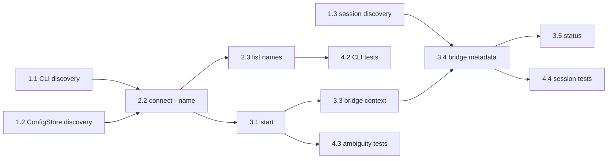

# Planning: Multi Telegram Channels

## Milestones

- [ ] Milestone 1: Confirm existing channel config and process tracking behavior
- [ ] Milestone 2: Add named Telegram channel configuration support
- [ ] Milestone 3: Add per-channel bridge start/status behavior
- [ ] Milestone 4: Add tests and compatibility coverage

## Task Breakdown

### Phase 1: Discovery and Compatibility
- [ ] Task 1.1: Inspect current `channel` CLI command implementation and identify type-only assumptions.
- [ ] Task 1.2: Inspect `ConfigStore` tests and implementation for multi-entry support.
- [ ] Task 1.3: Inspect current channel status behavior and define dedicated bridge registry needs.
- [ ] Task 1.4: Define compatibility behavior for legacy `telegram` commands and config.

### Phase 2: Config and CLI Naming
- [ ] Task 2.1: Add channel instance name validation helper.
- [ ] Task 2.2: Update `channel connect telegram` to accept `--name <name>`.
- [ ] Task 2.3: When connecting without `--name`, create or update the default `telegram` channel entry.
- [ ] Task 2.4: Update `channel list` output to display all channel names, types, bot usernames, enabled states, and auth states.
- [ ] Task 2.5: Update `channel disconnect` to remove by channel name.
- [ ] Task 2.6: Reject duplicate Telegram bot tokens without printing the token.

### Phase 3: Runtime Bridge Mapping
- [ ] Task 3.1: Update `channel start` to accept an explicit channel name.
- [ ] Task 3.2: Keep `channel start --agent <agent>` working when exactly one default Telegram channel is available.
- [ ] Task 3.3: Create an isolated bridge context per started channel instance.
- [ ] Task 3.4: Add `packages/cli/src/util/channel-bridges.ts` to track running bridge metadata by `channelName`, `agentName`, `agentPid`, and bridge PID.
- [ ] Task 3.5: Update `channel status [name]` to show per-channel process state.
- [ ] Task 3.6: Keep `channel stop <name>` out of scope and document that managed stop will arrive with daemon support.

### Phase 4: Tests and Documentation
- [ ] Task 4.1: Add `ConfigStore` tests for multiple Telegram entries and per-entry authorized chat IDs.
- [ ] Task 4.2: Add CLI tests for connect/list/disconnect with named channels.
- [ ] Task 4.3: Add CLI tests for start ambiguity when multiple Telegram channels exist.
- [ ] Task 4.4: Add channel bridge registry tests for multiple running bridge metadata entries and stale PID pruning.
- [ ] Task 4.5: Update implementation and testing docs with final behavior and verification evidence.

## Dependencies

## Timeline & Estimates

| Phase | Tasks | Effort |
|-------|-------|--------|
| Discovery and compatibility | 4 tasks | Small |
| Config and CLI naming | 5 tasks | Medium |
| Runtime bridge mapping | 6 tasks | Medium |
| Tests and documentation | 5 tasks | Medium |

## Risks & Mitigation

| Risk | Impact | Mitigation |
|------|--------|------------|
| Existing CLI syntax conflicts with adding positional channel names | Users may hit confusing command behavior | Preserve current commands and require explicit names only when ambiguous |
| Process tracking is currently config-only | Multiple active bots cannot be reported reliably | Add a dedicated channel bridge registry keyed by `channelName` |
| Duplicate Telegram token long polling conflicts | Messages may be missed or polling may fail | Reject duplicate tokens at connect/update time |
| Existing user config migration breaks | Current users lose channel access | Treat `telegram` as the default channel instance and test the compatibility path |

## Resources Needed

- Existing `docs/ai/design/feature-channel-connector.md`
- `packages/channel-connector` ConfigStore and Telegram adapter tests
- `packages/cli/src/commands/channel.ts`
- `packages/cli/src/util/channel-bridges.ts`
- Telegram bot tokens for optional manual end-to-end validation
