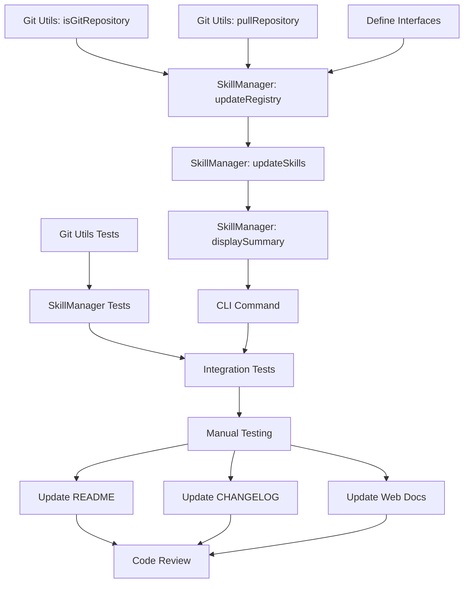

# Project Planning & Task Breakdown: Skill Update

## Milestones
**What are the major checkpoints?**

- [ ] **Milestone 1**: Git utilities extended (isGitRepository, pullRepository)
- [ ] **Milestone 2**: SkillManager update methods implemented
- [ ] **Milestone 3**: CLI command integrated and tested
- [ ] **Milestone 4**: All tests passing, documentation updated

## Task Breakdown
**What specific work needs to be done?**

### Phase 1: Foundation - Git Utilities
**Goal**: Extend git utilities to support repository updates

- [ ] **Task 1.1**: Add `isGitRepository(dirPath: string)` function
  - Check if `.git` directory exists
  - Return boolean result
  - Add JSDoc documentation
  - **Estimate**: 15 minutes

- [ ] **Task 1.2**: Add `pullRepository(repoPath: string)` function
  - Execute `git pull` in specified directory
  - Set 30-second timeout
  - Throw descriptive error on failure
  - Add JSDoc documentation
  - **Estimate**: 20 minutes

- [ ] **Task 1.3**: Write unit tests for git utilities
  - Test `isGitRepository` with git and non-git directories
  - Test `pullRepository` success case
  - Test `pullRepository` error cases (network, conflicts, timeout)
  - Mock `execAsync` and `fs.pathExists`
  - **Estimate**: 30 minutes

### Phase 2: Core Features - SkillManager
**Goal**: Implement update logic in SkillManager

- [ ] **Task 2.1**: Define TypeScript interfaces
  - Create `UpdateResult` interface
  - Create `UpdateSummary` interface
  - Add to SkillManager.ts
  - **Estimate**: 10 minutes

- [ ] **Task 2.2**: Implement `updateRegistry()` private method
  - Accept `registryPath` and `registryId` parameters
  - Check if directory is git repository
  - If not git: return 'skipped' status
  - If git: call `pullRepository`
  - Catch errors and return 'error' status
  - Return 'success' status on success
  - **Estimate**: 30 minutes

- [ ] **Task 2.3**: Implement `updateSkills()` public method
  - Validate git installation
  - Scan `SKILL_CACHE_DIR` for registries
  - Filter by `registryId` if provided
  - Loop through registries, calling `updateRegistry()`
  - Display progress for each registry
  - Collect results into `UpdateSummary`
  - Call `displayUpdateSummary()`
  - Return summary
  - **Estimate**: 45 minutes

- [ ] **Task 2.4**: Implement `displayUpdateSummary()` private method
  - Format summary with chalk colors
  - Show counts (updated, skipped, failed)
  - List errors with helpful messages
  - Suggest remediation for common errors
  - **Estimate**: 30 minutes

- [ ] **Task 2.5**: Write unit tests for SkillManager update methods
  - Test `updateSkills()` with no registries
  - Test `updateSkills()` with all registries
  - Test `updateSkills()` with specific registry
  - Test `updateRegistry()` with git repo (success)
  - Test `updateRegistry()` with non-git directory (skip)
  - Test `updateRegistry()` with git error (error)
  - Mock file system and git utilities
  - **Estimate**: 60 minutes

### Phase 3: Integration & CLI
**Goal**: Wire up CLI command and integrate with existing system

- [ ] **Task 3.1**: Add `update` command to skill.ts
  - Define command with optional `[registry-id]` parameter
  - Add description
  - Create action handler
  - Instantiate ConfigManager and SkillManager
  - Call `skillManager.updateSkills(registryId)`
  - Handle errors and exit codes
  - **Estimate**: 20 minutes

- [ ] **Task 3.2**: Add integration tests for CLI command
  - Test `ai-devkit skill update` (all registries)
  - Test `ai-devkit skill update <registry>` (specific registry)
  - Test error handling (git not installed, invalid registry)
  - Use test fixtures for skill cache
  - **Estimate**: 45 minutes

- [ ] **Task 3.3**: Manual testing
  - Set up test registries in cache
  - Test update all registries
  - Test update specific registry
  - Test with non-git directory
  - Test with git conflicts
  - Test with network issues
  - Verify output formatting
  - **Estimate**: 30 minutes

### Phase 4: Documentation & Polish
**Goal**: Complete documentation and prepare for release

- [ ] **Task 4.1**: Update CLI README
  - Add `skill update` command documentation
  - Include examples
  - Document error scenarios
  - **Estimate**: 20 minutes

- [ ] **Task 4.2**: Update CHANGELOG
  - Add entry for skill update feature
  - Document new commands
  - Note any breaking changes (none expected)
  - **Estimate**: 10 minutes

- [ ] **Task 4.3**: Update web documentation
  - Add skill update section to docs
  - Include usage examples
  - Add troubleshooting guide
  - **Estimate**: 30 minutes

- [ ] **Task 4.4**: Code review and cleanup
  - Review all code changes
  - Ensure consistent style
  - Add missing comments
  - Remove debug code
  - **Estimate**: 20 minutes

## Dependencies
**What needs to happen in what order?**

### Task Dependencies

### External Dependencies
- **Git**: Must be installed on user's system (already required)
- **Network**: Required for git pull operations
- **Existing Skill System**: Must not break existing `add`, `list`, `remove` commands

### Critical Path
1. Git utilities (Tasks 1.1, 1.2) - **35 minutes**
2. SkillManager core logic (Tasks 2.1, 2.2, 2.3, 2.4) - **115 minutes**
3. CLI integration (Task 3.1) - **20 minutes**
4. Testing (Tasks 1.3, 2.5, 3.2, 3.3) - **165 minutes**
5. Documentation (Tasks 4.1, 4.2, 4.3) - **60 minutes**

**Total Critical Path**: ~6.5 hours

## Timeline & Estimates
**When will things be done?**

### Effort Estimates by Phase
- **Phase 1 (Git Utilities)**: 65 minutes (~1 hour)
- **Phase 2 (SkillManager)**: 175 minutes (~3 hours)
- **Phase 3 (Integration)**: 95 minutes (~1.5 hours)
- **Phase 4 (Documentation)**: 80 minutes (~1.5 hours)

**Total Estimated Effort**: ~7 hours

### Development Timeline
Assuming focused development time:

- **Day 1 (Morning)**: Phase 1 + Phase 2 (Tasks 2.1-2.3)
- **Day 1 (Afternoon)**: Phase 2 (Tasks 2.4-2.5) + Phase 3 (Task 3.1)
- **Day 2 (Morning)**: Phase 3 (Tasks 3.2-3.3)
- **Day 2 (Afternoon)**: Phase 4 (All tasks)

**Target Completion**: 2 days

### Buffer
- Add 20% buffer for unexpected issues: **~1.5 hours**
- Total with buffer: **~8.5 hours** (just over 1 full working day)

## Risks & Mitigation
**What could go wrong?**

### Risk 1: Git Pull Complexity
**Description**: Git pull can fail in many ways (conflicts, network, permissions, etc.)  
**Likelihood**: Medium  
**Impact**: High  
**Mitigation**:
- Comprehensive error handling
- Clear error messages with remediation steps
- Extensive testing of error scenarios
- Timeout protection

### Risk 2: Breaking Existing Functionality
**Description**: Changes to SkillManager could break existing commands  
**Likelihood**: Low  
**Impact**: High  
**Mitigation**:
- Only add new methods, don't modify existing ones
- Run full test suite before committing
- Manual testing of all skill commands
- Code review focused on integration points

### Risk 3: Performance Issues
**Description**: Updating many registries could be slow  
**Likelihood**: Medium  
**Impact**: Medium  
**Mitigation**:
- Set reasonable timeouts (30s per registry)
- Show progress feedback so users know it's working
- Document expected performance
- Future enhancement: parallel updates

### Risk 4: User Confusion
**Description**: Users might not understand registry vs. skill updates  
**Likelihood**: Medium  
**Impact**: Low  
**Mitigation**:
- Clear command descriptions
- Helpful examples in documentation
- Good error messages
- FAQ section in docs

### Risk 5: Test Coverage Gaps
**Description**: Missing edge cases in tests  
**Likelihood**: Medium  
**Impact**: Medium  
**Mitigation**:
- Comprehensive test plan (see testing doc)
- Manual testing checklist
- Code review focused on test coverage
- Integration tests in addition to unit tests

## Resources Needed
**What do we need to succeed?**

### Team Members
- **Developer**: Implement features, write tests, update docs
- **Reviewer**: Code review, test validation

### Tools and Services
- **Development Environment**: Node.js, TypeScript, npm
- **Testing**: Jest (existing test framework)
- **Git**: For testing git operations
- **CI/CD**: Existing pipeline for automated testing

### Infrastructure
- **Test Registries**: Sample git repositories for testing
- **Test Cache**: Mock skill cache directory structure

### Documentation/Knowledge
- **Git Documentation**: Understanding git pull behavior
- **Existing Codebase**: SkillManager, git utilities, CLI patterns
- **Commander.js**: CLI framework documentation
- **Chalk**: Terminal styling documentation

### Test Data Needed
- Git repository with commits to pull
- Non-git directory in cache
- Git repository with uncommitted changes
- Git repository with merge conflicts
- Network-unreachable repository (for timeout testing)

