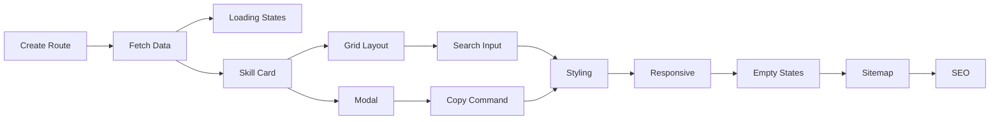

# Project Planning & Task Breakdown

## Current Status: ✅ Complete

**Last Updated:** 2026-02-07

Implementation is complete and verified. All milestones achieved.

---

## Milestones
**What are the major checkpoints?**

- [x] Milestone 1: Documentation complete and approved
- [x] Milestone 2: Basic page with data loading
- [x] Milestone 3: Search and filtering working
- [x] Milestone 4: Modal and install command copy
- [x] Milestone 5: Polish and responsive design

## Task Breakdown
**What specific work needs to be done?**

### Phase 1: Foundation ✅
- [x] Task 1.1: Create `/skills` route directory and page.tsx
- [x] Task 1.2: Implement skill data fetching from remote JSON
- [x] Task 1.3: Add loading and error states

### Phase 2: Core Features ✅
- [x] Task 2.1: Build skill card component with name and description
- [x] Task 2.2: Implement responsive grid layout
- [x] Task 2.3: Add search input with real-time filtering (with 200ms debounce)
- [x] Task 2.4: Create install modal component
- [x] Task 2.5: Add copy-to-clipboard for install command

### Phase 3: Integration & Polish ✅
- [x] Task 3.1: Style components to match existing website design
- [x] Task 3.2: Add responsive breakpoints
- [x] Task 3.3: Handle empty search results
- [x] Task 3.4: Update sitemap.ts to include /skills
- [x] Task 3.5: Add SEO meta tags (layout.tsx with OpenGraph/Twitter)

## Dependencies
**What needs to happen in what order?**

### External Dependencies
- Remote JSON must be accessible ✅
- Existing CSS patterns in globals.css ✅

## Timeline & Estimates
**When will things be done?**

| Phase | Estimated | Actual |
|-------|-----------|--------|
| Phase 1: Foundation | 30 min | ✅ |
| Phase 2: Core Features | 1 hour | ✅ |
| Phase 3: Polish | 30 min | ✅ |
| **Total** | ~2 hours | ✅ Complete |

## Risks & Mitigation
**What could go wrong?**

| Risk | Status | Notes |
|------|--------|-------|
| JSON endpoint unavailable | ✅ Mitigated | Error state with retry button |
| Large skill count (~1400) | ✅ Handled | Client-side filtering works well with debounce |
| Modal accessibility | ✅ Addressed | Escape key, click outside, aria-labels |

## Implementation Summary

**Files Created/Modified:**
- `web/app/skills/page.tsx` - Main skills page component
- `web/app/skills/layout.tsx` - SEO metadata
- `web/app/sitemap.ts` - Added /skills route

**Key Enhancements Made:**
- Added 200ms debounce for search (not originally planned, improves UX)
- Install command includes registry (user requirement)
- Elegant modal design with backdrop blur

## Resources Needed
**What do we need to succeed?**

- ✅ Existing web codebase patterns (page.tsx, globals.css)
- ✅ Remote JSON endpoint for skill data
- ✅ Understanding of Next.js App Router
