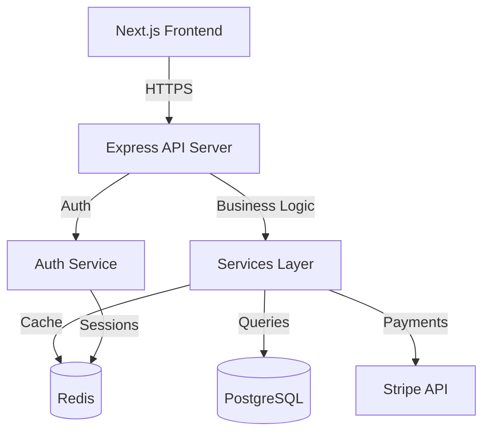

# Ultimate Guide: Building Your SaaS Side Project with AI DevKit + Claude Code + MCP Servers

This is a comprehensive, battle-tested workflow for solo developers building SaaS products at home. Learn how to combine AI DevKit's structured approach with Claude Code's power and MCP servers for maximum productivity.

## Table of Contents
1. [Initial Setup](#initial-setup)
2. [Essential MCP Servers for SaaS Development](#essential-mcp-servers)
3. [Complete SaaS Development Workflow](#complete-saas-workflow)
4. [Daily Development Patterns](#daily-patterns)
5. [Advanced MCP + AI DevKit Combos](#advanced-combos)
6. [Real-World SaaS Example](#real-example)
7. [Pro Tips](#pro-tips)

---

## Initial Setup {#initial-setup}

### Step 1: Set Up Your SaaS Project

```bash
# Create your SaaS project
mkdir my-saas-app
cd my-saas-app
git init

# Initialize AI DevKit for Claude Code
npx ai-devkit init --environment claude --all

# This creates:
# - .claude/CLAUDE.md (workspace rules)
# - .claude/commands/ (custom slash commands)
# - docs/ai/ (phase templates)
```

### Step 2: Install Essential MCP Servers

MCP (Model Context Protocol) servers extend Claude Code with powerful capabilities. Here are the must-haves for SaaS development:

**Database MCP Servers:**
```bash
# PostgreSQL MCP (for database operations)
npm install -g @modelcontextprotocol/server-postgres

# SQLite MCP (for local development)
npm install -g @modelcontextprotocol/server-sqlite
```

**Development MCP Servers:**
```bash
# Filesystem MCP (advanced file operations)
npm install -g @modelcontextprotocol/server-filesystem

# GitHub MCP (repo operations, issues, PRs)
npm install -g @modelcontextprotocol/server-github

# Puppeteer MCP (browser automation for E2E tests)
npm install -g @modelcontextprotocol/server-puppeteer
```

**SaaS-Specific MCP Servers:**
```bash
# Stripe MCP (payment integration testing)
# MongoDB MCP (if using NoSQL)
# Redis MCP (caching layer)
```

### Step 3: Configure Claude Code with MCP Servers

Create or edit `~/.config/claude/claude_desktop_config.json`:

```json
{
  "mcpServers": {
    "postgres": {
      "command": "npx",
      "args": ["-y", "@modelcontextprotocol/server-postgres", "postgresql://localhost/my_saas_db"]
    },
    "github": {
      "command": "npx",
      "args": ["-y", "@modelcontextprotocol/server-github"],
      "env": {
        "GITHUB_PERSONAL_ACCESS_TOKEN": "your_token_here"
      }
    },
    "filesystem": {
      "command": "npx",
      "args": ["-y", "@modelcontextprotocol/server-filesystem", "/path/to/my-saas-app"]
    },
    "puppeteer": {
      "command": "npx",
      "args": ["-y", "@modelcontextprotocol/server-puppeteer"]
    }
  }
}
```

---

## Essential MCP Servers for SaaS {#essential-mcp-servers}

Here's what each MCP server brings to your workflow:

### 1. PostgreSQL/Database MCP
**Why:** Direct database queries, schema migrations, seeding test data

**Use cases:**
- Query production data safely
- Generate migrations from design docs
- Seed test users/subscriptions
- Analyze query performance

**Example with AI DevKit:**
```
You: /new-requirement
Claude: What feature?
You: user-subscription-tiers

[After design phase with data models documented]

You: Using the data models in docs/ai/design/feature-user-subscription-tiers.md,
     generate the PostgreSQL migration script

Claude: [Uses PostgreSQL MCP to check existing schema, generates migration]
```

### 2. GitHub MCP
**Why:** Create issues, PRs, manage milestones without leaving Claude

**Use cases:**
- Create GitHub issues from planning docs
- Generate PR descriptions from implementation notes
- Link commits to issues automatically
- Track project progress

**Example with AI DevKit:**
```
You: /execute-plan

[After completing tasks]

You: Create a PR for the subscription tiers feature using the planning
     and implementation docs

Claude: [Uses GitHub MCP to create PR with structured description from docs]
```

### 3. Filesystem MCP
**Why:** Advanced file operations, batch refactoring, code generation

**Use cases:**
- Generate boilerplate from templates
- Batch file operations
- Search and replace across codebase
- Generate API routes from design specs

### 4. Puppeteer MCP
**Why:** Automated browser testing for your SaaS

**Use cases:**
- E2E test generation from user stories
- Screenshot regression testing
- Automated onboarding flow testing
- Payment flow verification (with Stripe test mode)

### 5. Slack/Discord MCP (Optional but useful)
**Why:** Get notifications on deployment, test failures

---

## Complete SaaS Development Workflow {#complete-saas-workflow}

### Phase 0: Ideation & Market Research

**Use MCP:** Web search, competitor analysis

```
You: I want to build a SaaS for [your idea]. Help me research competitors
     and validate the market

Claude: [Uses web search MCP to research]
        [Creates docs/ai/requirements/product-vision.md with findings]
```

### Phase 1: Define Your SaaS Product

**Command:** `/new-requirement`

**What happens:**
1. Claude asks about your SaaS idea
2. You discuss features, target users, pricing tiers
3. Claude creates structured documentation

**Example conversation:**
```
You: /new-requirement

Claude: What is the feature name?
You: mvp-launch

Claude: What problem does it solve?
You: Small businesses need an easy way to manage customer subscriptions
     without Stripe complexity

Claude: Who will use it?
You: Solo entrepreneurs and small business owners (1-50 employees)

Claude: What are the key user stories?
You:
- As a business owner, I want to create subscription plans
- As a business owner, I want customers to subscribe with credit card
- As a customer, I want to manage my subscription (upgrade/cancel)
- As a business owner, I want to see MRR and churn metrics

[Claude proceeds to create comprehensive docs]
```

**Files created:**
- `docs/ai/requirements/feature-mvp-launch.md` - Complete requirements
- Initial user stories
- Success criteria (e.g., "Process payment in < 3 seconds")

### Phase 2: Design Your SaaS Architecture

**Command:** `/review-requirements` then work on design

**SaaS-specific design considerations:**
```
You: Based on the requirements, design a multi-tenant SaaS architecture
     with the following:
     - PostgreSQL for data
     - Redis for sessions/caching
     - Stripe for payments
     - Next.js for frontend
     - Node.js/Express for API

     Include Mermaid diagrams for architecture, auth flow, and payment flow

Claude: [Creates docs/ai/design/feature-mvp-launch.md with diagrams]
```

**Generated design doc includes:**

```markdown
## Architecture Overview



## Data Models

### User Table
- id: UUID (primary key)
- email: string (unique)
- tenant_id: UUID (for multi-tenancy)
- stripe_customer_id: string
- created_at: timestamp

### Subscription Table
- id: UUID
- user_id: UUID (foreign key)
- plan_id: UUID
- stripe_subscription_id: string
- status: enum (active, canceled, past_due)
- current_period_end: timestamp

[... full design spec]
```

**MCP Bonus:**
```
You: Using PostgreSQL MCP, generate the initial schema migration

Claude: [Uses PostgreSQL MCP to create migration]
        [Saves to migrations/001_initial_schema.sql]
```

### Phase 3: Break Down MVP Into Sprints

**Command:** `/review-design` then work on planning

```
You: Based on the design doc, create a 4-week MVP plan with weekly sprints

Claude: [Creates docs/ai/planning/feature-mvp-launch.md]
```

**Generated planning doc:**

```markdown
## Milestones

- [ ] Week 1: Foundation & Auth (MVP-ready auth system)
- [ ] Week 2: Subscription Management (Create/manage plans)
- [ ] Week 3: Payment Integration (Stripe integration complete)
- [ ] Week 4: Dashboard & Testing (Admin dashboard, E2E tests)

## Task Breakdown

### Week 1: Foundation & Auth (16 hours)
- [ ] Set up Next.js + Express monorepo (2h)
- [ ] Configure PostgreSQL + Prisma ORM (2h)
- [ ] Set up Redis for sessions (1h)
- [ ] Implement user registration (email/password) (3h)
- [ ] Implement login with JWT + refresh tokens (3h)
- [ ] Add email verification flow (2h)
- [ ] Write auth middleware (1h)
- [ ] Unit tests for auth (2h)

### Week 2: Subscription Management (20 hours)
- [ ] Create subscription plans model (2h)
- [ ] Build admin UI for creating plans (4h)
- [ ] API endpoints for plan CRUD (3h)
- [ ] Tenant isolation middleware (3h)
- [ ] User plan selection UI (4h)
- [ ] Plan comparison page (2h)
- [ ] Integration tests (2h)

### Week 3: Payment Integration (24 hours)
- [ ] Stripe API integration setup (2h)
- [ ] Create Stripe customer on signup (2h)
- [ ] Implement checkout session flow (4h)
- [ ] Handle Stripe webhooks (subscription.created, payment_succeeded, etc.) (6h)
- [ ] Subscription status sync (3h)
- [ ] Payment method management UI (3h)
- [ ] Upgrade/downgrade logic (3h)
- [ ] Test with Stripe test mode (1h)

### Week 4: Dashboard & Testing (20 hours)
- [ ] Admin dashboard - MRR chart (4h)
- [ ] Admin dashboard - Active subscriptions list (2h)
- [ ] Admin dashboard - Churn metrics (3h)
- [ ] User dashboard - Subscription status (2h)
- [ ] User dashboard - Billing history (2h)
- [ ] E2E tests with Puppeteer (signup → subscribe → upgrade) (5h)
- [ ] Performance testing (1h)
- [ ] Bug fixes and polish (1h)

## Dependencies
- Stripe test account required before Week 3
- Email service (SendGrid/Postmark) for verification emails
- Hosting setup (Vercel/Railway) for staging deployment
```

### Phase 4: Execute Sprint-by-Sprint

**Command:** `/execute-plan`

This is where the magic happens. Here's a typical day:

**Monday - Start of Week 1:**

```
You: /execute-plan

Claude: Loading plan from docs/ai/planning/feature-mvp-launch.md...

### Task Queue: MVP Launch (Week 1: Foundation & Auth)

1. [ ] Set up Next.js + Express monorepo (2h)
2. [ ] Configure PostgreSQL + Prisma ORM (2h)
3. [ ] Set up Redis for sessions (1h)
4. [ ] Implement user registration (3h)
[... rest of tasks]

Let's start with task 1: Set up Next.js + Express monorepo

Would you like me to:
1. Set up the monorepo structure
2. Configure package.json and TypeScript
3. Set up development scripts

Ready to begin? (yes/no)

You: yes

Claude: [Creates folder structure]
        [Sets up package.json with workspaces]
        [Configures TypeScript]
        [Adds development scripts]

Done! Here's what was created:
- /apps/web (Next.js)
- /apps/api (Express)
- /packages/shared (shared types)
- Root package.json with workspace config
- tsconfig.json files
- Development scripts (dev:web, dev:api, dev)

Mark task as complete? (yes/no)

You: yes

Claude: ✅ Task 1 completed. Updated planning doc.

Moving to task 2: Configure PostgreSQL + Prisma ORM

[Uses PostgreSQL MCP to check connection]

I'll set up Prisma with your PostgreSQL database. Ready? (yes/no)
```

**Combining with MCP throughout the day:**

```
[Later that day - Task 4: User registration]

You: Implement the registration endpoint based on design docs

Claude: [Reads docs/ai/design/feature-mvp-launch.md]
        [Creates /apps/api/src/routes/auth.ts]
        [Implements validation, password hashing, email verification]

You: Test this endpoint with sample data

Claude: [Uses PostgreSQL MCP to create test user]
        [Generates curl command to test]

You: Run the test

Claude: [Executes test via bash]
        ✅ Test passed - user created successfully
```

### Phase 5: Testing with MCP Superpowers

**Command:** `/writing-test`

**Traditional approach:**
```
You: Write tests for the auth system

Claude: [Writes basic unit tests]
```

**MCP-enhanced approach:**
```
You: /writing-test

Claude: I'll create comprehensive tests for auth. Let me:
        1. Write unit tests for registration/login
        2. Generate E2E tests using Puppeteer MCP
        3. Create database fixtures using PostgreSQL MCP

[Uses Puppeteer MCP to create E2E test]

E2E Test generated: tests/e2e/auth-flow.spec.ts

This test will:
1. Navigate to signup page
2. Fill form and submit
3. Verify email sent (mock)
4. Complete email verification
5. Login with new credentials
6. Verify dashboard access

[Uses PostgreSQL MCP to create test fixtures]

Created test fixtures in tests/fixtures/users.sql

Run tests? (yes/no)

You: yes

Claude: [Runs tests]
        ✅ 15/15 tests passed
        Coverage: 94%
```

### Phase 6: Code Review Before Commits

**Command:** `/code-review`

```
You: /code-review

Claude: Gathering context...

Modified files:
- apps/api/src/routes/auth.ts
- apps/api/src/services/user-service.ts
- apps/api/src/middleware/auth.ts
- prisma/schema.prisma

Relevant design: docs/ai/design/feature-mvp-launch.md

Performing review...

### Summary
- Blocking issues: 1
- Important follow-ups: 2
- Nice-to-have improvements: 3

### Detailed Notes

1. **apps/api/src/routes/auth.ts**
   - Issue: JWT secret is hardcoded
   - Impact: BLOCKING - Security vulnerability
   - Recommendation: Use environment variable process.env.JWT_SECRET
   - Design reference: Security Requirements section

2. **apps/api/src/services/user-service.ts**
   - Issue: No rate limiting on registration
   - Impact: Important - Vulnerability to spam/abuse
   - Recommendation: Add rate limiting middleware (express-rate-limit)
   - Design reference: Non-Functional Requirements > Security

[... more findings]

Fix blocking issues before committing? (yes/no)

You: yes

Claude: [Fixes JWT secret issue]
        [Adds environment variable]
        ✅ Fixed. Re-running review...

All blocking issues resolved! Ready to commit.
```

### Phase 7: Deployment Prep

**Command:** Work through `docs/ai/deployment/feature-mvp-launch.md`

```
You: Help me deploy to Vercel (frontend) and Railway (API + DB)

Claude: [Reads design and deployment docs]

I'll help you set up deployment. Steps:

1. Configure environment variables
2. Set up Railway PostgreSQL
3. Configure Vercel project
4. Set up GitHub Actions for CI/CD
5. Create deployment scripts

Let's start. First, let me create a deployment checklist...

[Creates detailed deployment checklist]

You: Use GitHub MCP to create deployment workflow

Claude: [Uses GitHub MCP to:]
        - Create .github/workflows/deploy.yml
        - Set up environments (staging, production)
        - Configure secrets

✅ CI/CD pipeline created

When you push to main:
- Run tests
- Build applications
- Deploy API to Railway
- Deploy web to Vercel
- Run smoke tests
```

---

## Daily Development Patterns {#daily-patterns}

### Morning Routine

**Goal:** Pick up where you left off

```bash
# 1. Review yesterday's progress
/execute-plan

# Claude shows task queue with completed items marked
# Pick next task

# 2. If stuck on something, use capture-knowledge
/capture-knowledge

# Provide the problematic function/module
# Get detailed analysis with diagrams
```

### During Implementation

**Pattern 1: Design-First Feature Development**

```
1. /new-requirement                  # Document feature
2. [Fill requirements]               # Your input
3. /review-requirements             # Validate
4. [Design architecture]            # Your input + Claude
5. /review-design                   # Validate + generate diagrams
6. [Break into tasks]               # Your input + Claude
7. /execute-plan                    # Implement task-by-task
8. /writing-test                    # Generate tests
9. /code-review                     # Review before commit
10. Git commit + push               # Ship it
```

**Pattern 2: Quick Bug Fix**

```
1. /debug                           # Structured debugging
2. [Claude helps isolate issue]
3. Fix the bug
4. /writing-test                    # Add regression test
5. /code-review                     # Quick review
6. Commit with clear message
```

**Pattern 3: Refactoring**

```
1. /capture-knowledge               # Understand current code
2. [Claude creates knowledge doc with diagrams]
3. Update design docs with refactor plan
4. /execute-plan                    # Refactor step-by-step
5. /writing-test                    # Ensure tests still pass
6. /check-implementation            # Verify refactor matches design
```

### Evening Routine

**Goal:** Document progress and plan tomorrow

```
You: Update the planning doc with today's progress

Claude: [Updates planning doc]
        [Marks completed tasks]
        [Adds notes on blockers]

You: What should I focus on tomorrow?

Claude: Based on your plan, tomorrow you should:
        1. Complete Stripe webhook handlers (Week 3, Task 4)
        2. Test payment flows with Stripe test cards
        3. Start on subscription sync logic

        Estimated time: 6 hours
        Blocker: Need Stripe test account (reminder sent)
```

---

## Advanced MCP + AI DevKit Combos {#advanced-combos}

### Combo 1: Database-Driven Feature Development

**Scenario:** Building an analytics dashboard

```
You: I need to add an analytics dashboard showing MRR, churn rate,
     and subscription breakdown

Claude: Let me help. First, I'll:
        1. Query your DB schema using PostgreSQL MCP
        2. Design the analytics queries
        3. Create the feature docs
        4. Implement the dashboard

[Uses PostgreSQL MCP to analyze schema]

Based on your subscriptions table, here's the design:

[Creates docs/ai/design/feature-analytics-dashboard.md]

## Data Models & Queries

### Monthly Recurring Revenue (MRR)
```sql
SELECT
  DATE_TRUNC('month', created_at) as month,
  SUM(amount) as mrr
FROM subscriptions
WHERE status = 'active'
GROUP BY month
ORDER BY month DESC;
```

### Churn Rate
[... SQL queries]

Shall I implement this?

You: Yes, and use the PostgreSQL MCP to test queries with sample data

Claude: [Creates sample data using PostgreSQL MCP]
        [Tests queries]
        [Implements dashboard API endpoints]
        [Creates React components with charts]
```

### Combo 2: End-to-End Feature with GitHub Integration

**Scenario:** Complete feature from idea to PR

```
You: /new-requirement

[Complete requirements, design, planning phases]

You: Execute this plan and create a PR when done

Claude: [Uses /execute-plan to implement]
        [Uses /writing-test to create tests]
        [Uses /code-review to validate]
        [Uses GitHub MCP to create PR]

✅ Feature implemented and tested

Created PR #42: "feat: Add analytics dashboard"

PR Description (from docs):
## Feature: Analytics Dashboard

### Summary
Implements real-time MRR, churn rate, and subscription breakdown
analytics for business owners.

### Requirements
Documented in: docs/ai/requirements/feature-analytics-dashboard.md

### Design
Architecture: docs/ai/design/feature-analytics-dashboard.md
- PostgreSQL materialized views for performance
- Redis caching for frequently accessed data
- Chart.js for visualizations

### Testing
- Unit tests: 18/18 passed
- Integration tests: 5/5 passed
- E2E test: Dashboard loads in < 2s ✅

Ready for review!
```

### Combo 3: Multi-Service SaaS Architecture

**Scenario:** Building microservices-based SaaS

```
You: My SaaS needs to scale. Help me break the monolith into:
     - Auth Service
     - Billing Service
     - Analytics Service
     - Main API Gateway

Use the current design docs and create a migration plan

Claude: [Reads current docs/ai/design/*.md files]
        [Uses /capture-knowledge on existing services]
        [Creates new architecture design]

Created: docs/ai/design/microservices-migration.md

## Migration Strategy (4 weeks)

Week 1: Extract Auth Service
- [ ] Create auth-service package
- [ ] Extract auth routes and middleware
- [ ] Set up shared database with row-level security
- [ ] Update API gateway to proxy auth requests

[... detailed plan]

[Uses Filesystem MCP to create service directories]
[Uses PostgreSQL MCP to design database isolation]

Shall I create the task breakdown in planning docs?

You: Yes, and use execute-plan to guide me through Week 1

Claude: [Creates detailed planning doc]
        [Launches /execute-plan workflow]
```

---

## Real-World Example: "SubscriptionBox SaaS" {#real-example}

Let me walk you through building a real SaaS from scratch: **SubscriptionBox** - a platform for managing subscription box businesses.

### Week 0: Setup & Vision

```bash
mkdir subscription-box-saas
cd subscription-box-saas
git init
npx ai-devkit init --environment claude --all
```

```
You: /new-requirement

Claude: What is the feature name?
You: mvp-v1

Claude: What problem does it solve?
You: Subscription box businesses (like coffee, snacks, books subscriptions)
     need an all-in-one platform to:
     - Manage products and box variants
     - Handle recurring billing
     - Manage shipments and fulfillment
     - Track customer preferences

Claude: Who will use it?
You: Primary: Subscription box business owners (solopreneurs to small teams)
     Secondary: Their customers (box subscribers)

[Claude creates comprehensive requirements doc]
```

**Generated:** `docs/ai/requirements/feature-mvp-v1.md`

### Week 1: Architecture & Foundation

```
You: Design a scalable multi-tenant SaaS architecture for SubscriptionBox.
     Tech stack:
     - Next.js 14 (App Router) for web app
     - PostgreSQL for data (multi-tenant with tenant_id)
     - Redis for job queues and caching
     - Stripe for payments
     - AWS S3 for product images
     - Resend for transactional emails
     - Railway for hosting

     Include Mermaid diagrams for:
     1. Overall architecture
     2. Multi-tenancy isolation
     3. Subscription billing flow
     4. Order fulfillment flow

Claude: [Creates comprehensive design doc with diagrams]
```

**Generated:** `docs/ai/design/feature-mvp-v1.md` (with 4 Mermaid diagrams)

```
You: Based on design, create a 6-week MVP plan

Claude: [Creates detailed planning doc with weekly sprints]
```

**Generated:** `docs/ai/planning/feature-mvp-v1.md`

**Sample from planning doc:**

```markdown
## Week 1: Foundation (20 hours)

### Database Setup
- [ ] Set up PostgreSQL on Railway (1h)
- [ ] Design multi-tenant schema with RLS (3h)
- [ ] Set up Prisma ORM (1h)
- [ ] Create seed data for development (2h)

### Auth System
- [ ] Implement Clerk auth (3h)
- [ ] Multi-tenant workspace selection (2h)
- [ ] Role-based permissions (Owner, Admin, Staff) (3h)

### Project Setup
- [ ] Next.js monorepo (2h)
- [ ] Tailwind + shadcn/ui (1h)
- [ ] ESLint + Prettier (1h)
- [ ] GitHub Actions CI (1h)
```

```
You: /execute-plan

Claude: Let's start Week 1. Task 1: Set up PostgreSQL on Railway

You: [Provides Railway credentials]

Claude: [Uses PostgreSQL MCP to connect and verify]
        ✅ Connected to PostgreSQL

        Creating initial schema based on design docs...

        [Generates Prisma schema]
```

**Generated schema with multi-tenancy:**

```prisma
// prisma/schema.prisma

model Tenant {
  id        String   @id @default(uuid())
  name      String
  slug      String   @unique
  ownerId   String
  createdAt DateTime @default(now())

  users         User[]
  products      Product[]
  subscriptions Subscription[]
}

model User {
  id          String   @id @default(uuid())
  email       String   @unique
  clerkId     String   @unique
  tenantId    String
  role        Role     @default(STAFF)

  tenant      Tenant   @relation(fields: [tenantId], references: [id])

  @@index([tenantId])
}

model Product {
  id          String   @id @default(uuid())
  tenantId    String
  name        String
  description String?
  price       Decimal
  imageUrl    String?

  tenant      Tenant   @relation(fields: [tenantId], references: [id])
  boxVariants BoxVariant[]

  @@index([tenantId])
}

model BoxVariant {
  id             String   @id @default(uuid())
  productId      String
  name           String
  billingCycle   BillingCycle
  price          Decimal

  product        Product  @relation(fields: [productId], references: [id])
  subscriptions  Subscription[]
}

model Subscription {
  id                    String   @id @default(uuid())
  tenantId              String
  customerId            String
  boxVariantId          String
  stripeSubscriptionId  String   @unique
  status                SubscriptionStatus
  currentPeriodEnd      DateTime

  tenant                Tenant   @relation(fields: [tenantId], references: [id])
  customer              Customer @relation(fields: [customerId], references: [id])
  boxVariant            BoxVariant @relation(fields: [boxVariantId], references: [id])
  orders                Order[]

  @@index([tenantId])
  @@index([customerId])
}

// ... more models
```

### Week 2-3: Core Features Implementation

**Using execute-plan + MCP throughout:**

```
[Day 5 - Building Stripe Integration]

You: Implement Stripe checkout for box subscriptions

Claude: [Reads design docs for payment flow]
        [Implements checkout session creation]
        [Sets up webhook handlers]

        Created:
        - /app/api/checkout/route.ts
        - /app/api/webhooks/stripe/route.ts
        - /lib/stripe.ts

You: Test the checkout flow

Claude: [Uses Puppeteer MCP to create E2E test]

        Created: tests/e2e/checkout-flow.spec.ts

        This test:
        1. Creates test product
        2. Navigates to checkout
        3. Uses Stripe test card (4242 4242 4242 4242)
        4. Completes payment
        5. Verifies subscription created
        6. Checks webhook received

        Run test? (yes/no)

You: yes

Claude: [Runs E2E test with Puppeteer]
        ✅ Test passed

        [Uses PostgreSQL MCP to verify subscription in DB]
        ✅ Subscription created: sub_test_123
```

**Database-driven development:**

```
[Day 10 - Building Analytics]

You: Create a dashboard showing:
     - MRR by month
     - Active subscriptions
     - Churn rate
     - Top products

Claude: [Uses PostgreSQL MCP to analyze data schema]
        [Creates optimized queries]
        [Generates materialized views]

        Created materialized view for MRR:

        ```sql
        CREATE MATERIALIZED VIEW tenant_mrr AS
        SELECT
          tenant_id,
          DATE_TRUNC('month', created_at) as month,
          COUNT(*) as active_subscriptions,
          SUM(bv.price) as mrr
        FROM subscriptions s
        JOIN box_variants bv ON s.box_variant_id = bv.id
        WHERE s.status = 'active'
        GROUP BY tenant_id, month;
        ```

        Shall I implement the dashboard components?

You: Yes, and add real-time updates with React Query

Claude: [Implements dashboard with streaming]
        [Adds React Query for caching]
        [Creates chart components]
```

### Week 4: Polish & Testing

```
You: /writing-test

Claude: I'll create comprehensive test suite:

        Unit Tests:
        - Auth flow (10 tests)
        - Product CRUD (12 tests)
        - Subscription management (15 tests)
        - Stripe integration (8 tests)

        Integration Tests:
        - Multi-tenant isolation (6 tests)
        - Payment flows (5 tests)
        - Email triggers (4 tests)

        E2E Tests (using Puppeteer MCP):
        - Complete signup → create product → checkout (1 test)
        - Customer subscription management (1 test)
        - Admin dashboard navigation (1 test)

        [Generates all tests]

        Run full test suite? (yes/no)

You: yes

Claude: Running tests...

        ✅ Unit: 45/45 passed
        ✅ Integration: 15/15 passed
        ✅ E2E: 3/3 passed

        Coverage: 87.3%

        Missing coverage:
        - Webhook retry logic (edge case)
        - Image upload error handling

        Add tests for these? (yes/no)
```

### Week 5: Deployment

```
You: Deploy to production. Use Railway for API+DB, Vercel for frontend

Claude: [Reads docs/ai/deployment/feature-mvp-v1.md]

        Deployment checklist:

        ✅ Environment variables configured
        ✅ Database migrations ready
        ✅ Stripe webhook endpoint configured
        ✅ CI/CD pipeline set up
        ✅ Monitoring configured (Sentry)

        [Uses GitHub MCP to create deployment workflow]

        Created .github/workflows/deploy.yml:
        - Run tests on PR
        - Deploy to staging on push to develop
        - Deploy to production on push to main

        Push to trigger deployment? (yes/no)

You: yes

Claude: [Monitors deployment]

        ✅ Tests passed
        ✅ Built successfully
        ✅ Deployed to Vercel: subscription-box-saas.vercel.app
        ✅ Railway: API healthy at api.subscription-box-saas.com

        Running smoke tests...
        ✅ Homepage loads
        ✅ Auth flow works
        ✅ API responding

        🎉 Deployment successful!
```

### Post-Launch: Maintenance

```
[Customer reports bug]

You: /debug

Claude: What's the issue?

You: Customers can't cancel subscriptions - button doesn't work

Claude: Let me investigate...

        [Uses /capture-knowledge on subscription cancel flow]
        [Analyzes the code]
        [Checks database logs with PostgreSQL MCP]

        Found the issue:
        File: app/dashboard/subscriptions/[id]/page.tsx:142

        The cancel button calls cancelSubscription() but the API route
        expects POST, not DELETE.

        Fix: Change fetch method from DELETE to POST

        Also found: Missing error handling if Stripe API fails

        Shall I:
        1. Fix both issues
        2. Add error handling
        3. Write regression test

        (yes/no)

You: yes

Claude: [Fixes issues]
        [Adds error handling]
        [Uses Puppeteer MCP to create regression test]
        [Uses /code-review to validate]
        [Uses GitHub MCP to create hotfix PR]

        ✅ Created PR #67: "fix: Subscription cancellation and error handling"

        All tests passing. Ready to deploy hotfix.
```

---

## Pro Tips for Maximum Productivity {#pro-tips}

### 1. Create Custom Commands for Your SaaS

Add to `.claude/commands/stripe-test.md`:

```markdown
# Stripe Testing Helper

Help me test Stripe integration:

1. List all Stripe test cards for different scenarios
2. Create a test subscription using PostgreSQL MCP
3. Trigger webhook events locally
4. Verify webhook handling with database checks
5. Clean up test data

Provide commands I can run for each step.
```

### 2. Use Planning Docs as Your TODO List

```
# Every morning:
/execute-plan

# Claude loads your planning doc and shows task queue
# No more forgetting what you were working on
```

### 3. Document As You Code

```
# After implementing complex logic:
You: Document the subscription billing logic in implementation notes

Claude: [Reads code]
        [Updates docs/ai/implementation/feature-mvp-v1.md]
        [Adds diagrams and examples]
```

### 4. Automate Repetitive Tasks with MCP

Create shortcuts for common operations:

```
You: Create a command to seed my dev database with realistic test data

Claude: [Uses PostgreSQL MCP to create seed script]
        [Creates .claude/commands/seed-dev-db.md]

        Now you can run: /seed-dev-db
```

### 5. Use GitHub MCP for Project Management

```
You: Create GitHub issues from my planning doc uncompleted tasks

Claude: [Uses GitHub MCP]

        Created 12 issues:
        - #1: Implement email notifications
        - #2: Add product image upload
        - #3: Build order fulfillment workflow
        [...]

        Each linked to planning doc section.
```

---

## The Ultimate Solo SaaS Developer Stack

**Development Workflow:**
- **AI DevKit** - Structure and documentation
- **Claude Code** - AI pair programmer
- **MCP Servers** - Superpowers (DB, GitHub, E2E testing)

**Tech Stack (Recommended for SaaS):**
- **Frontend:** Next.js 14 + Tailwind + shadcn/ui
- **Backend:** Next.js API routes or Express
- **Database:** PostgreSQL (with PostgreSQL MCP)
- **Auth:** Clerk or NextAuth
- **Payments:** Stripe (with Stripe MCP if available)
- **Email:** Resend or Postmark
- **Storage:** AWS S3 or Cloudinary
- **Hosting:** Vercel + Railway/Supabase
- **Monitoring:** Sentry + LogRocket

**Daily Routine:**
1. Morning: `/execute-plan` - See what's next
2. Implementation: Follow task queue, use MCP for data/testing
3. Before commit: `/code-review` - Catch issues
4. Evening: Update planning docs, mark progress

**Time Savings:**
- ✅ No more "what should I build next?" - Planning docs guide you
- ✅ No more manual DB queries - PostgreSQL MCP
- ✅ No more manual testing - Puppeteer MCP for E2E
- ✅ No more context switching to GitHub - GitHub MCP
- ✅ No more forgetting requirements - Everything documented

---

## Conclusion

This workflow combines:
- **AI DevKit's structure** (requirements → design → planning → implementation → testing → deployment)
- **Claude Code's intelligence** (understanding your codebase, generating code)
- **MCP's power** (direct access to databases, GitHub, browsers, etc.)

**Result:** You can build production-ready SaaS products 3-5x faster as a solo developer, with better documentation, testing, and maintainability.

Start today:
```bash
npx ai-devkit init --environment claude --all
/new-requirement
# [Describe your SaaS idea]
# Follow the workflow
# Ship faster
```

Questions? Start with `/new-requirement` and let Claude guide you through your first feature. The system gets more valuable the more you use it.
